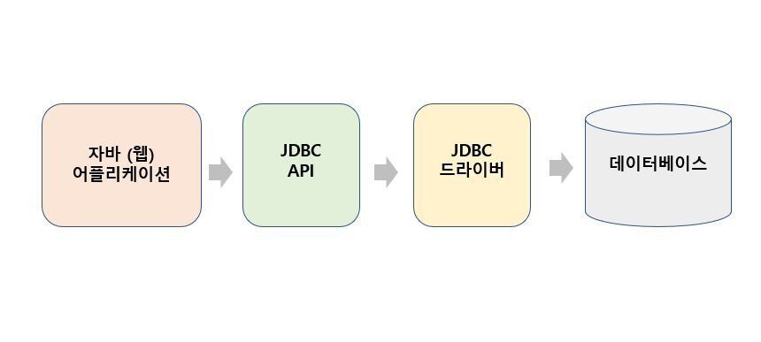
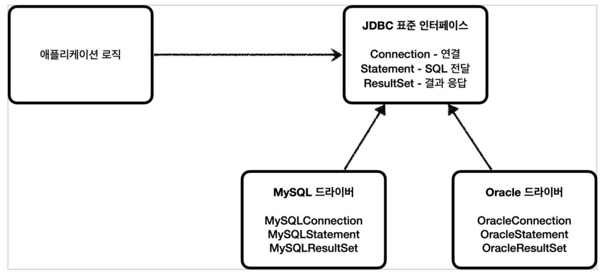
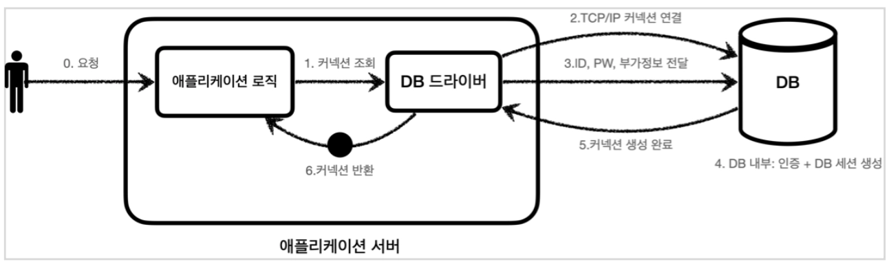
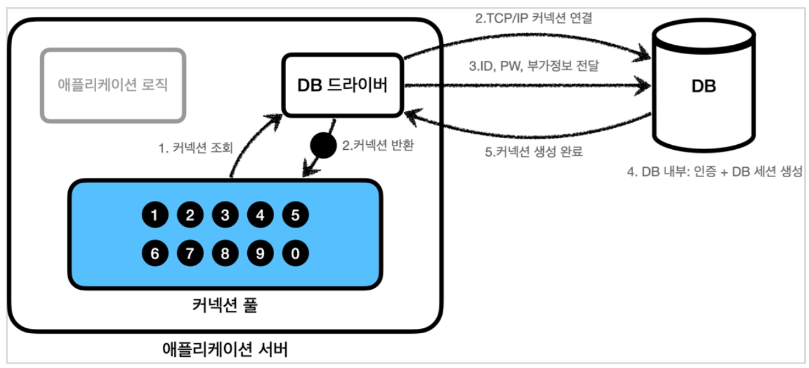
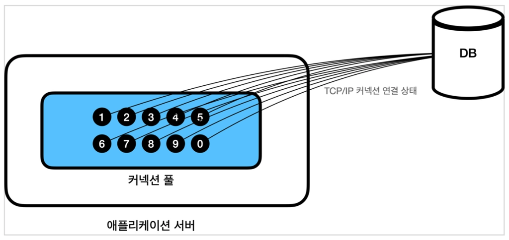

# 🧑🏻‍💻 커넥션 풀

---

- [✅ DB Connection](#-db-connection)
- [✅ JDBC](#-jdbc)
- [✅ 커넥션 풀 이해](#-커넥션-풀-이해)
- [✅ Connection Pool이 커지면 성능이 무조건 좋을까?](#-connection-pool이-커지면-성능이-무조건-좋을까)


## ✅ DB Connection

---

> [!NOTE]
> - DB를 사용하기 위해 DB와 애플리케이션 간 통신을 할 수 있는 수단
> - DB Connection은 Database Driver와 Database 연결 정보를 담은 URL이 필요함
> - Java의 DB Connection은 JDBC를 주로 이용하는데, URL 타입을 사용함.

<br>

## ✅ JDBC

---




> [!NOTE]
> - Java Database Connectivity의 약어로 Java 언어로 다양한 종류의 관계형 데이터베이스에 접속하고 SQL문을 수행하여 처리하고자할 때 사용되는 표준 SQL 인터페이스 API이다.
> - JDBC 드라이버 : 이 JDBC 인터페이스를 각각의 DB 벤더(회사)에서 자신의 DB에 맞도록 구현해서 제공하는 라이브러리

<br>

> [!TIP]
> JDBC의 등장으로 다음 2가지 문제가 해결되었다.
> 1. 데이터베이스를 다른 종류의 데이터베이스로 변경하면 애플리케이션 서버의 데이터베이스 사용 코드도 함께 변경해야하는 문제
>    - 애플리케이션 로직은 이제 JDBC 표준 인터페이스에만 의존한다. 
>    - ⇒ 데이터베이스를 다른 종류의 데이터베이스로 변경하고 싶으면 JDBC 구현 라이브러리만 변경하면 된다. 
>    - ⇒ 다른 종류의 데이터베이스로 변경해도 애플리케이션 서버의 사용 코드를 그대로 유지할 수 있다.
> 2. 개발자가 각각의 데이터베이스마다 커넥션 연결, SQL 전달, 그리고 그 결과를 응답 받는 방법을 새로 학습해야하는 문제 
>    - 개발자는 JDBC 표준 인터페이스 사용법만 학습하면 된다. 
>    - 한번 배워두면 수십개의 데이터베이스에 모두 동일하게 적용할 수 있다.

<br>


> [!CAUTION]
> **표준화의 한계**  
> - JDBC의 등장으로 많은 것이 편리해졌지만, 각각의 데이터베이스마다 SQL, 데이터타입 등의 일부 사용법은 다르다.
> - ANSI SQL이라는 표준이 있기는 하지만 일반적인 부분만 공통화했기 때문에 한계가 있다.
> - 대표적으로 실무에서 기본으로 사용하는 페이징 SQL은 각각의 데이터베이스마다 사용법이 다르다.
> - 결국 데이터베이스를 변경하면 JDBC 코드는 변경하지 않아도 되지만 SQL은 해당 데이터베이스에 맞도록 변경해야 한다.
> - 참고로 JPA(Java Persistence API)를 사용하면 이렇게 각각의 데이터베이스마다 다른 SQL을 정의해야하는 문제도 많은 부분 해결할 수 있다.

<br>

## ✅ 커넥션 풀 이해

---

  

> [!TIP]
> 위 방식은 커넥션 풀 없이 순수 JDBC를 이용해 커넥션을 획득하는 복잡한 과정이다.  
> 1. 애플리케이션 로직은 DB 드라이버를 통해 커넥션을 조회한다.
> 2. DB 드라이버는 DB와 `TCP/IP` 커넥션을 연결한다. 
>    - 물론 이 과정에서 3 way handshake 같은 `TCP/IP` 연결을 위한 네트워크 동작이 발생한다. 
> 3. DB 드라이버는 `TCP/IP` 커넥션이 연결되면 ID, PW와 기타 부가정보를 DB에 전달한다.
> 4. DB는 ID, PW를 통해 내부 인증을 완료하고, 내부에 DB 세션을 생성한다.
> 5. DB는 커넥션 생성이 완료되었다는 응답을 보낸다.
> 6. DB 드라이버는 커넥션 객체를 생성해서 클라이언트에 반환한다.

<br>

> [!CAUTION]
> **문제점**
> - 이렇게 커넥션을 새로 만드는 것은 과정도 복잡하고 시간도 많이 많이 소모되는 일이다.
> - DB는 물론이고 애플리케이션 서버에서도 `TCP/IP` 커넥션을 새로 생성하기 위한 리소스를 매번 사용해야 한다.
> - 진짜 문제는 고객이 애플리케이션을 사용할 때, SQL을 실행하는 시간 뿐만 아니라 커넥션을 새로 만드는 시간이 추가되기 때문에 결과적으로 응답 속도에 영향을 준다.

<br>


> [!NOTE]
> - 이러한 문제를 한 번에 해결하는 아이디어가 바로 커넥션을 미리 생성해두고 사용하는 커넥션 풀이라는 방법이다.  
> - 커넥션 풀은 이름 그대로 커넥션을 관리하는 풀이다.


<br>



> [!NOTE]
> 위는 커넥션 풀 초기화의 과정이다.
> - 애플리케이션을 시작하는 시점에 커넥션 풀은 필요한 만큼 커넥션을 미리 확보해서 풀에 보관한다.
> - 보통 얼마나 보관할지는 다르지만 기본값은 보통 10개이다.

<br>



> [!NOTE]
> 위는 커넥션 풀이 연결된 상태다.
> - 커넥션 풀에 들어있는 커넥션은 TCP/IP로 DB와 커넥션이 연결된 상태이기 때문에 언제든지 다시 SQL을 DB에 전달할 수 있다.

<br>

> [!TIP]
> - 커넥션 풀은 서버당 최대 커넥션 수를 제한할 수 있어 DB에 무한정 연결이 생성되는 것을 막아줄 수 있기 때문에 DB를 보호해줄 수 있다.
> - 커넥션 풀은 얻는 이점이 매우 크기 대문에 실무에서는 항상 기본으로 사용한다.
> - 대표적으로 커넥션 풀 오픈소스는 `commons-dbcp2`, `tomcat-jdbc pool`, `HikariCP` 등이 있다.
>   - 스프링 부트 2.0부터는 기본 커넥션 풀로 `HikariCP`를 제공한다.
>   - 실무에서는 레거시 프로젝트가 아닌 이상 대부분 `HikariCP`를 사용한다.

<br>

## ✅ Connection Pool이 커지면 성능이 무조건 좋을까?

---

> [!IMPORTANT]
> 그렇지 않다.  
> Connection의 주체는 Thread이므로 Thread와 함께 고려해야 한다.
> - Thread Pool 크기 < Connection Pool 크기
>   - Thread Pool에서 트랜잭션을 처리하는 Thread가 사용하는 Connection 외에 남는 Connection은 모두 실질적으로 메모리 공간만 차지한다.
> - Thread Pool 크기와 Connection Pool 모두 크기 증가
>   - Thread 증가로 인해 더 많은 Context Switching이 발생한다.
>   - CPU 코어가 8개인 서버에 커넥션 1,000개가 몰리면, OS는 1,000개의 스레드/프로세스를 8코어에 스케줄링해야 한다.
>     ➡️이 컨텍스트 스위칭 비용이 오히려 전체 처리량을 낮추게 된다.
> - 잠금 경합(Lock Contention) 심화 
>   - 커넥션이 많을수록 동일 레코드/페이지에 동시 접근하는 트랜잭션 수가 늘어납니다. 
>   - MySQL InnoDB의 경우 → Next-Key Lock 대기 큐가 길어지고, 데드락 확률 상승 
>   - PostgreSQL의 경우 → MVCC로 어느 정도 완충되지만, 동일 레코드 UPDATE 경합은 Lock Wait으로 직결 
>   - 결국 커넥션이 많아도 Lock 앞에서 줄 서서 대기하면, 실제 처리량은 늘지 않고 대기 시간만 증가한다.

<br>

> [!NOTE]
> `HikariCP` 공식 문서에 의하면, 적정 Connection Pool의 크기는 `(core_count * 2) + effective_spindle_count`로 정의하고 있다.  
> - `core_count`: 현재 서버 환경에서의 CPU 코어의 개수
>   - Context Switching으로 인한 오버헤드를 고려하더라도 데이터베이스에서 Disk I/O보다 CPU 속도가 월등히 빠르다.
>   - Thread가 Disk와 같은 작업에서 블로킹되는 시간에 다른 Thread의 작업을 처리할 수 있는 여유가 생기고, 여유 정도에 따라 멀티 스레드 작업을 수행할 수 있게 된다.  
>     ➡ `HikariCP`가 제시한 공식에서는 계수를 2로 선정하여 Thread 개수를 지정하였다.
> - `effective_spindle_count`: 기본적으로 DB 서버가 관리할 수 있는 동시 I/O 요청 수
>   - 하드 디스크 하나는 spindle 하나를 갖는다.
>   - 디스크가 16개 있는 경우, 시스템은 동시에 16개의 I/O 요청을 처리할 수 있다.

```text
하나의 쿼리 실행 타임라인:

[CPU 연산] → [디스크 I/O 대기] → [CPU 연산] → [네트워크 응답]
   ▲ CPU 사용               ▲ CPU 유휴
```


<br>

**출처**
- [[데이터베이스] Connection Pool이란?](https://steady-coding.tistory.com/564)
- [DB Connection Pool 이란](https://velog.io/@lilychoi/DB-Connection-Pool-%EC%9D%B4%EB%9E%80)
- [스프링 DB 1편 - 데이터 접근 핵심 원리](https://www.inflearn.com/course/%EC%8A%A4%ED%94%84%EB%A7%81-db-1?cid=328723)