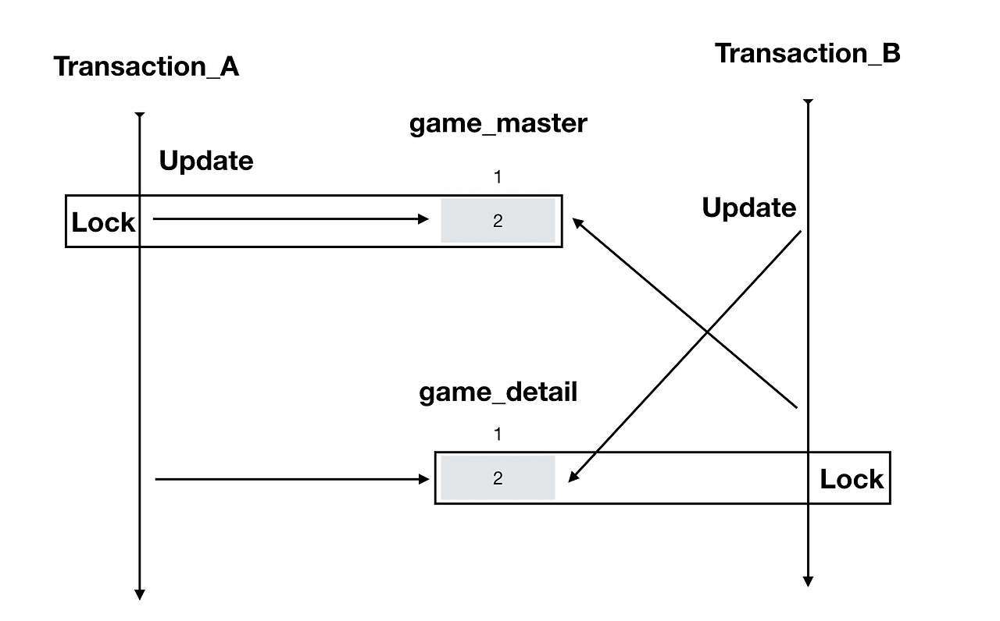
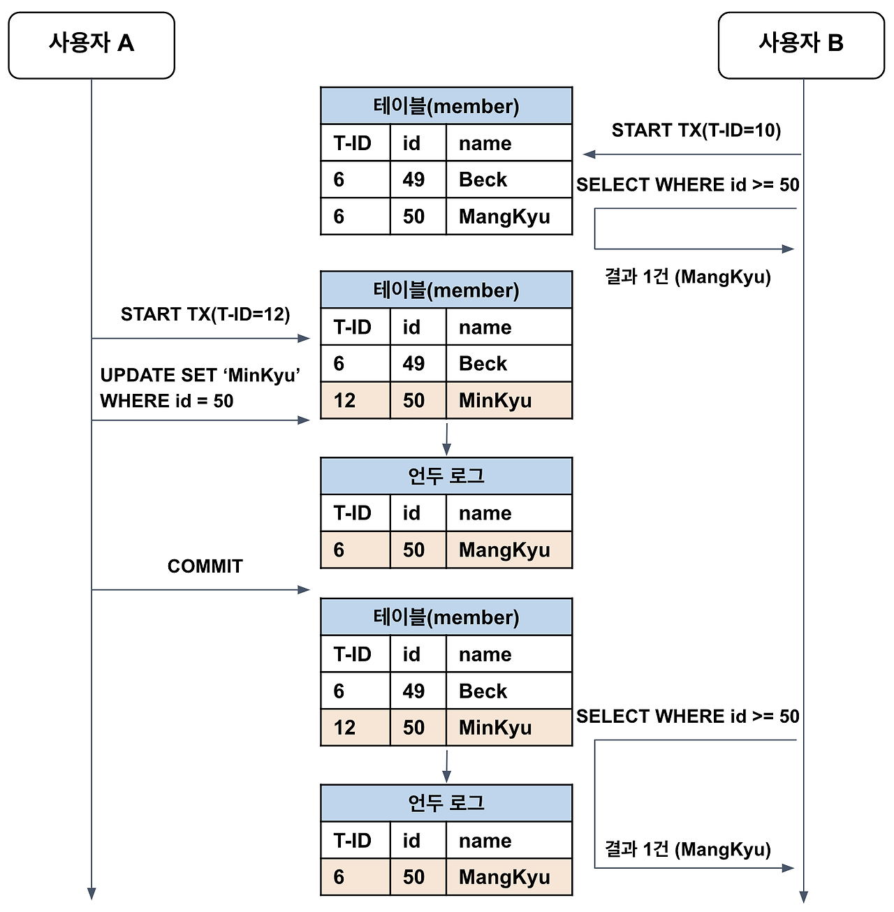
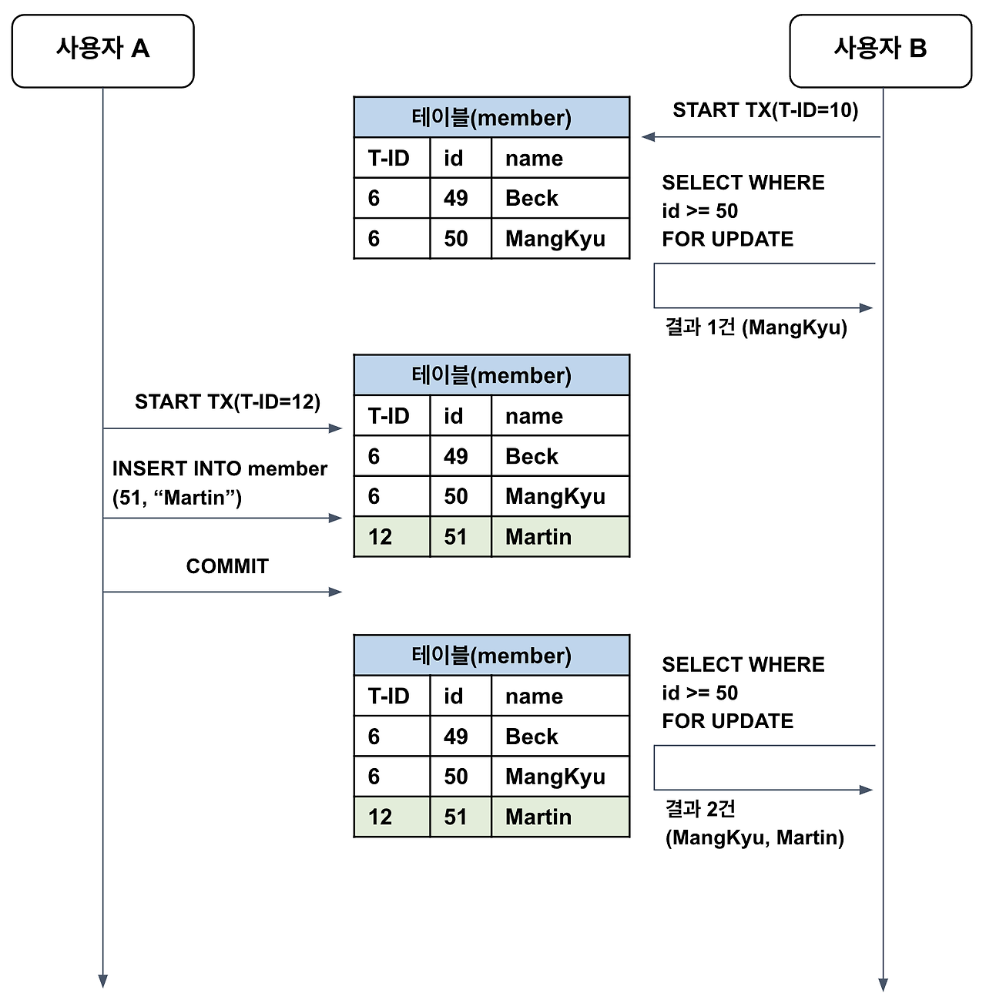
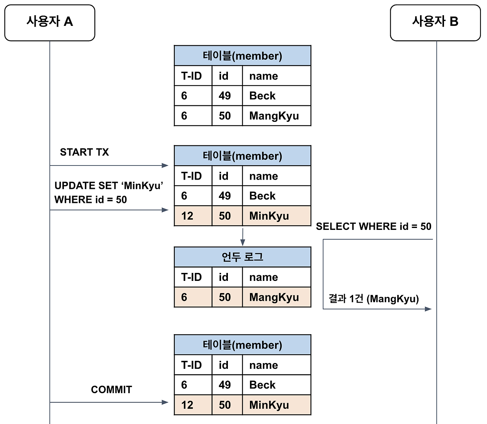
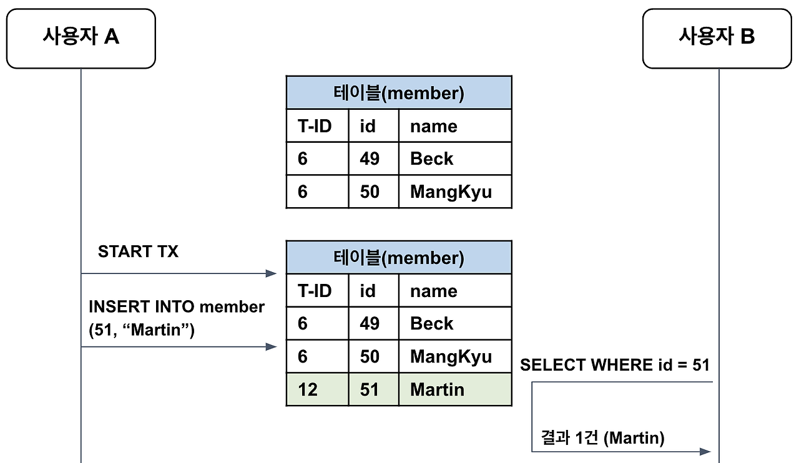
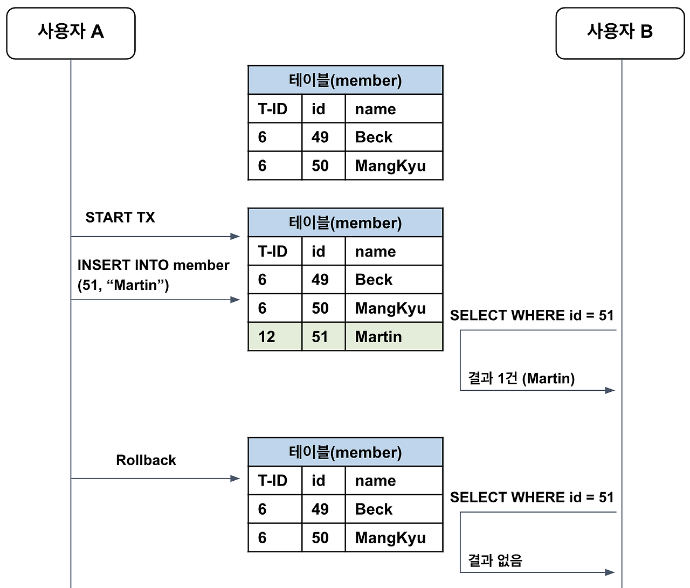

# 🕵️ 트랜잭션 DeadLock & Isolation Level

- [1️⃣ 교착상태 (Deadlock)](#1-교착상태-deadlock)
- [2️⃣ 격리 수준 (Isolation Level)](#2-격리-수준-isolation-level)

## 1️⃣ 교착상태 (Deadlock)

### ▶️ 개념

- 두 트랜잭션이 각각 Lock을 설정하고 다음 서로의 Lock에 접근하여 값을 얻어오려고 할 때 각각의 트랜잭션에 의해 Lock이 설정되어 있어 양쪽 트랜잭션 모두 영원히 처리가 되지않게 되는 상태

### ▶️ 발생원인

- 아래 4가지 중 하나라도 이루어지지 않으면 발생 X

#### 1. 상호 배제 (Mutual Exclusion)

- 각 트랜잭션에 대해 베타적인 제어권 존재
- 베타적 제어권: 한 트랜잭션이 자원을 독점하고 있어 다른 트랜잭션이 접근할 수 없음

#### 2. 소유와 대기 (Hold and Wait)

- 트랜잭션이 최소한 하나의 자원 보유와 동시에 다른 트랜잭션이 보유한 자원 기다림

#### 3. 비선점(No Preemption)

- 트랜잭션이 자원을 스스로 해제할 때까지 다른 트랜잭션이 해당 자원을 강제로 강탈 불가

#### 4. 순환 대기 (Circular wait)

- 트랜잭션들 사이에 순환형태의 대기 상태 존재

### ▶️ 탐지 및 해결방안

#### 1. 탐지

① Union & Find 알고리즘
  + 사이클이 존재하는지를 여부 파악하여 교착상태 발생 여부 파악 가능

② Wait-For 그래프
  + 데이터베이스의 트랜잭션과 자원 간의 의존성을 그래프로 표현
  + 각 트랜잭션 -> 노드, 자원을 기다리는 상태 -> 간선 표시
  + 그래프에 사이클(순환)이 존재하면 데드락 발생

③ 타임아웃 기반 탐지
  + 트랜잭션이 특정 시간 동안 자원을 획득하지 못하면 데드락이 발생했다고 판단

#### 2. 예방기법

- 각 트랜잭션이 실행되기 전에 필요한 데이터 모두 Locking
- 대상 데이터가 많아지면 트랜잭션 병행성이 낮아짐
- 일부 트랜잭션은 계쏙해서 처리를 못하게되는 기아 상태 발생

#### 3. 낙관적 병행 기법

- 트랜잭션이 실행되는 동안 아무런 검사를 하지 않음
- 트랜잭션이 다 실행된 이휴 검사를 하고 검사에 문제가 있다면 되돌림

#### 4. 회피 기법

- 자원을 할당할 때 시간 스탬프를 사용하여 교착상태가 되지 않도록 회피하는 방법

① Wait-Die 방식
  + 트랜잭션 i가 j에 의해 Locking된 데이터를 요청할 때
  + i가 먼저 들어온 트랜잭션인 경우에는 기다림
  + i가 나중에 들어온 트랜잭션이라면 포기하고 나중에 다시 요청

② Wound-Wait 방식
+ 트랜잭션 i가 j에 의해 Locking된 데이터를 요청할 때
+ i가 먼저 들어온 트랜잭션인 경우에는 데이터 선점
+ i가 나중에 들어온 트랜잭션이라면 기다림

### ▶️ 실제 예시

- https://notavoid.tistory.com/119

## 2️⃣ 격리 수준 (Isolation Level)

### ▶️ 개념 

- 동시에 여러 트랜잭션 처리 시 특정 트랜잭션이 다른 트랜잭션에서 변경/조회하는 데이터 접근 여부 결정
- READ UNCOMMITED (가장 낮은 격리 수준)
- READ COMMITED 
- REPEATABLE READ
- SERIALIZABLE (가장 엄격한 격리 수준)

### ▶️ SERIALIZABLE (가장 엄격한 격리 수준)

- 트랜잭션을 순차적으로 진행시킴
- 어떠한 데이터 부정합 문제 발생 X
- 동시 처리 성능이 매우 떨어짐
- 순수한 SELECT 작업에서도 읽기 잠금 (공유락)
- 타 트랜잭션에서 추가/수정/삭제 절대 불가
- 성능이 떨어져 극단적으로 안전이 필요한 작업이 아니면 사용 X

### ▶️ REPEATABLE READ

- MVCC 를 통해 한 트랜잭션 내에서 동일한 결과를 보장
- 새로운 레코드가 추가되는 경우에 부정합 발생 가능 -> 유령읽기 (Phantom Read) 

> [!NOTE]
> ## MVCC (Multi-Version Concurrency Control, 다중 버전 동시성 제어)
> * 일반적인 RDBMS -> 변경 전의 레코드를 UNDO 공간에 백업
> * 동일한 레코드에 대해 여러 버전의 데이터 존재
> * 트랜잭션 롤백 시 데ㅣ터 복원
> * 서로 다른 트랜잭션 간의 접근 세밀하게 제어
> * 백업 레코드 -> 어떤 트랜잭션에 의해 백업된건지 번호 함께 저장
> * 데이터 불필요 판단 => 주기적으로 백그라운드 쓰레드를 통해 삭제
> * 트랜잭션 번호 참고 -> 자신보다 먼저 실행된 트랜잭션의 데이터만을 조회

> [!NOTE]
> ## 유령 읽기(Phantom Read)
> * SELECT 로 조회하 경우 트랜잭션이 끝나지 전에 다른 트랜잭션에 의해 추가된 레코드 발견
> * MVCC 로 일반적인 조회에서는 발생 X
> * 잠금이 사용되는 경우 발생 O
> * MYSQL -> RDBMS와 다르게 특수한 갭락 존재
> * 단순 SELECT -> UNDO LOG에서 조회
> * SELECT FOR UPDATE | SELECT FOR SHARE -> 테이블에서 조회
>
> 
> * 갭락이 존재 X => id = 50인 레코드에만 잠금
> * MySQL -> id=50에 레코드 락 & 큰 범위에 갭 락으로 넥스트 키 락 => B의 트랜잭션이 끝날 때까지 기다림

### ▶️ READ COMMITED

- Commit된 데이터만 읽을 수 있는 격리 상태
- 대부분의 RDB에서 사용되고 있는 격리 수준
- 실제 테이블에서 값을 가져오지 X -> Undo 영역에 백업된 레코드에서 값을 가져옴
- Phantom Read, Non-Repeatable Read(반복 읽기 불가능) 문제 발생

> [!NOTE]
> ## 반복 읽기 불가능 (Non-Repeatable Read)
> * 반복 읽기 수행 시 다른 트랜잭셩의 커밋 여부에 따라 조회 결과가 달라질 수 있음
> * 하나의 트랜잭션에서 동일한 데이터를 여러번 읽고 변경하는 작업이 금전적인 처리와 연결되면 문제가 생길 수 있음
> * 
> 

### ▶️ READ UNCOMMITED (가장 낮은 격리 수준)

- 각 트랜잭션에서의 변경 내용을 Commit/Rollback 과 상관없이 읽을 수 있음
- 정합성에 문제가 많아 사용하지 않는 것을 권장
- Dirty Read, Non-Repeatable Read, Phantom Read 발생 가능
- Transaction 1에서 update 후 commit 되지 않은 상태를 Transaction2에서 read 가능
 

> [!NOTE]
> ## Dirty read (오손읽기)
> * 데이터가 조회되었다가 사라지는 현상 초래 
> * 

#### 출처
- https://velog.io/@flasharrow/트랜잭션의-이해와-Lock-해결-방법
- https://mangkyu.tistory.com/298
- https://blog.naver.com/ndb796/221243161017
- https://cladren123.tistory.com/264
- https://cochun-diary.tistory.com/100

