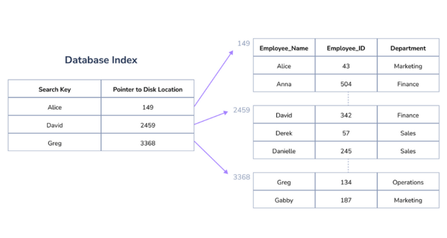
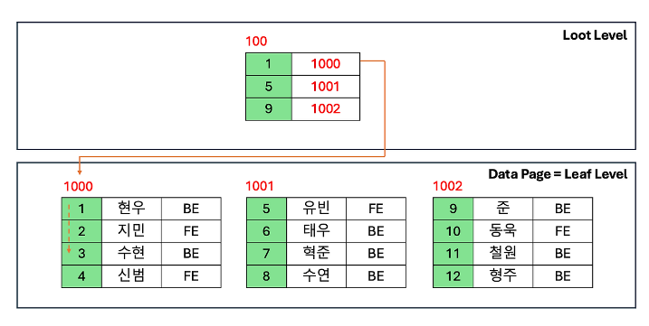
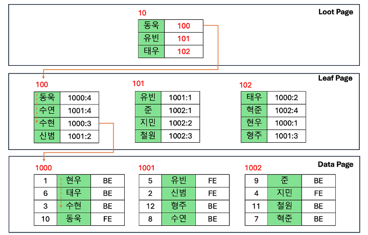

# 🧑🏻‍💻 Database Index 개념

---

- [✅ 인덱스(Index)란?](#-인덱스index란)
- [✅ 인덱스의 장점과 단점](#-인덱스의-장점과-단점)
- [✅ 인덱스 선정 기준: 어떤 컬럼에 걸어야 할까?](#-인덱스-선정-기준-어떤-컬럼에-걸어야-할까)
- [✅ 클러스터링 인덱스 vs 넌클러스터링 인덱스](#-클러스터링-인덱스-vs-넌클러스터링-인덱스)

 

## ✅ 인덱스(Index)란?

> [!NOTE]
> **인덱스는 데이터베이스 테이블의 검색 속도를 성능을 향상시키기 위한 '색인'이다.**
> 책의 맨 뒤에 있는 '찾아보기'가 단어와 페이지 번호를 연결해주는 것처럼, 인덱스는 
`{컬럼의 값: 해당 레코드가 저장된 주소}`를 키-값 쌍으로 저장하여 데이터 접근을 빠르게 한다.

 

## ✅ 인덱스의 장점과 단점

---

### 💡 장점
- **검색 효율성:** 테이블 전체를 읽는 `Full Table Scan`을 피하고, 데이터의 위치를 바로 찾아내어 응답 시간을 단축한다.
- **정렬/그룹화 최적화:** 인덱스는 이미 정렬된 상태이므로 `ORDER BY`나 `GROUP BY` 연산 시 추가적인 정렬 작업 없이 결과를 반환할 수 있다.

### 💡 단점
- **추가 저장 공간:** 데이터 페이지 외에 별도의 인덱스 페이지를 관리해야 하므로 DB 크기의 약 10% 공간이 더 필요하다.
- **쓰기 성능 저하:** `INSERT`, `UPDATE`, `DELETE`가 발생할 때마다 인덱스 구조를 실시간으로 재정렬하고 갱신해야 하므로 오버헤드가 발생한다.
- **관리의 복잡성:** 잘못 만든 인덱스는 오히려 성능을 저하시키며, 주기적으로 단편화(Fragmentation)를 제거해줘야 할 수도 있다.

 

## ✅ 인덱스 선정 기준: 어떤 컬럼에 걸어야 할까?

---

> [!IMPORTANT]
> 인덱스는 무조건 많이 만든다고 좋은 것이 아니다. 아래 4가지 요소를 고려하여 **'변별력이 높은'** 컬럼을 선택해야 한다.

1.  **카디널리티 (Cardinality):**
    - 중복된 값이 적고 고유한 값이 많을수록 좋다. (예: 주민번호 > 이름 > 성별)
2.  **선택도 (Selectivity):**
    - 특정 조건으로 조회했을 때 전체 데이터 중 몇 건이나 걸러지는가를 의미한다. 보통 **5~10% 이내**를 걸러낼 수 있을 때 인덱스가 가장 효율적이다.
3.  **수정 빈도:**
    - 데이터가 자주 변경되는 컬럼은 인덱스 갱신 비용이 크므로 지양한다.
4.  **활용도:**
    - `WHERE`, `JOIN`, `ORDER BY` 절에 자주 등장하는 컬럼이어야 한다.

 

## ✅ 클러스터링 인덱스 vs 넌클러스터링 인덱스

---

데이터가 물리적으로 어떻게 저장되느냐에 따라 크게 두 종류로 나뉜다.

### 1️⃣ 클러스터링 인덱스 (Clustered Index)

- **정의:** 테이블당 **단 하나**만 존재하며, 인덱스의 리프 노드가 곧 **실제 데이터 페이지**다.
- **특징:** PK(Primary Key)를 생성하면 자동으로 클러스터링 인덱스가 된다. 데이터 자체가 인덱스 순서로 정렬되어 저장된다.
- **장점:** 범위 검색(Range Scan)이 압도적으로 빠르다.

### 2️⃣ 넌클러스터링 인덱스 (Non-Clustered / Secondary Index)

- **정의:** 실제 데이터와 별도로 생성되는 인덱스 페이지다.
- **구조:** 리프 노드에 실제 데이터가 아닌, **데이터가 위치한 주소(RID)나 PK값**을 가지고 있다.
- **비유:** 책 본문은 그대로 있고, 뒤에 별도로 붙은 '찾아보기' 페이지와 같다.

> [!IMPORTANT]
> **Clustered Index VS Non-Clustered Index**
> - `Clustered Index`는 Data가 정렬되어 있기 때문에 Read 성능은 빠르지만, Insert/Update/Delete 작업에 있어서는 정렬로 인한 데이터의 이동이 있어 느림.
> - `Non-Clustered Index`는 Data를 정렬하지 않기 때문에 Insert/Update/Delete 영향이 덜 하지만, 실제 Data에 접근해야하기 때문에 Read 성능이 떨어짐. 추가로, 인덱스를 관리하기 위한 Data의 약 10%에 해당하는 저장공간을 차지함.

 

**참고 자료**
- [인덱스](https://velog.io/@c-on/인덱스)
- [[Database] DB Index에 대하여](https://velog.io/@bagt/DB-Index에-대하여)
- [효과적인 DB index 설정하기](https://velog.io/@jwpark06/%ED%9A%A8%EA%B3%BC%EC%A0%81%EC%9D%B8-DB-index-%EC%84%A4%EC%A0%95%ED%95%98%EA%B8%B0)
- [Clustered Index 와 Non-Clustered Index](https://uhanuu.tistory.com/entry/Clustered-Index-%EC%99%80-Non-Clustered-Index)
- [[SQL] Clustered Index & Non-Clustered Index](https://velog.io/@gillog/SQL-Clustered-Index-Non-Clustered-Index)