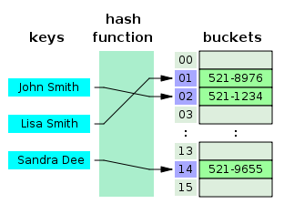
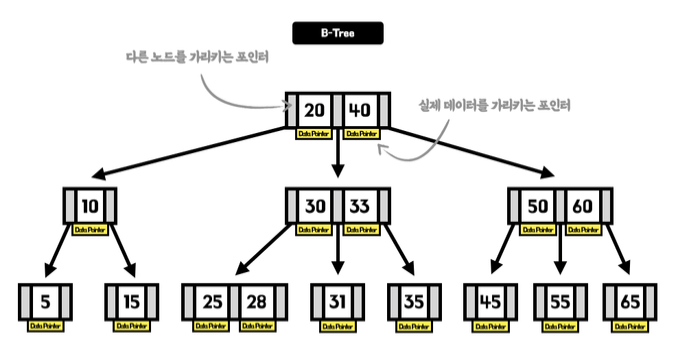
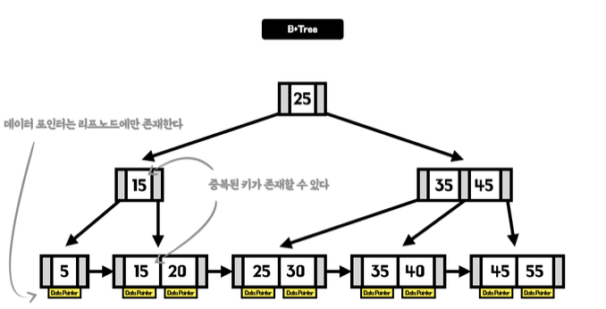

# 🧑🏻‍💻 Index Structures

---

- [✅ 인덱스의 자료구조 종류](#-인덱스의-자료구조-종류)
- [✅ B-Tree vs B+ Tree 상세 비교](#-b-tree-vs-b-tree-상세-비교)
- [✅ 왜 Hash Table이 아닌 B+ Tree를 사용하는가?](#-왜-hash-table이-아닌-b-tree를-사용하는가)

 

## ✅ 인덱스의 자료구조 종류

---

#### 1️⃣ Hash Table

- **방식:** 해시 함수를 이용해 키값을 주소로 변환하여 접근
- **시간 복잡도:** $O(1)$로 가장 빠르다.
- **한계:** 데이터가 정렬되어 있지 않으므로 **범위 검색(`BETWEEN`, `>`, `<`)**이나 **부분 일치 검색(`LIKE`)**이 불가능하다.

#### 2️⃣ B-Tree

- **방식:** 모든 리프 노드가 같은 깊이를 유지하며 균형을 잡는 트리
- **구조:** 루트, 브랜치, 리프 모든 노드에 `Key`와 `Data(Value)`를 함께 저장한다.
- **특징:** 어떤 노드에서든 데이터를 바로 찾을 수 있지만, 모든 데이터를 훑으려면 트리 전체를 순회해야 한다.

#### 3️⃣ B+ Tree

- **방식:** 현대 DB 인덱스의 표준
- **구조:** `리프 노드에만 실제 데이터`를 저장하고, 중간 노드들은 가이드(Key) 역할만 한다.
  - 리프 노드끼리 **Linked List**로 연결되어 있다.

 

## ✅ 왜 Hash Table이 아닌 B+ Tree를 사용하는가?

---

> [!IMPORTANT]
> **해시 테이블이 인덱스로 사용되기 힘든 결정적 이유: 정렬의 부재**

#### 1️⃣ Hash Table
- **작동 원리:** 해시 함수를 통해 데이터의 위치를 즉시 계산 ($O(1)$).
- **범위 검색 ($WHERE \ age > 20$):** - 해시 함수는 값이 20인 데이터와 21인 데이터가 물리적으로 전혀 다른 곳에 있게 만든다. 
    - 따라서 특정 범위의 데이터를 찾으려면 모든 해시 버킷을 다 뒤져야 하는 **Full Scan ($O(N)$)**이 발생한다.
- **정렬:** 데이터가 무작위로 흩어져 저장되므로 `ORDER BY` 연산을 수행할 수 없다.

#### 2️⃣ B-Tree / B+ Tree
- **작동 원리:** 노드 내의 키값들이 항상 정렬된 상태를 유지한다 ($O(\log N)$).
- **범위 검색:** - 트리의 구조를 이용해 시작점(예: age=20)을 빠르게 찾은 뒤, 그 지점부터 순차적으로 데이터를 읽으면 된다.

 

### 💡 B-Tree vs B+ Tree: 결정적 차이

> [!NOTE]
> B-Tree도 범위 검색이 가능은 하지만, 왜 굳이 **B+ Tree**를 표준으로 사용할까?

#### 1️⃣ 범위 스캔(Range Scan)의 압도적 효율성
- **B-Tree:** 특정 범위를 읽으려면 트리를 위아래로 계속 왔다 갔다 하는 `중위 순회(In-order Traversal)`를 해야 한다. 이 과정에서 노드를 여러 번 재방문하므로 성능이 떨어진다.
- **B+ Tree:** 리프 노드들이 `Double Linked List`로 연결되어 있다. 시작점 하나만 찾으면, 트리를 다시 올라갈 필요 없이 리프 노드 레벨에서 옆으로 쭉 읽기만 하면 된다.

#### 2️⃣ 모든 데이터의 일관된 탐색 시간
- **B-Tree:** 루트나 중간 노드에서 데이터를 찾으면 바로 반환하므로 탐색 시간이 일정하지 않다.
- **B+ Tree:** 실제 데이터는 무조건 최하단 리프 노드에만 있다. 따라서 어떤 데이터를 찾든 항상 리프까지 내려가야 하므로 탐색 시간이 **일정($O(\log N)$)**하며 서비스 예측 가능성이 높다.

> [!TIP]
> #### Database에서 Hash Table의 사용
> - Index로는 사용되지 않지만, Join의 경우 사용 됨.
> - 컬럼의 Index가 없고, `=` 연산자로 Join을 하게 될 경우, 적은 데이터의 테이블을 메모리에 Hash Table로 올려놓고, HashJoin을 사용하는데, 이 때 Index가 없는 NL보다 평균적으로 빠르게 조회가 가능함.

 

**참고 자료**
- [[DB] 인덱스(Index) - 개념, 장단점, 인덱스의 자료구조](https://beautiflow.tistory.com/131)
- [[Database] DB Index에 대하여](https://minyakk.tistory.com/58)
- [데이터베이스 인덱스 (1) - 인덱스와 인덱싱 알고리즘 (hash table, b-tree, b+tree)](https://hudi.blog/db-index-and-indexing-algorithms/#%ED%95%B4%EC%8B%9C-%ED%85%8C%EC%9D%B4%EB%B8%94Hash-Table)
- [[DB] 인덱스에서 B+Tree를 사용하는 이유](https://munak.tistory.com/182)
- [DataBase Index에서 기본적으로 HashTable이 아닌 B-Tree를 쓰는 이유](https://foot-develop.tistory.com/56#google_vignette)