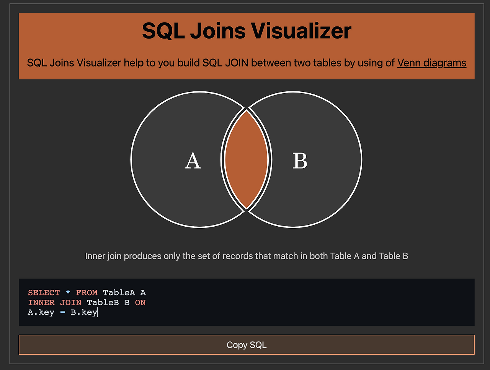
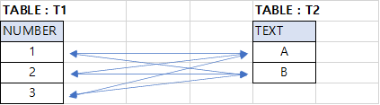
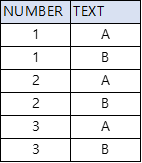
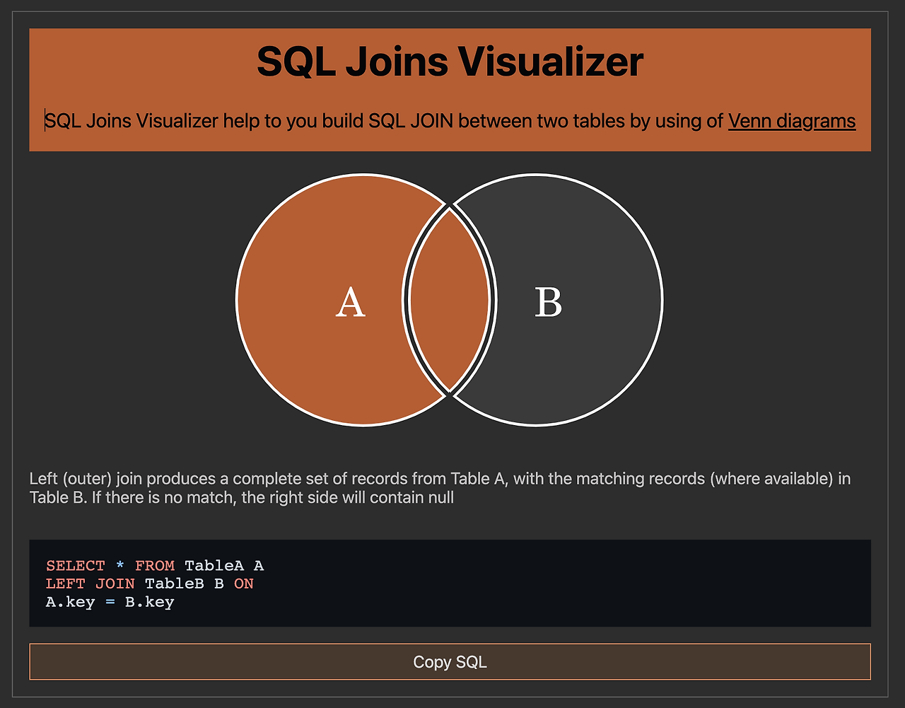
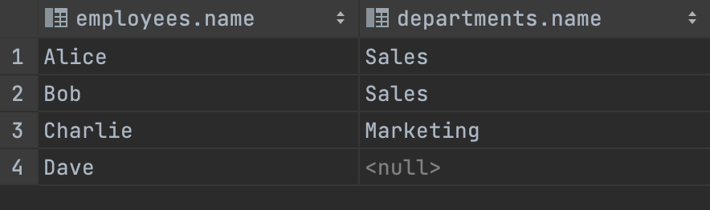
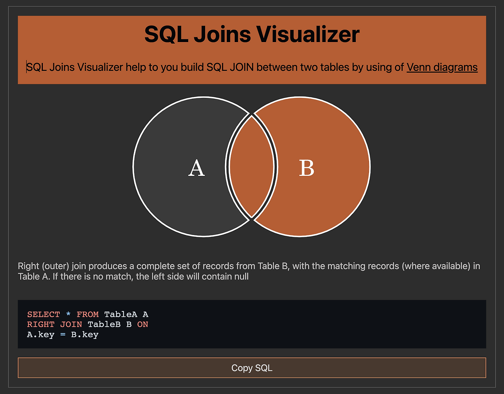
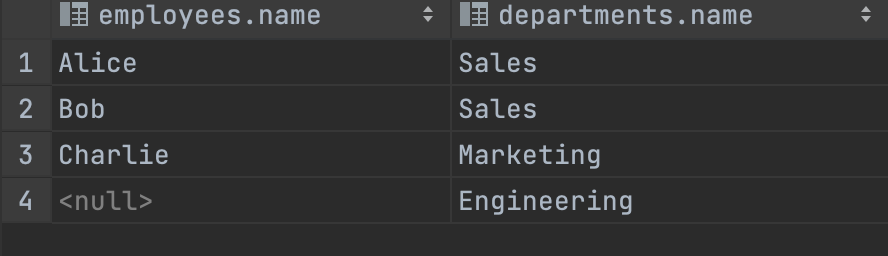
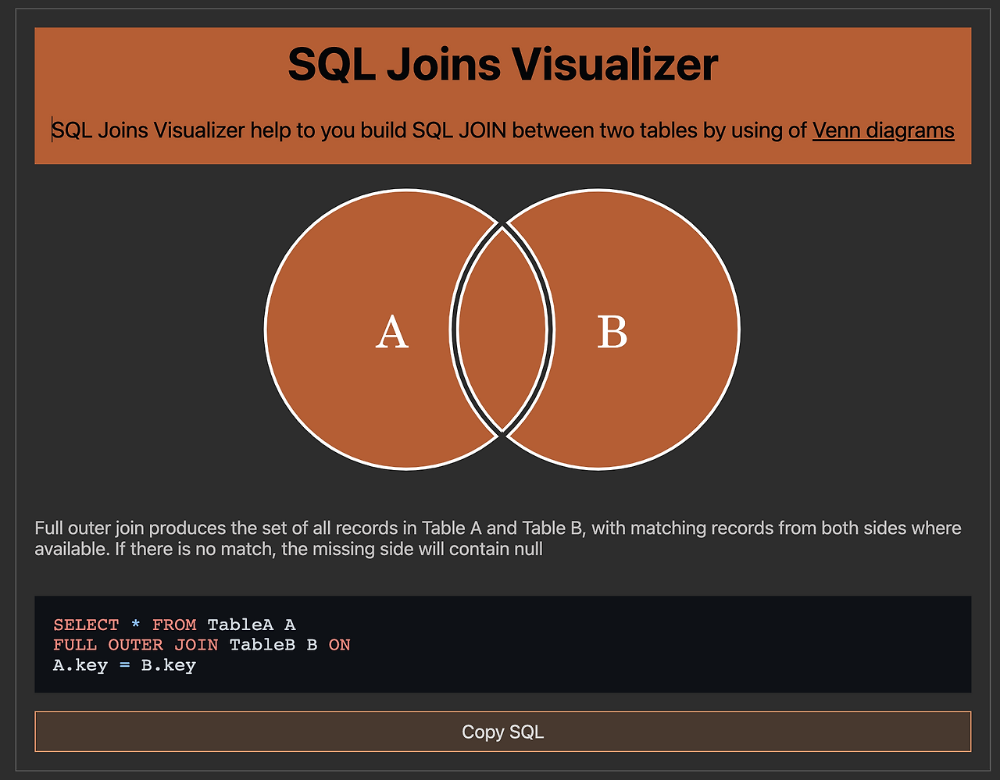
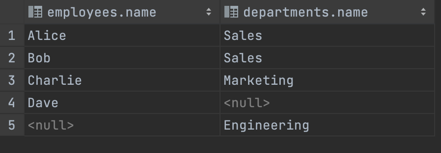

# 🧑🏻‍💻 조인

---

- [✅ 내부 조인(INNER JOIN)](#-내부-조인inner-join)
  - [💡 SELF INNER JOIN](#-self-inner-join)
  - [💡 CROSS INNER JOIN](#-cross-inner-join)
- [✅ 외부 조인(OUTER JOIN)](#-외부-조인outer-join)
  - [💡 LEFT OUTER JOIN](#-left-outer-join)
  - [💡 RIGHT OUTER JOIN](#-right-outer-join)
  - [💡 FULL OUTER JOIN](#-full-outer-join)
- [✅ Join 알고리즘](#-join-알고리즘)

> [!NOTE]
> Join이란?  
> - 데이터베이스에서 **'두 개 이상의 테이블'을 연결하여 '하나의 결과의 테이블'로 만드는 것**을 의미하며, 이를 통해 데이터를 효율적으로 검색하고 처리하는 데 도움을 준다.
> -  JOIN을 사용하는 이유는 데이터베이스에서 테이블을 분리하여 **'데이터 중복을 최소화'하고 '데이터의 일관성'을 유지**하기 위함이다.

<br>

> [!TIP]
> - ANSI JOIN 방식이란?
>   - ANSI JOIN은 ANSI SQL 표준에 따라 작성된 코드를 의미하며 데이터베이스 테이블 간의 관계를 맺는 방법 중 하나로 다양한 데이터베이스 관리 시스템에서 동일하게 작동한다.  
>     이를 통해 코드의 이식성을 높일 수 있다.
>   - ANSI JOIN은 INNER JOIN, LEFT JOIN, RIGHT JOIN, FULL OUTER JOIN과 같은 다양한 JOIN 유형을 지원한다.
>   - Non ANSI JOIN은 `,`를 통해 테이블을 나열하고 `WHERE`절안에 조건절로 조인을 작성하는 방식이다.  
> - ANSI SQL 표준이란?
>   - ANSI SQL(미국 국립표준협회 SQL)에서 SQL(Structured Query Language)을 표준화한 표준 규격이다.
> - (+) 기호
>   - Oracle DB에서 사용되는 구식 조인 문법이다.
>   - LEFT JOIN일 경우 왼쪽에 (+) 기호를, RIGHT JOIN일 경우 오른쪽에 (+) 기호가 붙는다.

<br>

## ✅ 내부 조인(INNER JOIN)

---

> [!IMPORTANT]
> INNER JOIN이란?  
> ➡️ 두 테이블에서 '공통된 값'을 가지고 있는 행들만 반환한다.



```mysql
-- INNER JOIN
SELECT employees.name, departments.name
FROM employees
INNER JOIN departments
ON employees.department_id = departments.id;
```

<br>

### 💡 SELF INNER JOIN

---

> [!NOTE]
> Self Inner Join이란?  
> - 하나의 테이블 내에서 다른 열을 참조하기 위해 사용하는 '자기 자신과의 조인' 방법이다.
> - 이를 통해 데이터베이스에서 한 테이블 내의 레코드를 다른 레코드와 연결할 수 있다.

```mysql
SELECT 테이블1.열, 테이블2.열
FROM 테이블1 t1
JOIN 테이블1 t2
ON 테이블1.열 = 테이블2.열;
```

<br>

### 💡 CROSS INNER JOIN

---

> [!NOTE]
> Cross Inner Join이란?
> - **두 개 이상의 테이블에서 '모든 가능한 조합'을 만들어 결과를 반환하는 조인 방법**이다.
>   - 이를 통해 두 개 이상의 테이블을 조합하여 새로운 테이블을 생성할 수 있다.
> - Cross Join은 일반적으로 테이블 간의 관계가 없을 때 사용된다.
>   - 각 행의 모든 가능한 조합을 만들기 때문에 결과가 매우 큰 테이블이 될 수 있으므로 사용에 주의가 필요하다.

<br>

> [!TIP]
> Cross Join이 필요한 경우는 많지 않지만, 튜닝이나 리포트를 위해 고의적으로 사용하는 경우가 있다.


```mysql
-- CROSS JOIN 예시
SELECT *
FROM T1 CROSS JOIN T2;
```


<br>

## ✅ 외부 조인(OUTER JOIN)

---

> [!NOTE]
> OUTER JOIN이란?
> - Outer Join은 **두 테이블에서 '공통된 값을 가지지 않는 행들'도 반환**한다.
> - Left Join, Right Join, Full Join의 종류가 있다.

<br>

### 💡 LEFT OUTER JOIN

---

> [!NOTE]
> LEFT JOIN이란?
> - **'왼쪽 테이블의 모든 행'과 '오른쪽 테이블에서 왼쪽 테이블과 공통된 값'을 가지고 있는 행들을 반환**한다.
> - 만약 오른쪽 테이블에서 공통된 값을 가지고 있는 행이 없다면 NULL 값을 반환한다.



```mysql
-- LEFT JOIN
SELECT employees.name, departments.name
FROM employees
LEFT JOIN departments
ON employees.department_id = departments.id;
```



> [!TIP]
> 통상적으로 'Left Join'을 'Right Join'보다 더 많이 사용한다.  
> 대부분의 경우 **왼쪽 테이블의 데이터를 중심으로 분석하고자할 때가 많기 때문**이다.

<br>

### 💡 RIGHT OUTER JOIN

---

> [!NOTE]
> RIGHT JOIN이란?
> - Left Join과 반대로 **'오른쪽 테이블의 모든 행'과 '왼쪽 테이블에서 오른쪽 테이블과 공통된 값'을 가지고 있는 행들을 반환**한다.
> - 만약 왼쪽 테이블에서 공통된 값을 가지고 있는 행이 없다면 NULL 값을 반환한다.




```mysql
-- RIGTH JOIN
SELECT employees.name, departments.name
FROM employees
RIGHT JOIN  departments
ON employees.department_id = departments.id;
```


<br>

### 💡 FULL OUTER JOIN

---

> [!NOTE]
> FULL OUTER JOIN이란?
> - **두 테이블에서 '모든 값'을 반환**한다.
> - 만약 공통된 값을 가지고 있지 않는 행이 있다면 NULL 값을 반환한다.


```mysql
-- FULL JOIN
SELECT employees.name, departments.name
FROM employees
FULL JOIN departments
ON employees.department_id = departments.id;
```


<br>

## ✅ Join 알고리즘

---

### 💡 Nested Loop Join

---

> [!NOTE]
> - 하나의 테이블을 루프하면서 다른 테이블을 루프하며 두 테이블의 조인 조건이 맞는지 확인하는 중첩 반복문 구조다.
>   - 두 테이블 중 작은 테이블을 먼저 루프하고, 큰 테이블을 뒤에 루프하면 효율적이다.
> - 데이터 양이 많을 경우 혹은 Index가 없는 경우 효율이 좋지 않다.

<br>

### 💡 Sort Merge Join

---

> [!NOTE]
> - 두 테이블을 각각 정렬한 다음 조인하는 알고리즘이다.
>   - 양쪽 포인터를 이동해가며 조인을 한다.
>   - 정렬된 데이터를 이용하기 때문에 Nested Loop Join보다는 빠른 속도를 보인다.
> - 하지만 정렬에 대한 비용이 추가되므로, 조인할 데이터의 크기가 작을 경우에는 Nested Loop Join이 더 빠를 수 있다.
> - 결합 키가 정렬되어 있는 상태(인덱스)라면 정렬을 생략하기도 한다.

<br>

### 💡 Hash Join

---

> [!NOTE]
> - 두 테이블을 Hash Table로 변환한 다음에 조인하는 알고리즘이다.
> - Hash Table을 이용하기 때문에 매우 빠른 속도를 보인다.
> - 하지만 Hash Table을 만드는 데에 메모리가 많이 필요하며, 조인할 데이터의 크기가 클 경우에는 디스크 I/O가 많아져 성능이 떨어질 수 있다.
> - 대규모 데이터 셋에서 Index가 없을 때, 메모리에 Hash Table을 생성할 수 있는 충분한 자원이 있을 때 적합하다.


<br>

**출처**
- [[DB/Postgres] 조인(JOIN) 이해하기 : 내부/외부 조인, UNION/UNION ALL](https://adjh54.tistory.com/155)
- [🚀 DB JOIN 정리 (INNER/LEFT/RIGHT/OUTER)](https://pearlluck.tistory.com/46)
- [sql Join 알고리즘에 대해 알아보자](https://developbear.tistory.com/126)
- [Join 알고리즘 및 Index 활용 개념](https://velog.io/@dobecom/Join-%EC%95%8C%EA%B3%A0%EB%A6%AC%EC%A6%98-%EB%B0%8F-Index-%ED%99%9C%EC%9A%A9-%EA%B0%9C%EB%85%90)
