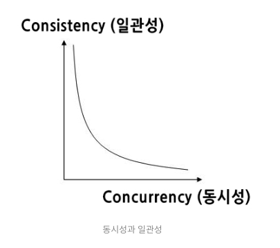

# 🕵️ 트랜잭션 Lock

- [1️⃣ 동시성 제어 ](#1-동시성-제어-)
- [2️⃣ Lock ](#2-lock-)

## 1️⃣ 동시성 제어 

> [!NOTE]
> ## 트랜잭션
> * 데이터베이스의 상태를 변경시키기 위해 수행하는 작업 단위
> * 한꺼번에 수행되어야할 일련의 연산들
> * ACID 특성 → 데이터 일관성과 성능 사이의 적절한 균형 

<b> => 적절한 격리성(isolation) 수준 설정 필요 → 동시성 제어 </b>

### ▶️ 개념 

- 동시에 실행되는 트랜잭션 수 최대화 / 동시에 데이터 일관성 보장
- 동시성 - 일관성 => 트레이드오프 관계

### ▶️ 낙관적 동시성 제어 (Optimistic Concurrency Control)

- 동일 데이터 동시 수정 X 가정 (낙관적)
- 트랜잭션이 데이터를 읽는 시점에 락 설정 X
- 트랜잭션이 데이터를 실제로 수정할 때, 데이터가 자신이 읽은 후에 변경되었는지 확인
- 데이터 충돌이 드믄 경우에 효율적
- 대기시간 줄일 수 있음

### ▶️ 비관적 동시성 제어 (Pessimistic Concurrency Control)

- 동일 데이터 동시 수정 O 가정 (비관적)
- 특정 데이터에 대한 작업 시작 시 바로 락 설정
- 작업 완료 후 락 해제까지 타 트랜잭션은 접근 불가
- 데이터 일관성 높음
- 여러 트랜잭션이 동일 데이터 접근 시 대기시간 증가

## 2️⃣ Lock 

### ▶️ 개념 

- 특정 작업을 수행하는 동안 다른 트랜잭션의 접근으로부터 보호하는 방법
- 데이터 일관성 보장
- 동시에 수행되는 여러 트랜잭션 간의 충돌 방지
- 일반적인 트랜잭션이 걸린 Lock -> commit | rollback 될 때 Unlock

### ▶️ 종류
#### 1. 공유락 (Shared Lock)

- 여러 트랜잭션이 동시에 같은 데이터를 읽기 O, 쓰기 X
- 한 트랜잭션이 읽는 동안 다른 트랜잭션은 쓰기 불가
- 공유락끼리는 동시에 접근 가능
- 공유락이 설정된 데이터는 베타락을 사용할 수 없음

#### 2. 베타적 락 (Exclusive Lock)

- 한 트랜잭션만이 데이터 읽기, 쓰기 가능
- 락 해제 시까지 다른 트랜잭션 접근 차단
- 비관적 동시성 제어에서 베타적 락 설정

> [!NOTE]
> ## 블로킹 (Blocking)
> * Lock (베타-베타, 베타-공유)의 경합이 발생하여 특정 트랜잭션이 작업을 진행하지 못하고 멈춰선 상태
> * 공유락 끼리는 블로킹 발생 X
> * 블로킹 해소 -> 이전의 트랜잭션 완료 필요
> * 성능에 좋지 않은 영향 -> 최소화 필요
> * 방안
>   + 한 트랜잭션의 길이를 너무 길게 하지 말 것
>   + 설계 시 데이터를 갱신하는 트랜잭션 동시 수행 X
>   + 트랜잭션 격리성 수준을 불필요하게 상향 조정 X
>   + 쿼리를 오랜시간 잡아두지 않도록 튜닝 진행

### ▶️ 설정 범위

#### 1. 데이터베이스
 - 전체 데이터베이스를 기준으로 럭
 - 1개의 세션만이 DB의 데이터에 접근 가능
 - 일반적으로 사용 X
 - 주요 DB 업데이트에 사용

#### 2. 파일

- 테이블, row 등과 같은 실제 데이터가 쓰여지는 물리적인 저장소
- 잘 사용되지 않음

#### 3. 테이블

- 테이블을 기준으로 락 설정
- 전체 테이블에 영향을 주는 변경 수행 시 유용
- DDL과 함께 사용됨

#### 4. 페이지와 블럭

- 파일의 일부인 페이지와 블록을 기준으로 락
- 잘 사용 X

#### 5. 컬럼

- 컬럼 가준 락
- 락 설정 및 해제의 리소스가 많이 들기 때문에 일반적으로 사용 X

#### 6. 행 (Row)

- 1개의 행을 기준으로 락
- DML에 대한 락으로 가장 일반적으로 사용함

