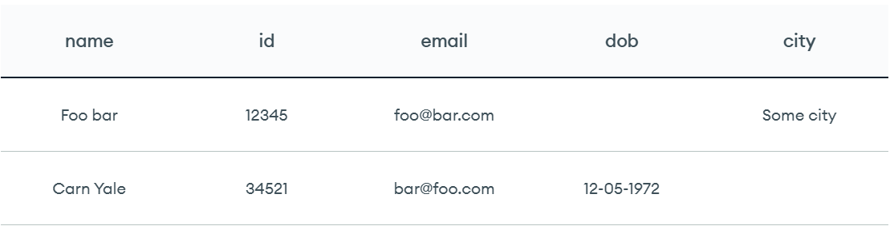
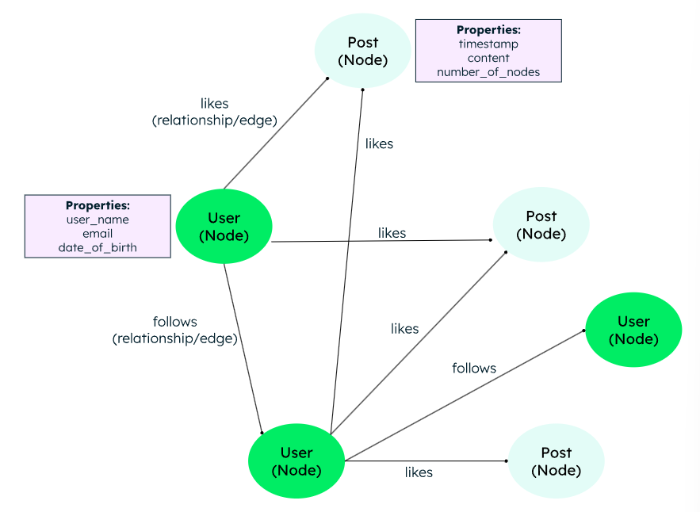

# 🧑🏻‍💻 NoSQL


- [✅ NoSQL의 등장 배경과 개념](#-nosql의-등장-배경과-개념)
- [✅ RDBMS vs NoSQL 차이점](#-rdbms-vs-nosql-차이점)
- [✅ NoSQL의 주요 유형](#-nosql의-주요-유형)
- [✅ CAP 정리와 BASE](#-cap-정리와-base)

<br>

## ✅ NoSQL의 등장 배경과 개념

> [!NOTE]
> **NoSQL이란?**
> - 전통적인 관계형 데이터베이스(RDBMS)의 한계를 극복하기 위해 등장한, 데이터 간의 관계를 정의하지 않는 비관계형 데이터베이스다.
> - 초고용량 데이터 처리와 **수평적 확장(Scale-out)**에 최적화되어 있다.


<br>

## ✅ RDBMS vs NoSQL 차이점


| 구분 | RDBMS (Relational) | NoSQL (Non-Relational) |
| :--- | :--- | :--- |
| **데이터 모델링** | 유형(키-값, 문서, 그래프 등)에 따라 달라지며, 반/비정형에 적합 | 행과 열로 구성된 표 형식, 구조화된 정형에 적합 |
| **스키마** | 고정된 스키마 (Table) | 유연한 스키마 (Key-Value, Doc 등) |
| **쿼리 언어** | SQL | 데이터 모델에 따른 다양한 API |
| **확장 방식** | 수직적 확장 (Scale-up) | 수직 및 수평적 확장 (Scale-out) |
| **데이터 관계** | 외래키로 정의 및 Join 사용 | 중첩 구조, 명시적/암묵적 |
| **트랜잭션 유형** | 강력한 ACID 보장 | BASE (유연한 일관성) |
| **성능** | 실시간 처리 / 빅데이터 분석 및 분산 환경 | 읽기 위주의 작업 및 트랜잭션 중심 워크로드 |
| **주요 사례** | MySQL, PostgreSQL, Oracle | MongoDB, Redis, Cassandra |

<br>

## ✅ NoSQL의 주요 유형


### 💡 1. Key-Value Store
키-값 저장소는 각 항목이 키와 값으로 이루어진 단순한 유형의 데이터베이스입니다. 각 키는 고유하며, 하나의 값과만 연결됩니다.
- **특징:** 가장 단순한 구조. Key를 통해 Value를 즉시 탐색. 메모리에 데이터를 저장하기 때문에 읽기 및 쓰기 성능 우수.
- **용도:** 세션 관리, 캐싱, 단순한 설정값 저장.
- **예시:** **Redis**, Riak.
- ```JSON
  Key : user:12345
  Value : {"name" : "foo bar", "email" : "foo@bar.com", "designation" : "software developer"}
  ```

### 💡 2. Document Store
문서 지향 데이터베이스는 JSON 객체와 유사한 문서 형태로 데이터를 저장합니다. 각 문서는 필드와 값의 쌍을 포함하고, 값은 일반적으로 문자역, 숫자, 불리언, 배열 또은 기타 객체를 비롯한 다양한 유형일 수 있습니다. 
- **특징:** 데이터를 JSON, BSON 포맷의 문서 형태로 저장. 스키마가 자유로움. 반정형 데이터나 비정형 데이터 집합에 적합. 중첩된 구조를 지원.
- **용도:** 콘텐츠 관리, 실시간 분석, 데이터 구조가 자주 변하는 서비스.
- **예시:** **MongoDB**, CouchDB.
- ```JSON
  {
    "_id": "12345",
    "name": "foo bar",
    "email": "foo@bar.com",
    "address": {
                "street": "123 foo street",
                "city": "some city",
                "state": "some state",
                "zip": "123456"
                },
    "hobbies": ["music", "guitar", "reading"]
  }
  ```

### 💡 3. Column-family Store (Wide Column)
와이드 컬럼 저장소는 테이블, 행, 그리고 동적으로 구성되는 컬럼에 데이터를 저장합니다. 기존 SQL DB와 달리 와이드 컬럼 저장소는 서로 다른 행마다 서로 다른 컬럼 집합을 가질 수 있을 정도로 구조가 유연합니다.
- **특징:** 행마다 다른 컬럼을 가질 수 있으며, 대량의 데이터를 압축 저장하는 데 유리하다. 희소하면서도 폭이 넓은 데이터를 효율적으로 조회.
- **용도:** 로그 데이터, 센서 데이터, 거대 데이터 집계.
- **예시:** **Apache Cassandra**, HBase.
- 

### 💡 4. Graph Store
그래프 데이터베이스는 노드와 엣지 형태로 데이터를 저장합니다.이러한 데이터베이스는 관계나 패턴이 처음에는 명확하지 않을 수 있는 고도로 연결된 데이터에 적합합니다.
- **특징:** 노드(Node)와 간선(Edge)으로 데이터 간의 관계를 표현한다.
- **용도:** 소셜 네트워크 서비스(SNS), 추천 엔진, 복잡한 연결 분석.
- **예시:** Neo4j, Amazon Neptune, AllegroGraph.
- 

<br>

## ✅ CAP 정리와 BASE

### 💡 BASE (NoSQL의 철학)
RDBMS의 ACID와 대비되는 개념이다.
- **Basically Available:** 언제든 접근 가능. 시스템이 부분적인 장애(예: 노드 손실)를 허용할 수 있는 능력.
- **Soft state:** 시스템이 시간 경과에 따라 자동으로 일관성을 회복하기 전에 일시적인 불일치를 허용함.
- **Eventual Consistency:** 결과적으로는 모든 노드의 데이터가 일치.

### 💡 CAP 정리
NoSQL을 선택할 때 고려해야 하는 세 가지 특성이다. (보통 두 가지만 완벽히 만족 가능)
1. **Consistency (일관성):** 모든 노드가 동시에 같은 데이터를 보여줘야 함.
2. **Availability (가용성):** 일부 노드가 장애가 나도 서비스는 계속되어야 함.
3. **Partition Tolerance (분할 내성):** 노드 간 통신 단절이 발생해도 시스템이 동작해야 함.

<br>

**출처**
- [NoSQL Databases Explained - MongoDB](https://www.mongodb.com/nosql-explained)
- [CAP Theorem - Wikipedia](https://en.wikipedia.org/wiki/CAP_theorem)