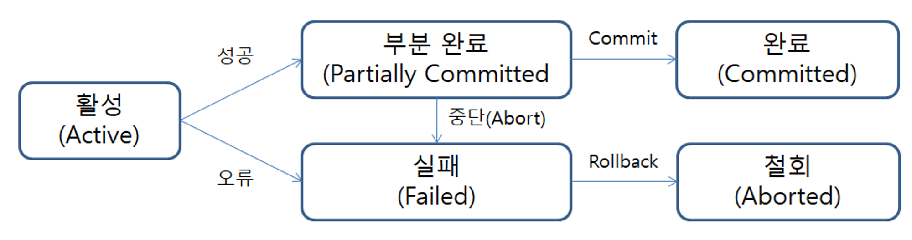
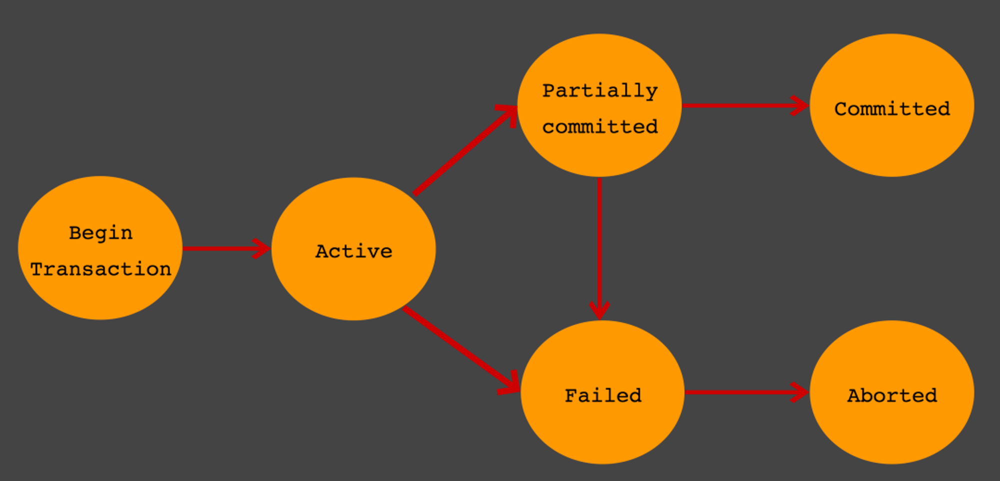

# 🧑🏻‍💻 트랜잭션

---

- [✅ 트랜잭션의 주요 특성](#-트랜잭션의-주요-특성)
- [✅ 트랜잭션의 연산](#-트랜잭션의-연산)
- [✅ 트랜잭션의 상태](#-트랜잭션의-상태)

> [!NOTE]
> - 트랜잭션(Transaction)이란, 데이터베이스 시스템에서 **하나의 논리적 기능을 정상적으로 수행하기 위한 작업의 기본 단위**를 뜻한다.  
> - 트랜잭션은 작업의 완전성을 보장해주는 것이다.  
> - 논리적인 작업 셋을 모두 완벽하게 처리하거나, 처리하지 못할 경우에는 원 상태로 복구해서 작업의 일부만 적용회든 현상(Partial Update)이 발생하지 않게 만들어주는 기능히다.
> - 트랜잭션은 꼭 여러 개의 변경 작업을 수행하는 쿼리가 조합됐을 때만 의미있는 개념이 아니고, 논리적인 작업 셋 자체가 100% 적용되거나(COMMIT을 실행했을 때), 아무것도 적용되지 않아야 함(ROLLBACK 또는 ROLLBACK시키는 오류가 발생했을 때)을 보장해주는 것이다.

<br>

> [!TIP]
> 게시판을 예로 들어보자.  
> - 게시판 사용자는 게시글을 작성하고, 올리기 버튼을 누른다.
> - 그 후 다시 게시판에 들어왔을 때, 게시판은 자신의 글이 포함된 업데이트된 게시판을 보게 된다.
> - 사용자가 올리기 버튼을 눌렀을 때, INSERT문을 사용하여 사용자가 입력한 게시글의 데이터를 옮긴다.
> - 그 후, 게시판을 구성할 데이터를 다시 SELECT하여 최신 정보로 유지한다.
> - 여기서 작업의 단위는 INSERT문과 SELECT문 둘 다를 합친 것이다.
> - 이러한 작업 단위를 하나의 트랜잭션이라고 한다.

<br>

> [!CAUTION]
> 잠금(Lock)과 트랜잭션은 서로 비슷한 개념 같지만, 사실 잠금은 동시성을 제어하기 위한 기능이고, 트랜잭션은 데이터의 정합성을 보장하기 위한 기능이다.

<br>

## ✅ 트랜잭션의 주요 특성

---

- 원자성(Atomicity)
  - 분해가 불가능한 작업의 최소 단위
  - 연산 전체가 성공 또는 실패(All or Nothing)
  - 하나라도 실패할 경우 전체가 취소되어야 하는 특성
- 일관성(Consistency)
  - 트랜잭션이 실행 성공 후 항상 일관된 데이터베이스 상태를 보존해야 하는 특성
  - `NOT NULL` 같은 데이터 타입, 제약 조건 등 규칙이 일관되게 유효해야 한다.
  - ex) 송금 시 금액의 데이터 타입을 정수형(integer)에서 문자열(string)로 변경할 수 없음 
- 격리성(Isolation)
  - 트랜잭션 실행 중 생성되는 연산의 중간 결과를 다른 트랜잭션이 접근 불가한 특성
- 영속성(Durability)
  - 성공이 완료된 트랜잭션의 결과는 영속적으로 데이터베이스에 저장하는 특성
  - 중간에 시스템에 문제가 발생해도 데이터베이스 로그 등을 사용해서 성공한 트랜잭션 내용을 복구할 수 있어야 한다.

<br>

## ✅ 트랜잭션의 연산

---

### 💡 COMMIT 연산
> [!NOTE]
> 트랜잭션이 성공적으로 수행되었음을 선언하는 연산으로,  
> `COMMIT` 연산의 실행을 통해 트랜잭션의 수행이 성공적으로 완료되었음을 선언하고, 그 결과를 최종적으로 DB에 반영한다.

### 💡 ROLLBACK 연산
> [!NOTE]
> 트랜잭션 수행이 실패했음을 선언하고 작업을 취소하는 연산으로,  
> 트랜잭션이 수행되는 도중 일부 연산이 처리되지 못한 상황이라면 `ROLLBACK` 연산을 실행하여 트랜잭션 수행이 실패했음을 선언하고, DB를 트랜잭션 수행 전과 일관된 상태로 되돌려야 한다.

<br>

## ✅ 트랜잭션의 상태

---

  
  

### 💡 Active
> [!NOTE]
> 트랜잭션 활동 상태  
> 
> 트랜잭션이 실행 중이며 동작 중인 상태를 말한다.

### 💡 Partially Committed
> [!NOTE]
> 트랜잭션의 `COMMIT` 명령이 도착한 상태
> 
> 트랜잭션의 `COMMIT` 이전 SQL문이 수행되고, `COMMIT`만 남은 상태를 말한다.  
> (트랜잭션의 마지막 연산까지 실행하고 `COMMIT` 연산을 실행하기 직전의 상태)

### 💡 Failed
> [!NOTE]
> 트랜잭션 실패 상태  
> 
> 더이상 트랜잭션이 정상적으로 진행될 수 없는 상태를 말한다.

### 💡 Committed
> [!NOTE]
> 트랜잭션 완료 상태
> 
> 트랜잭션이 정상적으로 완료된 상태를 말한다.

### 💡 Aborted
> [!NOTE]
> 트랜잭션 취소 상태
> 
> 트랜직션이 취소되고, 트랜잭션 실행 이전 데이터로 돌아간 상태를 말한다.  
> (트랜잭션 수행을 실패하고 `ROLLBACK` 연산을 실행한 상태)

<br>

## ✅ 주의사항

---

> [!TIP]
> 트랜잭션 또한 DBMS의 커넥션과 동일하게 꼭 필요한 최소의 코드에만 적용하는 것이 좋다.  
> ➡ 프로그램 코드에서 트랜잭션의 범위를 최소하라는 의미다.


```text
1) 처리 시작
    → 데이터베이스 커넥션 생성
    → 트랜잭션 시작
2) 사용자의 로그인 여부 확인
3) 사용자의 글쓰기 내용의 오류 여부 확인
4) 첨부로 업로드된 파일 확인 및 저장
5) 사용자의 입력 내용을 DBMS에 저장
6) 첨부 파일 정보를 DBMS에 저장
7) 저장된 내용 또는 기타 정보를 DBMS에서 조회
8) 게시물 등록에 대한 알림 메일 발송
9) 알림 메일 발송 이력을 DBMS에 저장
    ← 트랜잭션 종료(COMMIT) 
    ← 데이터베이스 커넥션 반납 
10) 처리 완료
```

> [!NOTE]
> 위 처리 절차 중에서 DBMS 트랜잭션 처리에 좋지 않은 영향을 미치는 부분을 살펴보자.
> - 실제로 DBMS에 데이터를 저장하는 작업(트랜잭션)은 5번부터 시작된다.
>   - 2, 3, 4번의 절차가 아무리 빨리 처리된다고 하더라도 DBMS의 트랜잭션에 포함시킬 필요는 없다.
>   - 일반적으로 DB 커넥션은 개수가 제한적이어서 각 단위 프로그램이 커넥션을 소유하는 시간이 길어질수록 사용 가능한 여유 커넥션의 개수는 줄어들 것이다.
> - 더 큰 위험은 8번 작업이다.
>   - 메일 전송이나 FTP 파일 전송 작업 또는 네트워크를 통해 원격 서버와 통신하는 등과 같은 작업은 어떻게 해서든 DBMS의 트랜잭션 내에서 제거하는 것이 좋다.
>   - 프로그램이 실행되는 동안 메일 서버와 통신할 수 없는 상황이 발생한다면 웹 서버뿐 아니라 DBMS 서버까지 위험해지는 상황이 발생할 것이다.
> - 이 처리 절차에는 DBMS의 작업이 크게 4가지가 있다.
>   1. 사용자가 입력한 정보를 저장하는 5번과 6번 작업은 반드시 하나의 트랜잭션으로 묶어야 한다.
>   2. 7번 작업은 저장된 데이터의 단순 확인 및 조회이므로 트랜잭션에 포함할 필요는 없다.
>   3. 9번 작업은 조금 성격이 다르기 때문에 이전 트랜잭션과 함께 묶을 필요는 없어 보인다.
>   4. 7번 작업은 단순 조회라고 본다면 별도로 트랜잭션을 사용하지 않아도 무방해 보인다.

```text
1) 처리 시작
2) 사용자의 로그인 여부 확인
3) 사용자의 글쓰기 내용의 오류 여부 확인
4) 첨부로 업로드된 파일 확인 및 저장
    → 데이터베이스 커넥션 생성(또는 커넥션 풀에서 가져오기)
    → 트랜잭션 시작
5) 사용자의 입력 내용을 DBMS에 저장
6) 첨부 파일 정보를 DBMS에 저장
    ← 트랜잭션 종료(COMMIT) 
7) 저장된 내용 또는 기타 정보를 DBMS에서 조회
8) 게시물 등록에 대한 알림 메일 발송
    → 트랜잭션 시작
9) 알림 메일 발송 이력을 DBMS에 저장
    ← 트랜잭션 종료(COMMIT) 
    ← 데이터베이스 커넥션 반납 
10) 처리 완료
```


<br>

**출처**
- [트랜잭션이란?](https://mommoo.tistory.com/62)
- [Real MySQL 8.0 (1권)](https://product.kyobobook.co.kr/detail/S000001766482)
- [[DB] 트랜잭션(Transaction) 개념 및 동작원리](https://haburu23.tistory.com/25)
- [[Database] 트랜잭션 정리](https://velog.io/@shasha/Database-%ED%8A%B8%EB%9E%9C%EC%9E%AD%EC%85%98-%EC%A0%95%EB%A6%AC)