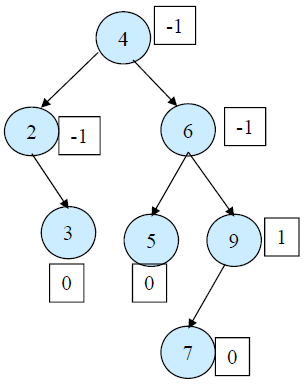
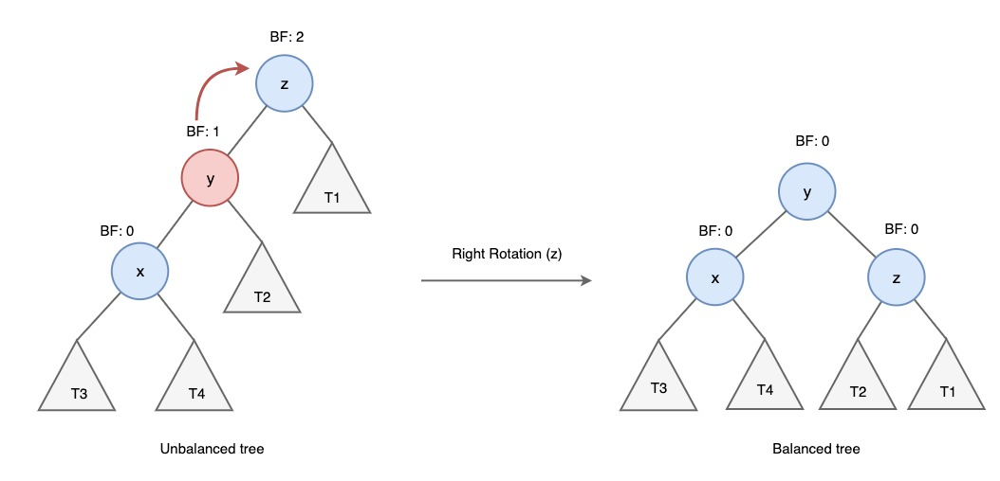
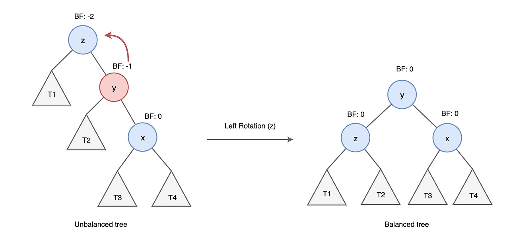
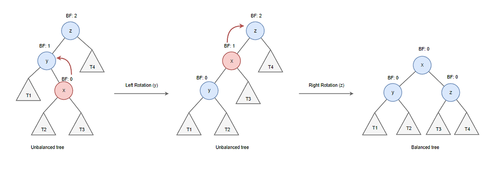
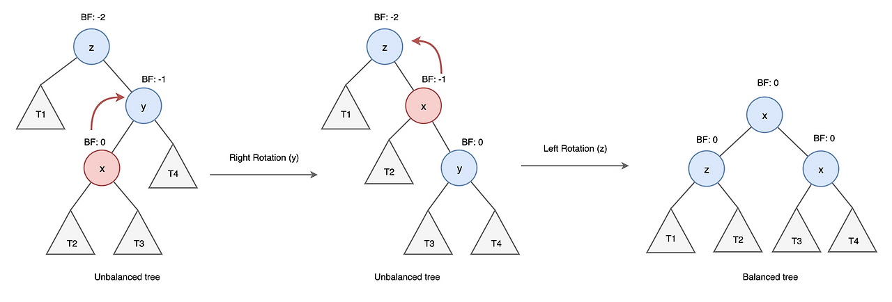

# 🕵️ AVL Tree
<hr>

- [1️⃣개념](#1개념)
- [2️⃣ Balance Factor (BF)](#2-balance-factor-bf)
- [3️⃣ 연산](#3-연산)
- [4️⃣ 시간복잡도](#4-시간복잡도)

## 1️⃣개념

- 서브 트리의 높이를 적절하게 제어해 전체 트리가 어느 한쪽으로 늘어지지 않도록 한 이진탐색트리
- 이진탐색트리 -> O(h) => 균형된 트리를 만들어 h를 줄이자!
- 삽입/식제 시에 서브 트리 재구성하여 전체 균형을 맞춤

## 2️⃣ Balance Factor (BF)

- 왼쪽 서브트리의 높이 - 오른쪽 서브트리의 높이
- 두 서브트리의 높이가 같거나 리프 노드인 경우, BF = 0
- Empty Tree의 BF = -1
- BF가 클수록 불균형 트리 = (BF NOT IN (-1, 0, 1))




## 3️⃣ 연산

- 이진탐색트리와 탐색/삽입/삭제 연산 동일
- 다만, 삽입/식제 후 BF가 달라지는 경우만 rotation 수행
```java
class Node {
    Integer data;
    Node left;
    Node right;
    int height;

    public Node(Integer data) {
        this.data = data;
        height = 0;
    }
}
```

### ▶️ Single rotation

#### LL (LeftLeft) case (BF > 1)

- right rotation 수행
1. y노드의 오르쪽 자식 노드를 z노드로 변경
2. z노드 왼쪽 자식 노드를 y노드 오른쪽 서브트리(T2)로 변경
3. y -> 새로운 루트 노드


```java
 private Node rightRotate(Node parent) {
        Node newParent = parent.left;
        Node T2 = newParent.right; 

        newParent.right = parent;
        parent.left = T2;

        parent.height = Math.max(height(parent.left), height(parent.right)) + 1;
        newParent.height = Math.max(height(newParent.left), height(newParent.right)) + 1;

        return newParent;
    }
```

#### RR (RightRight) case (BF < -1)
- left rotation 수행
1. y노드의 왼쪽 자식 노드를 z노드로 변경
2. z노드 오른쪽 자식 노드를 y노드 왼쪽 서브트리(T2)로 변경
3. y -> 새로운 루트 노드


```java
private Node leftRotate(Node parent) {
  Node newParent = parent.right;
  Node T2 = newParent.left;

  newParent.left = parent;
  parent.right = T2;

  parent.height = Math.max(height(parent.left), height(parent.right)) + 1;
  newParent.height = Math.max(height(newParent.left), height(newParent.right)) + 1;

  return newParent;
}
```

### ▶️ Double rotation

#### LR (LeftRight) case (BF > 1)

- left, right 순으로 2번 rotation 진행



#### RL (RightLeft) case (BF < -1)
- right, left 순으로 2번 rotation 진행



### 삽입
```java
public void insert(Integer data) {
  this.root = insertNode(this.root, data);
}
private Node insertNode(Node node, Integer data) {
        // BST 삽입을 수행

        // 트리의 첫 값이 삽입되었을 때 새로운 노드를 만든다 -> 해당 노드는 root가 된다
        if (node == null) {
            return new Node(data);
        }

        if (data < node.data) {
            node.left = insert(node.left, data);
        } else if (data > node.data) {
            node.right = insert(node.right, data);
        } else {
        	// 변경되는 코드가 없으니 Early Return을 시킨다.
            return node;
        }

		// 데이터가 삽입된 이후, 높이를 갱신한다
        node.height = 1 + Math.max(height(node.left), height(node.right));
        int balance = getBalance(node);

        // left-left
        if (balance > 1 && data < node.left.data)
            return rightRotate(node);

        // right-right
        if (balance < -1 && data > node.right.data) {
            return leftRotate(node);
        }

        // left-right
        if (balance > 1 && node.left.data < data) {
            node.left = leftRotate(node.left); // 왼쪽 자식노드에 대해 먼저 좌회전을 한다
            return rightRotate(node);
        }

        // right-left
        if (balance < -1 && data < node.right.data) {
            node.right = rightRotate(node.right);
            return leftRotate(node);
        }

        // 데이터가 삽입되었지만, 밸런스가 깨지지 않은 경우
        return node;
    }
    private int getBalance(Node node) {
      if (node == null) {
        return 0;
      }
      return height(node.left) - height(node.right);
    }
```

### 삭제
```java
public void delete(Integer data) {
  Node node = deleteNode(this.root, data);
  if (node == null) {
    // 트리에 데이터가 없는 경우
    return;
  }

}
private Node deleteNode(Node node, Integer data) {
        if (node == null) {
            return null;
        }
        // 삭제할 값을 찾는 중
        if (data < node.data) {
            node.left = delete(node.left, data);
        } else if (data > node.data) {
            node.right = delete(node.right, data);
        }
        else {
            // 삭제할 값 발견 -> 대체할 노드를 찾아야 한다.
            // 자식의 개수에 따라서 삭제된 노드를 대체하는 노드가 달라진다 (자식 입장에서 부모를 찾을 수 없음 -> 그래서 값을 바꾸는 방식을 사용)
            if (node.getChildCnt() == 0) {
                node = null;
            } else {
                if (node.left != null) { // 좌측 subtree에서 가장 큰 값을 찾는다(left에 자식이 있음)
                    Node target = findMaxNode(node.left);
                    node.data = target.data;
                    node.left = delete(node.left, target.data);
                } else { // 자식이 1개(right에만) -> 자식을 자신의 위치로 올리면 된다
                    node = node.right;
                }
            }
        }

        if (node == null) { // Leaf노드가 삭제된 케이스
            return null;
        }

        // 높이를 다시 정의한다
        // node에서 밸런스가 깨지지 않았는지 검사한다
        node.height = Math.max(height(node.left),height(node.right)) + 1;
        int balance = getBalance(node);

        // left-left
        if (balance > 1 && data < node.left.data) {
            return rightRotate(node);
        }

        // right-right
        if (balance < -1 && data > node.right.data) {
            return leftRotate(node);
        }

        // left-right
        if (balance > 1 && node.left.data < data) {
            node.left = leftRotate(node.left); // 왼쪽 자식노드에 대해 먼저 좌회전을 한다
            return rightRotate(node);
        }

        // right-left
        if (balance < -1 && data < node.right.data) {
            node.right = rightRotate(node.right);
            return leftRotate(node);
        }

        // 변경사항이 없을 경우
        return node;
        // 밸런스가 깨지지 않았는가 검사한다

    }

    private Node findMaxNode(Node node) {
        // max Value를 찾고,
        if (node.right != null) {
            return findMaxNode(node.right);
        } else {
            return node;
        }
    }
```

## 4️⃣ 시간복잡도

- BF 계산 -> O(h)
- Rotation 연산은 부모-자식 관계만 변경 -> 연결리스트로 구현되어있어 O(1)
- 삽입, 삭제 모두 여전히 O(h)
- 삽입/삭제 후 및 BF 계산 및 Rotation -> O(h+1+h) = O(h)
- 노드가 n개일 때 높이 h의 하한 = 2logN
  => O(h) = O(logN)


<hr>

#### 출처
- https://yoongrammer.tistory.com/72?category=956616
- https://ratsgo.github.io/data%20structure&algorithm/2017/10/27/avltree/
- https://en.wikipedia.org/wiki/AVL_tree
- [데굴데굴 개발자의 기록:티스토리] https://sjh9708.tistory.com/205#google_vignette
- https://velog.io/@iamtaehoon/AVL-트리