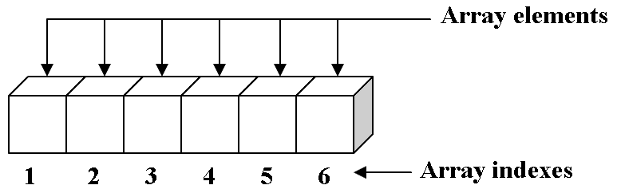
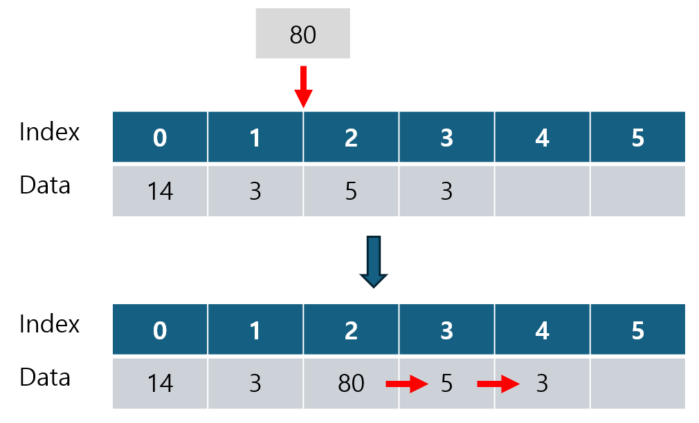
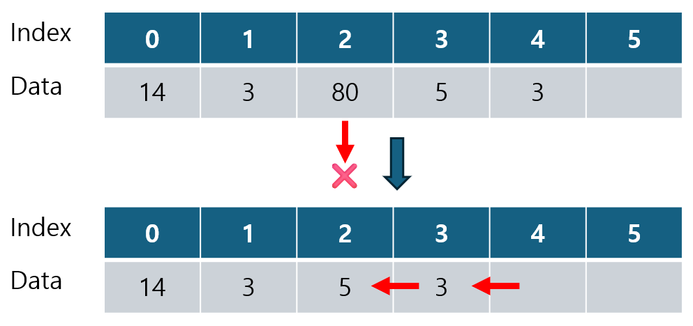
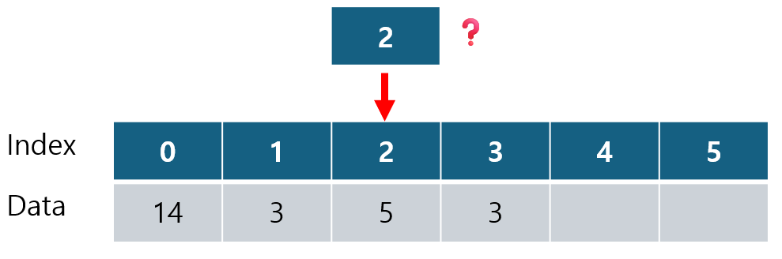
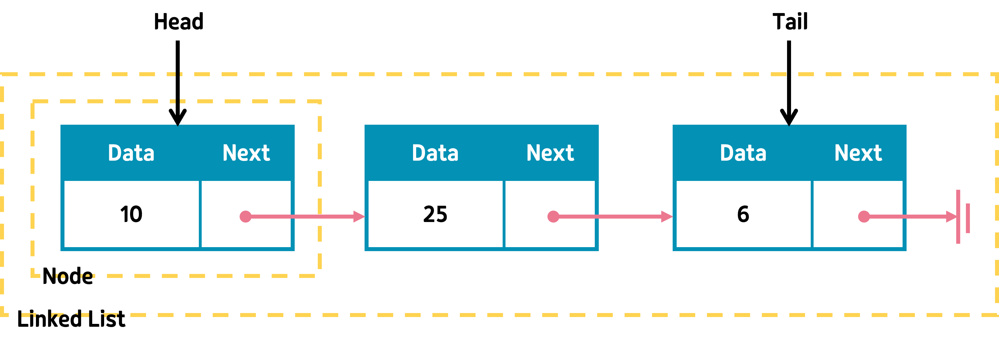
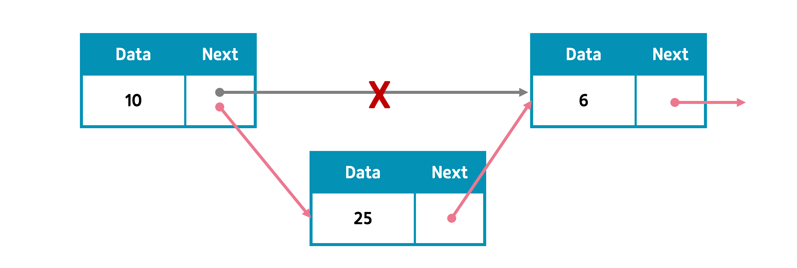
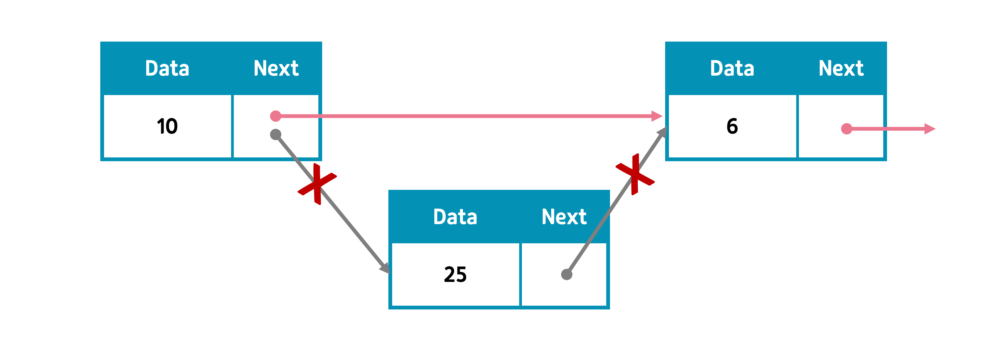
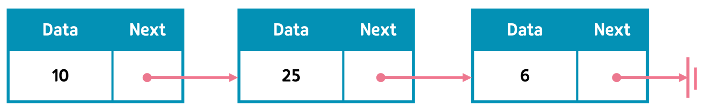
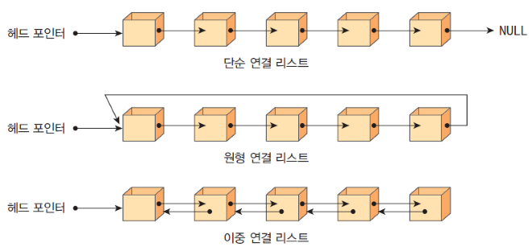

# 🕵️ Array & List
<hr>

- [1️⃣ Array](#1-array)
- [2️⃣ List](#2-list)
  - [💠 Array List](#-array-list)
  - [💠 Linked List](#-linked-list)


## 1️⃣ Array
<hr>

### ▶️ 정의
 
- 연속적인 메모리 공간에 순차적으로 저장된 동일한 타입의 데이터 모음



### ▶️ 구성 및 특징
- Index(인덱스)와 Element(요소)로 구성
- Index 로 인한 무작위 접근 가능
- 메모리 크기 정적 할당
- 중복 데이터 삽입 가능 및 값 수정 가능

* 다른 타입의 데이터들이 모인 집합체? 'record' or 'heterogeneous array'

### ▶️ 장단점
##### 장점
- index를 통한 접근으로 모든 element에 빠르게 접근 가능
- 항목을 반복하여 추가하거나 삭제 시 index를 통한 빠른 처리 가능
- 연속된 메모리 공간에 요소들을 순차적으로 저장하여 메모리 관리가 편리
- 요소 외 부가 정보 저장을 위한 추가 메모리 필요없음
- 쉬운 구현 및 사용

##### 단점

- 정적 메모리 할당으로 메모리 크기 변경 불가
- 사용하지 않는 공간에 대한 메모리 낭비 발생
- 다른 유형의 데이터 저장 불가
- 중간 요소의 삽입/삭제 오래 걸림

### ▶️ 언제 사용하면 좋은가?

- 데이터 개수(N)가 확실히 정해져 있는 경우
- 순차적인 데이터를 저장하고하 하는 경우
- 요소의 삽입과 삭제가 많지 않은 경우
- 데이터가 단순하고 빠른 검색이 필요한 경우

### ▶️ 삽입 / 삭제 / 조회
```java
// 배열 선언
int[] nums = new int[6] {14, 3, 5, 3};
```

#### 🔹 삽입


#### 🔹 삭제 



#### 🔹 조회 


> 탐색은 정렬 알고리즘에 따라 달라짐  <br>
> - 선형 탐색 = O(N) <br>
> - 이진 탐색 = O(logN)

| 시간복잡도 | 삽입   | 삭제   | 조회   |
|-------|------|------|------|
| Array | O(N) | O(N) | O(1) |


## 2️⃣ List
<hr>

## 💠 Array List
### ▶️ 정의

- 배열 기반의 리스트
- 배열과 매우 유사함

### ▶️ 구성 및 특징

- Index 로 인한 무작위 접근 가능
- 중복 데이터 삽입 가능 및 값 수정 가능

### ▶️ 배열과의 차이점

| Array                        | ArrayList                  |
|------------------------------|----------------------------|
| 초기화 시에 크기 고정                 | 배열 사이즈 변경 가능 |
| 초기화 시 메모리에 할당되어 속도 빠름        | 추가 시 메모리 재할당 필요로 속도 느림     |
| 다차원 가능                       | 다차원 불가능                    |
| Primitive Type, Object 모두 가능 | Object 만 가능                |


### ▶️ 자바
```java
ArrayList<Object> list = new ArrayList<>();
```

## 💠 Linked List
### ▶️ 정의

- 데이터와 다음 노드를 가리키는 포인터를 포함하는 노드들을 연결하여 데이터를 저장하는 자료구조


### ▶️ 구성 및 특징

- 노드(Node) : Linked List의 기본 단위, 데이터를 저장하는 데이터 필드와 다음 노드를 가리키는 링크 필드로 구성
- 포인터(Pointer) : 각 노드 안에서 다음이나 이전 노드와의 연결 정보를 가지고 있는 공간
- 헤드(Head) : 가장 처음 위치하는 노드
- 테일(Tail) : 가장 마지막에 위치하는 노드

### ▶️ 장단점
##### 장점

- 미리 데이터 크기를 지정할 필요없음 (동적 크기)
- 데이터 삽입 및 삭제 용이
- 노드가 메모리의 어디에든 위치 가능하여 효율적인 메모리 사용 가능

##### 단점

- 특정 인덱스 접근 시 리스트를 처음부터 순회해야 함
- 데이터 + 링크 정보를 추가 저장해야하므로 메모리 오버헤드가 큼
- 단방향의 경우, 역방향 탐색 어려움 -> 양방향 사용 시 또 다른 메모리 오버헤드 발생
- 메모리에 연속적으로 저장되지 않아 캐시 친화적이지 않음 (배열에 비해 느린 접근 속도)

### ▶️ 언제 사용하면 좋은가?

- 삽입, 삭제가 빈번한 경우

### ▶️ 삽입 / 삭제 / 조회
```java
class Node {
    int data;
    Node next;
}

LinkedList<Integer> list = new LinkedList<>();
```

#### 🔹 삽입


#### 🔹 삭제


#### 🔹 조회



| 시간복잡도       | 삽입   | 삭제   | 조회   |
|-------------|------|------|------|
| Linked List | O(1) | O(1) | O(N) |

> 다만, 삭제 및 삽입을 위해 값을 찾아갈 때, O(N) 필요

### ▶️ 종류 

> Singly Linked List (단순 연결 리스트)
> - 노드에 데이터와 다음 노드를 가리키는 포인터가 존재 <br>
>
> Doubly Linked List (이중 연결 리스트)
> - 노드에 데이터와 다음 노드를 가리키는 포인터, 이전 노드를 가리키는 포인터 존재<br>
> - 역방향 탐색 가능
>
> Circular Linked List (원형 연결 리스트)
> - 단순 연결 리스트의 마지막 노드(tail)이 처음 노드(head)를 가리키도록 함 <br><br>



<hr>

#### 출처
 
- https://ghleokim.github.io/%EC%9E%90%EB%A3%8C%EA%B5%AC%EC%A1%B0-%EB%B0%B0%EC%97%B4%EA%B3%BC-%EB%A6%AC%EC%8A%A4%ED%8A%B8/
- https://newstellar.tistory.com/64
- https://github.com/walbatrossw/java-data-structures
- https://ongveloper.tistory.com/403
- https://velog.io/@hyhy9501/5-1-Linked-List-%EC%97%B0%EA%B2%B0-%EB%A6%AC%EC%8A%A4
- https://limecoding.tistory.com/90
- https://newstellar.tistory.com/66
- https://velog.io/@717lumos/%EC%9E%90%EB%A3%8C%EA%B5%AC%EC%A1%B0-%EC%97%B0%EA%B2%B0%EB%A6%AC%EC%8A%A4%ED%8A%B8Linked-List-%EB%8B%A8%EC%9D%BC%EC%97%B0%EA%B2%B0%EB%A6%AC%EC%8A%A4%ED%8A%B8-%EC%9D%B4%EC%A4%91%EC%97%B0%EA%B2%B0%EB%A6%AC%EC%8A%A4%ED%8A%B8
- https://yjg-lab.tistory.com/118
- https://inpa.tistory.com/entry/JAVA-☕-LinkedList-구조-사용법-완벽-정복하기
