# 🧑🏻‍💻 B-Tree

- [✅ M원 탐색 트리(M-way Search Tree)](#-m원-탐색-트리m-way-search-tree)
- [✅ B-Tree](#-b-tree-1)
  - [💡 B-Tree의 key 검색 과정](#-b-tree의-key-검색-과정)
  - [💡 B-Tree의 key 삽입 과정](#-b-tree의-key-삽입-과정)
  - [💡 B-Tree의 key 삭제 과정](#-b-tree의-key-삭제-과정)
- [✅ B+Tree](#-btree)
  - [💡 B+Tree의 데이터 삽입](#-btree의-데이터-삽입)
  - [💡 B+Tree의 데이터 삭제](#-btree의-데이터-삭제)

## ✅ M원 탐색 트리(M-way Search Tree)

> [!TIP]
> B-Tree 이전에 먼저 M원 탐색 트리(다원 탐색 트리, Multiway search tree, m-way search tree)부터 알 필요가 있다.  
> 이진 탐색 트리는 차수가 2이기 때문에 높이가 커지게 되는 문제점이 있다.  
> ➡ M원 검색 트리는 차수를 2에서 M개로 늘려 문제점을 해결하였다.

위 그림은 M=3인 3원 탐색 트리라고 볼 수 있다.

 

> 다원 탐색 트리(Multiway)의 특징은 다음과 같다.  

1. 각 노드는 아래의 개수만큼 서브 트리를 갖는다.  
   0 <= 서브트리 개수 <= m

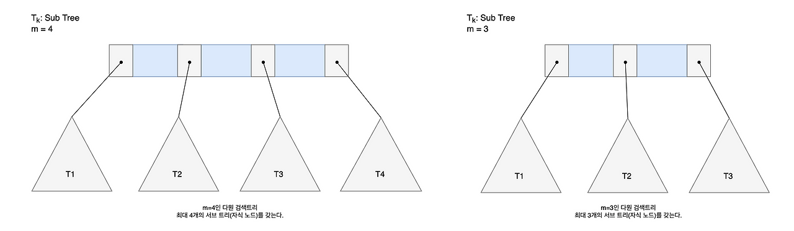

2. k개의 자식 노드를 가지는 노드는 k-1개의 요소를 갖는다.(k <= m)

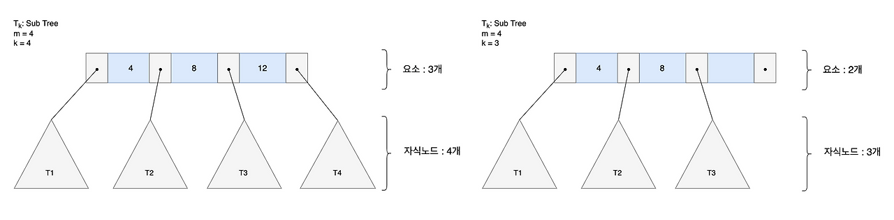

3. 각 노드 안에 있는 키는 오름차순으로 정렬되어 있다.  
   key1 <= key2 <= key3 ... <= key(k-1)

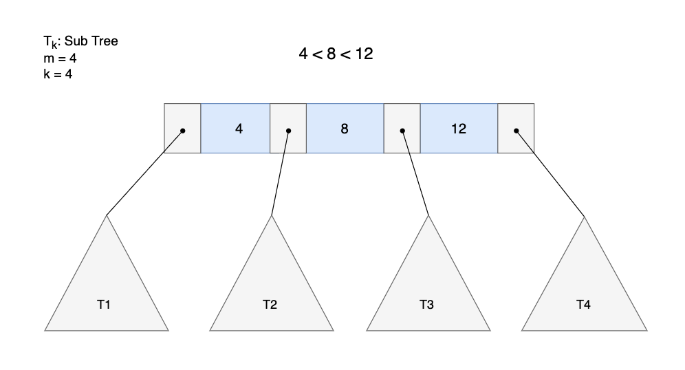

4. `i번째 key` <= `i번째 서브 트리 내의 모든 키 값` <= `i+1번째 key`

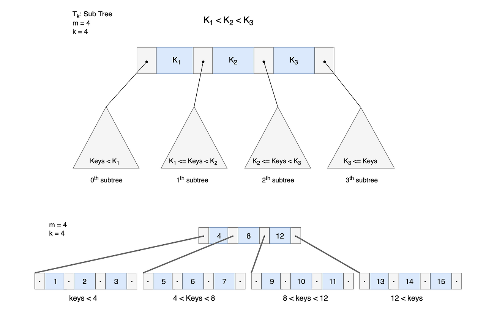  

 

> [!TIP]
> 다원 탐색 트리의 한계
> 다원 탐색 트리는 스스로 균형을 유지하지 못하기 때문에 불균형이 발생할 수 있다는 단점이 있다.  
> ➡️ 이럴 경우 검색 성능이 떨어지게 된다.  
> ➡️ 다원 탐색 트리의 단점을 보완하기 위해 스스로 균형을 유지하는 기능이 필요한데, 그것이 바로 B-Tree다.

 

## ✅ B-Tree

> [!IMPORTANT]
> 시간복잡도: `O(logN)`
> - B-tree란 자식 노드가 2개 이상인 트리
> - 균형 트리(Balanced Tree)로서, 최상위 루트 노드에서 리프 노드까지의 거리가 모두 동일하다.
>   - ❗️ Binary Tree가 아니다.

 

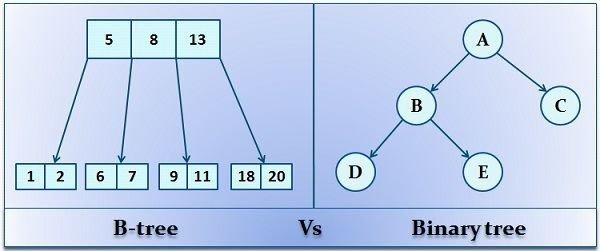
> [!TIP]
> 위 그림과 같이 B-Tree는 3개의 값, 4개의 자식이 있을 수 있다.  
> 하나의 노드의 최대 자식 수가 3개면 3차 B-Tree, 4개면 4차 B-Tree라고 한다.  
> ➡️ `m`차 B-Tree이면 하나의 노드가 가지는 키의 최대 개수는 `m-1`개이다.

 

> [!NOTE]
> Knuth에 따르면 B-tree는 다음과 같은 조건이 있다.
> 1. 모든 노드들은 최대 m개의 자식을 가질 수 있다.
> 2. k개의 자식을 가진 리프가 아닌 노드는 k-1개의 키를 가지고 있다.
> 3. 모든 내부 노드는 최소한 [m/2]개의 자식을 가져야 한다.  
>    [m/2]는 m/2를 반올림한 값
> 4. 모든 리프 노드들은 같은 레벨에 있어야 한다.
> 5. 리프가 아닌 모든 노드들은 최소 2개 이상의 자식을 가져야 한다.

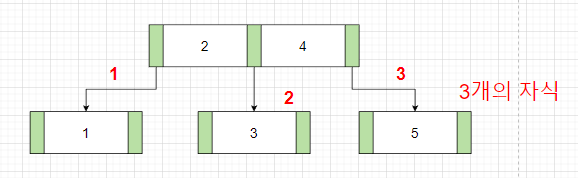
1. 모든 노드들은 최대 m개의 자식을 가질 수 있다.

 

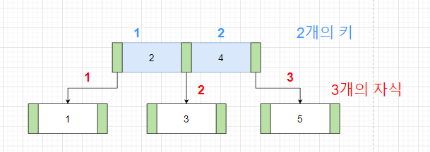
2. k개의 자식을 가진 리프가 아닌 노드는 k-1개의 키를 가지고 있다.

 

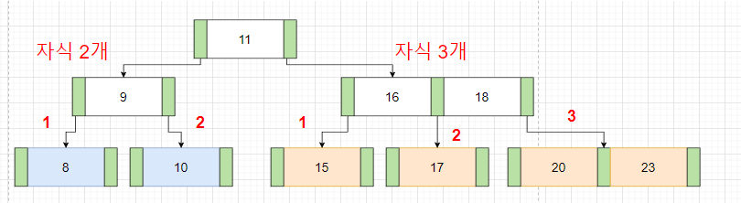
3. 모든 내부 노드는 최소한 [m/2]개의 자식을 가져야 한다.

 

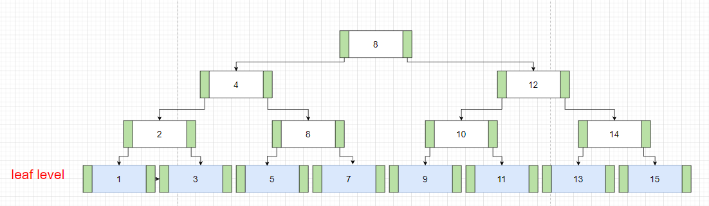
4. 모든 리프 노드들은 같은 레벨에 있어야 한다.

 

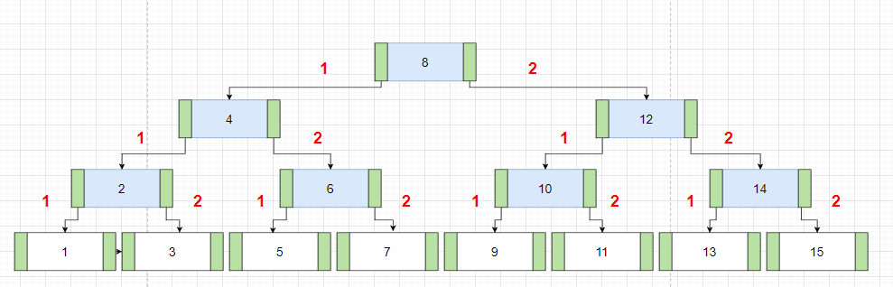
5. 리프가 아닌 모든 노드들은 최소 2개 이상의 자식을 가져야 한다.

### 💡 B-Tree의 key 검색 과정

> [!TIP]
> 루트노드에서 시작하여 하향식으로 검색을 수행한다.  
> 검색하고자 하는 key를 k라고 하자.
> 1. 루트 노드에서 key들을 순회하면서 검사한다.
>    1. 만일 k와 같은 key를 찾았다면 검색을 종료한다.
>    2. 검색하는 값과 key들의 대소관계를 비교해본다.  
>       어떠한 key들 사이에 k가 들어간다면 해당 key들 사이의 자식노드로 내려간다.
> 2. 해당 과정을 리프 노드에 도달할 때까지 반복한다.  
>    ➡️ 만약 리프 노드에서도 k와 같은 key가 없다면 검색이 실패된다.

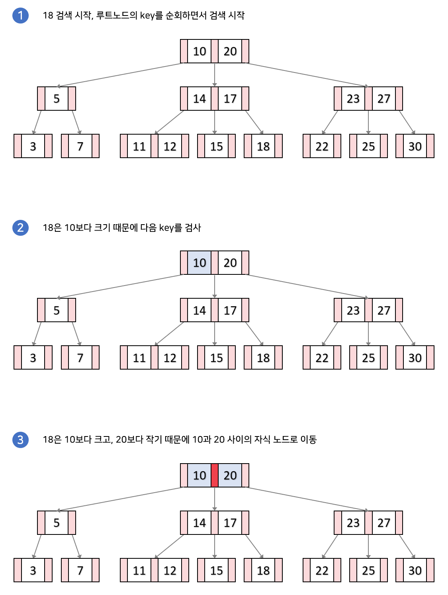
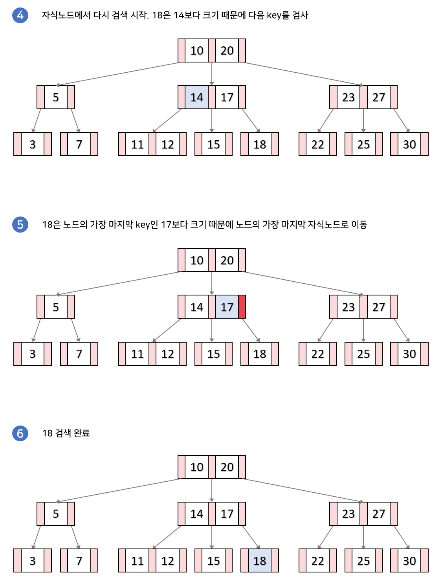

 

### 💡 B-Tree의 key 삽입 과정

> [!TIP]
> 1. 트리가 비어있으면 루트 노드를 할당하고 k를 삽입한다.  
>    ➡️ 만일 루트노드가 가득찼다면, 노드를 분할하고 리프노드가 생성된다.
> 2. 삽입하기에 적절한 리프노드를 찾아 k를 삽입한다.
>    1. 요소 삽입에 적절한 리프 노드 검색
>    2. 필요한 경우 노드를 분할

 

> [!NOTE]
> 분할이 일어나지 않는 경우는 다음과 같다.
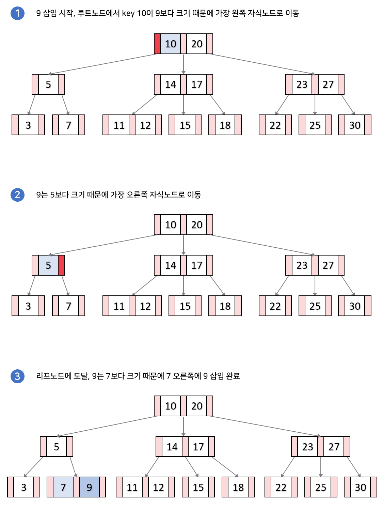

> [!NOTE]
> 분할이 일어나는 경우는 다음과 같다.
> 1. 오름차순으로 요소를 삽입하는데, 노드가 담을 수 있는 최대 key 개수를 초과하게 된다.
> 2. 중앙값에서 분할을 수행한다.
>    1. 중앙값은 부모 노드로 병합하거나 새로 생성된다.
>    2. 왼쪽 키들은 왼쪽 자식으로, 오른쪽 키들은 오른쪽 자식으로 분할된다.
> 3. 부모 노드를 검사해서 또 다시 가득찼다면, 다시 부모노드에서 위 과정을 반복한다.
> 
> 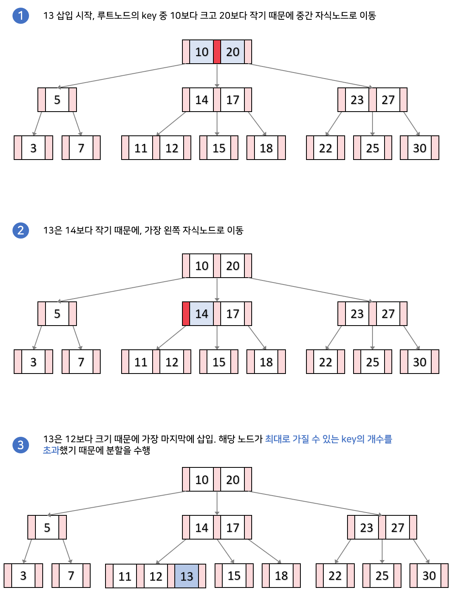  
> 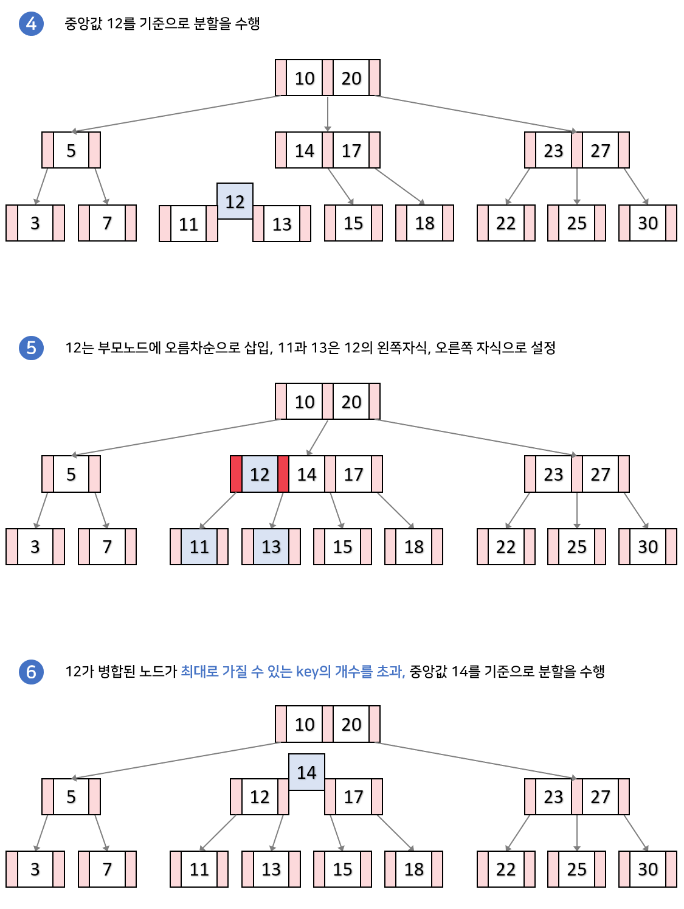  
> 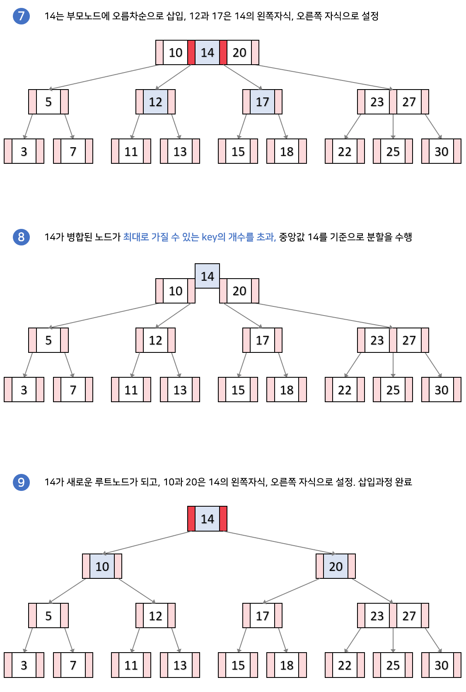

 

### 💡 B-Tree의 key 삭제 과정

> [!TIP]
> 요소를 삭제하기 위해서는 다음과 같은 프로세스를 거쳐야 한다.
> 1. 삭제할 키가 있는 노드 검색
> 2. 키 삭제
> 3. 필요한 경우 트리 균형 조정
> 
> 용어
> - `inorder predecessor`: 노드의 왼쪽 자손에서 가장 큰 key
> - `inorder successor`: 노드의 오른쪽 자손에서 가장 작은 key
> - 부모 key: 부모 노드의 key들 중 자신을 왼쪽 자식으로 갖고 있는 key 값이다.  
>   ➡️ 단, 마지막 자식노드의 경우에는 부모의 마지막 key이다.

#### ❗️ Case1. 삭제할 key k가 리프에 있는 경우
> [!NOTE]
> Case 1-1) 현재 노드의 key 개수가 최소 key 개수보다 크다면  
> ➡️ 다른 노드들에 영향 없이 해당 k를 단순 삭제한다.  
> 
> 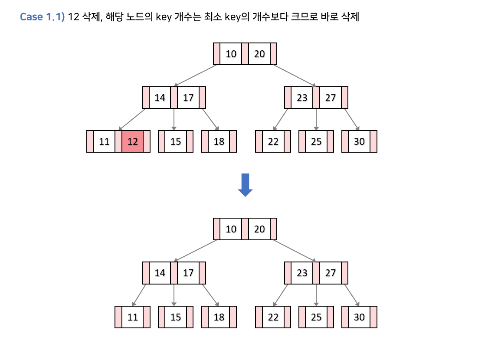

> [!NOTE]
> Case 1-2) 현재 노드의 key 개수가 최소 key 개수보다 적을 때, 왼쪽 또는 오른쪽 형제 노드의 key가 최소 key 개수보다 크다면  
> 1. 부모 key 값으로 k를 대체한다.
> 2. 최소 키 개수 이상의 키를 가진 형제 노드가 왼쪽 형제라면 가장 큰 값을, 오른쪽 형제라면 가장 작은 값을 부모 key로 대체한다.
> 
> 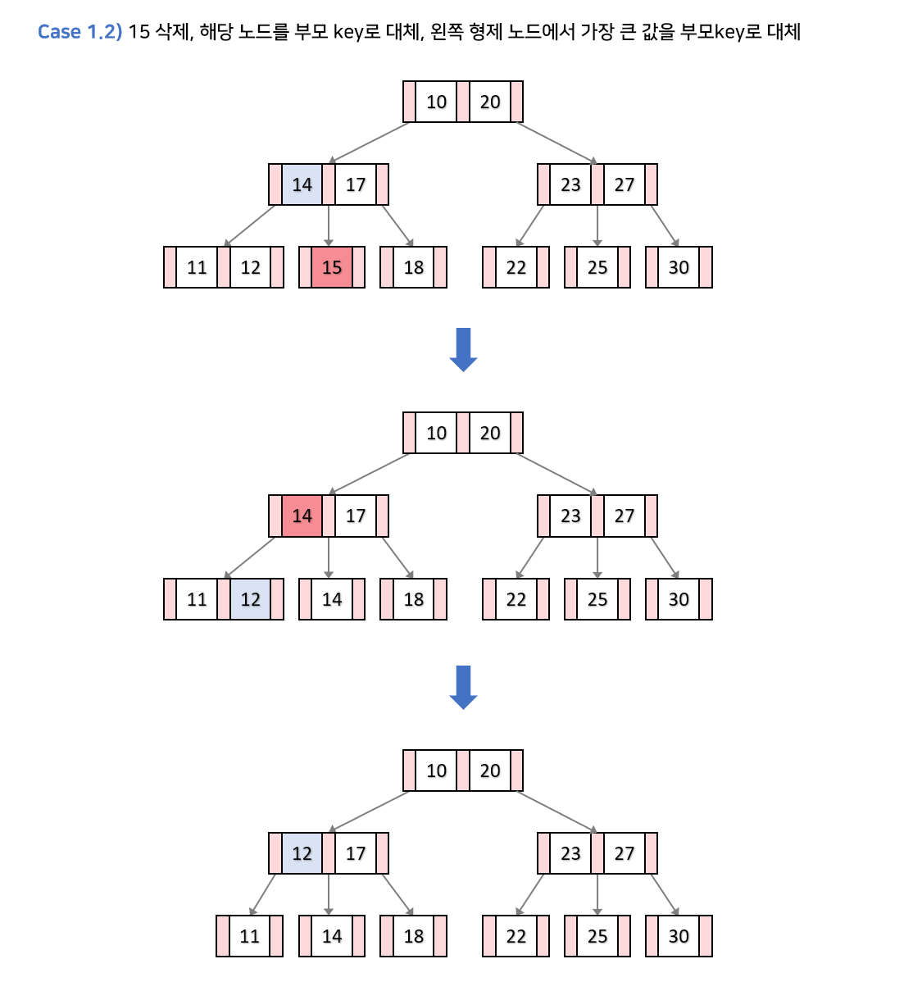

> [!NOTE]
> Case 1-3) 현재 노드의 key 개수가 최소 key 개수보다 적을 때, 왼쪽 또는 오른쪽 형제 노드의 key가 최소 key 개수이고, 부모 노드의 key가 최소 개수보다 크다면
> 1. k를 삭제한 후, 부모 key를 형제 노드와 병합한다.
> 2. 부모노드의 key 개수를 하나 줄이고, 자식 수 역시 하나를 줄여 B-Tree를 유지한다.
> 
> 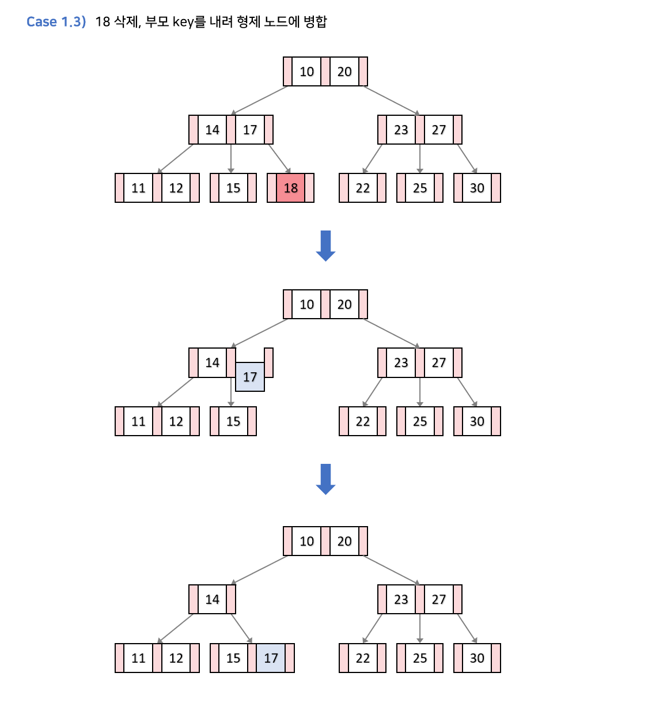

> [!NOTE]
> Case 1-4) 자신과 형제, 부모 노드의 key 개수가 모두 최소 key 개수라면  
> ➡️ 부모 노드를 루트 노드로 한 부분 트리의 높이가 줄어드는 경우이기 때문에 재구조화의 과정이 일어난다.  
> ➡️ 아래 Case 3-2) 과정이 일어난다.

 

#### ❗️ Case2. 삭제할 key k가 내부 노드에 있고, 노드나 자식에 키가 최소 키 개수보다 많을 경우

> [!NOTE]
> 1. 현재 노드의 `inorder predecessor` 또는 `inorder successor`와 k의 자리를 바꾼다.
> 2. 리프 노드의 k를 삭제하게 되면, 리프 노드가 삭제되었을 때의 조건으로 변한다.  
>    ➡️ Case 1 조건으로 이동한다.
> 
> 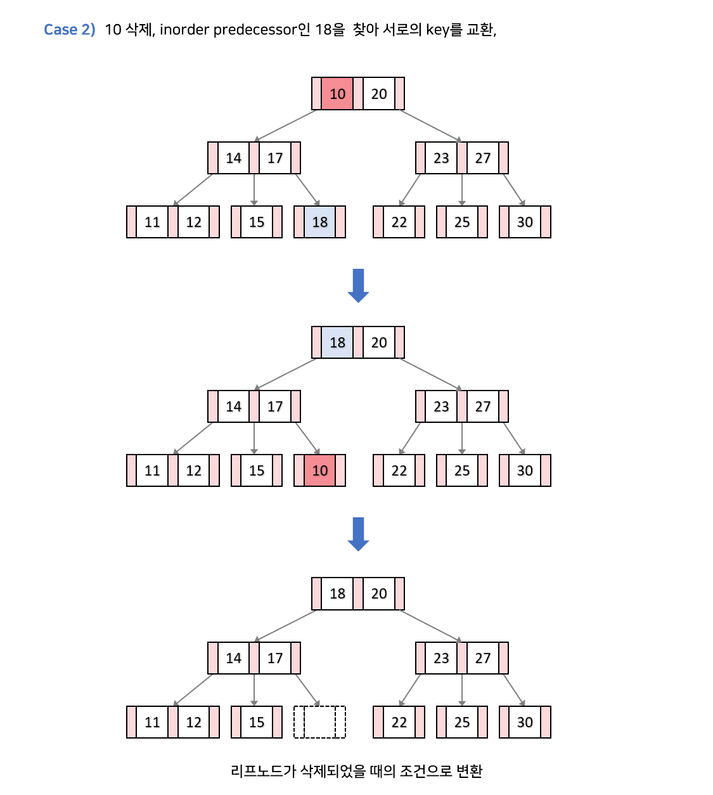

 

#### ❗️ Case3. 삭제할 key가 k 내부 노드에 있고, 노드에 key 개수가 최소 key 개수만큼, 노드의 자식 key 개수도 모두 최소 key 개수인 경우

> [!NOTE]
> 삭제할 key k가 있는 노드도 최소, 자식 노드들도 최소의 key 개수를 가지므로, k를 삭제하면 트리의 높이가 줄어들어 재구조화가 일어나는 케이스다.  
> 재구조화의 과정은 다음과 같다.
> 1. k를 삭제하고, k의 양쪽 자식을 병합하여 하나의 노드로 만든다.
> 2. k의 부모 key를 인접한 형제 노드에 붙인다.
> 3. 해당 과정을 수행했을 때 부모 노드의 개수에 따라 이후 수행 과정이 달라진다.
>    1. 만일 새로 구성된 인접 형제 노드의 key가 최대 key 개수를 넘어갔다면, 삽입 연산의 노드 분할 과정을 수행한다.
>    2. 만일 인접 형제 노드가 새로 구성되더라도 원래 k의 부모 노드가 최소 key의 개수보다 작아진다면, 부모 노드에 대하여 2번 과정부터 다시 수행한다.
> 
> 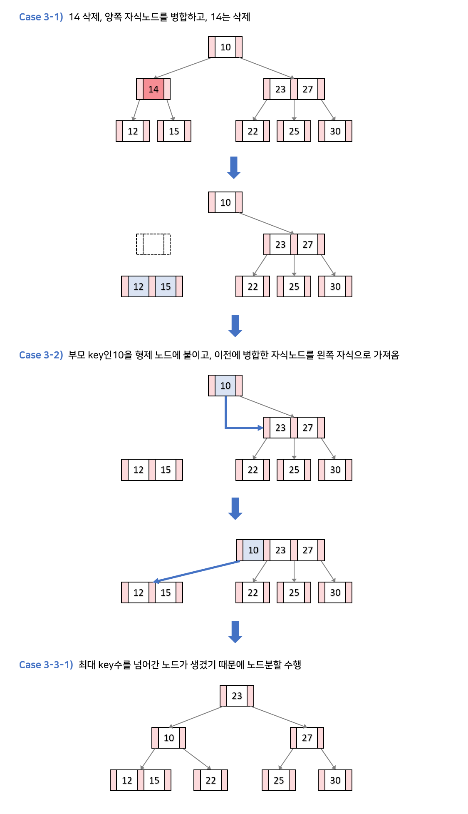  
> 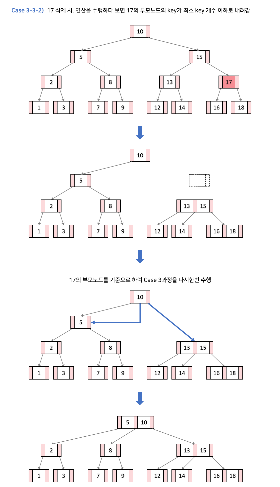

 

## ✅ B+Tree

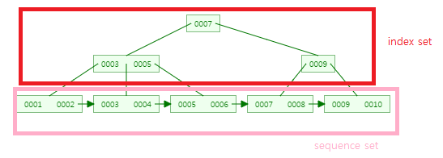  
> [!TIP]
> B+Tree는 B-Tree의 변형된 형태로 데이터의 효율적인 삽입, 검색, 삭제를 추구하는 자료구조다.  
> B-Tree와 달리 삽입, 삭제 연산이 리프 노드에서만 이루어지며, 리프 노드끼리 연결리스트로 연결되어 있다.  
> 리프 노드가 순차집합 연결되어있기 때문에 순차적인 탐색에 유리하다.  
> 브랜치 노드에는 데이터가 없고 key만 존재하고, 리프 노드에만 데이터가 존재한다.

 

### 💡 B+Tree의 데이터 삽입
> [!NOTE]
> 단말 노드가 가득찼을 경우 ➡️ 중간 값을 부모 노드로 올리고 분할한다.  
> 4가 삽입할 경우  
>   
> 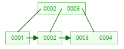  
> 4를 넣었더니 노드가 꽉 차서 [2], [3,4]로 분열한 뒤 부모 노드로 중간값 3이 올라간 모습이다.

> [!NOTE]
> 내부 노드가 가득찼을 경우  
> 5를 삽입할 경우  
>   
> 5를 넣었더니 노드가 꽉 찼다.  
>   
> [3], [4,5] 노드로 분열한 뒤 중간값인 4를 부모 노드로 올린다.  
> 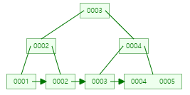  
> 부모 노드도 꽉 차서 중간값인 3을 부모로 올리고 [2], [4]로 분열한다.  
> 이때 중요한 것이 index set은 분열할 때 [3,4]로 되지 않는 것이다.

 

### 💡 B+Tree의 데이터 삭제
> [!TIP]
> B+Tree에서 데이터 삭제는 단말 노드에서만 일어나기 때문에 내부 노드는 신경쓸 필요가 없다.

> [!NOTE]
> Case 1. 삭제한 노드가 underflow가 아닐 때 ➡️ 부모 노드만 수정해주면 된다.  
>   
> 

> [!NOTE]
> Case 2. 삭제한 노드가 underflow일 때 ➡️ 형제 노드에게 값을 빌린 후 부모 노드를 수정한다.  
>   
> 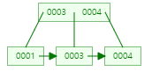

> [!NOTE]
> Case 3. 형제 노드도 underflow라면?  
> 참고로 아래의 예시는 5차 B+Tree다.  
> 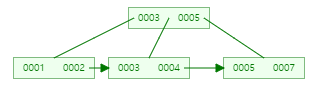  
> 4 데이터를 삭제한다.  
>   
> 삭제하였지만 형제 노드도 underflow 상태라 병합을 진행한다.  
>   
> 병합 후 부모 노드 수정

> [!TIP]
> B+Tree의 동작 과정을 직접 테스트해보고 싶을 때는 [B+Tree](https://www.cs.usfca.edu/~galles/visualization/BPlusTree.html)여기를 사용하자.

 

### ❗️ 정리
> [!TIP]
> B-Tree는 BST의 높이를 줄이기 위해 등장한 M원 탐색트리의 좌우 균형을 맞추기 위해 등장하였다.  
> B+Tree는 순차 탐색이 힘든 B-Tree를 보완하기 위해 등장하였다.  
> 직접 탐색의 경우 B-Tree와 B+Tree의 성능이 비슷하지만 순차 탐색의 경우 B+Tree의 성능이 뛰어나다.

|               | B-Tree                                | B+Tree                            |
|---------------|---------------------------------------|-----------------------------------|
| 주요 특징         | 모든 내부, 리프 노드들이 데이터를 가진다.              | 단지 리프 노드만 데이터를 가진다.               |
| 검색            | 모든 키가 리프에서 사용가능하지 않기 때문에, 검색이 때로 느리다. | 모든 키가 리프 노드에 있기 때문에 검색이 빠르고 정확하다. |
| 트리에 중복 키가 없다. | 중복 키가 존재하며, 모든 데이터들은 리프에 있다.          |                                   |
| 삭제            | 내부 노드의 삭제는 복잡하고, 트리 변형이 많다.           | 어떠한 노드든 리프에 있기 때문에 삭제가 쉽다.        |
| 리프 노드         | 링크드리스트로 저장되지 않는다.                     | 링크드리스트로 저장된다.                     |
| 높이            | 특정 개수의 노드는 높이가 높다.                    | 같은 노드일 때 B-Tree보다 높이가 낮다.         |
| 사용            | 파일 시스템    특정 key를 내부 노드에서 바로 찾을 수 있음                         | 대부분의 RDBMS 인덱스         리프 연결리스트 덕분에 BETWEEN, ORDER BY가 빠름        |

 

**출처**
- [[자료구조] B트리와 B+트리](https://m.blog.naver.com/shekwl24/222245938621)
- [Real MySQL 8.0](https://product.kyobobook.co.kr/detail/S000001766482)
- [[자료구조] 다원 탐색 트리 (Multiway Search Tree)](https://yoongrammer.tistory.com/73)
- [[MySQL] B-tree, B+tree란? (인덱스와 연관지어서)](https://zorba91.tistory.com/293)
- [DB의 인덱스와 B-tree, B+tree](https://escapefromcoding.tistory.com/731)
- [[자료구조] 그림으로 알아보는 B-Tree](https://velog.io/@emplam27/%EC%9E%90%EB%A3%8C%EA%B5%AC%EC%A1%B0-%EA%B7%B8%EB%A6%BC%EC%9C%BC%EB%A1%9C-%EC%95%8C%EC%95%84%EB%B3%B4%EB%8A%94-B-Tree)