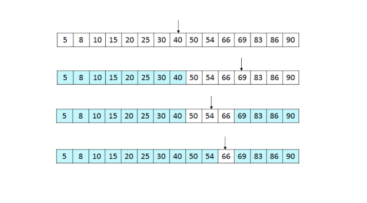
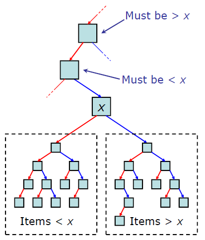
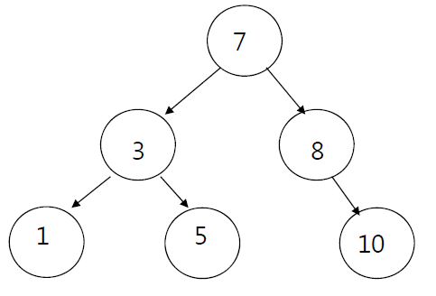
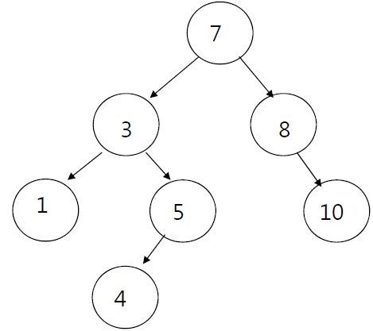
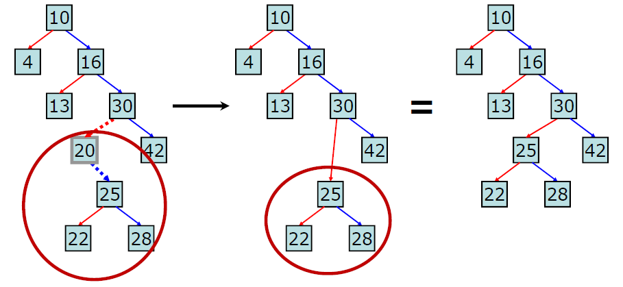
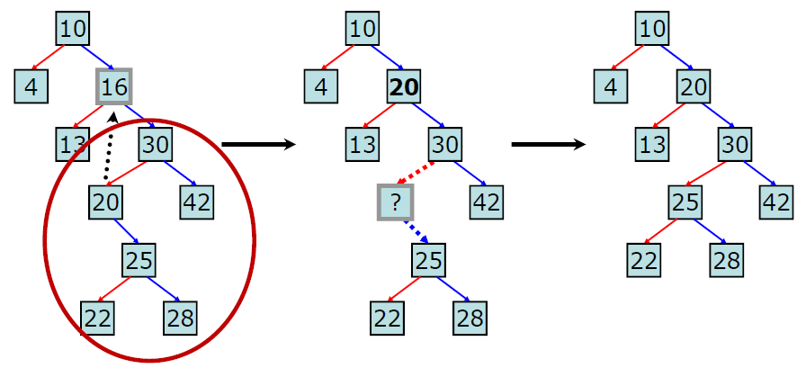
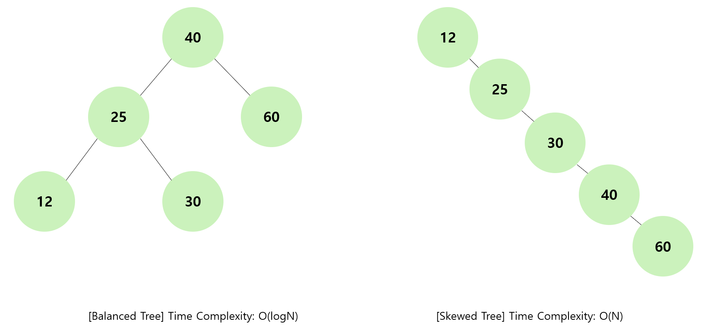

# 🕵️ Binary Search Tree
<hr>

- [1️⃣ 개념](#1-개념)
- [2️⃣ 특징](#2-특징)
- [3️⃣ 이진탐색트리 연산](#3-이진탐색트리-연산)

## 1️⃣ 개념

- 이진 탐색(Binary search)과 연결리스트(Linked List)를 결합한 자료구조
- 이진 탐색의 효율적인 탐색 + 빈번한 자료 입력 및 삭제 가능

> [!NOTE]
> 
> ### Binary Search (이진 탐색)
> - 정렬된 배열에서 특정 값을 찾는 알고리즘
> - 탐색 범위를 절반씩 줄여 나가 선형 탐색에 비해 빠른 속도 보장 -> 대량 데이터 탐색에 많이 사용됨
> - 배열이 정렬되어있는 상태여야 함 -> 별도의 정렬 작업 필요
> - 검색 대상의 생성, 수정에 취약함
> - 시간 복잡도 : O(logN)
>  * 남은 데이터가 1이 될 때까지 k번 반복 -> 탐색 시 N/2 씩 줄어듬 -> 1 = N/2^k
> 
> [ 탐색 과정 ]
> 
> 
>
> ① 정렬된 상태의 배열에서 중간값 찾기 <br>
> ② 찾고자하는 값과 중간 값 비교 <br>
> ③ 찾는 대상 값이 큰 경우 중앙값 기준 오른쪽 배열 / 작은 경우 중앙값 기준 왼쪽 배열에서 다시 중앙값 찾기 <br>
> ④ 찾는 대상이 있거나 데이터가 1개가 남을 때까지 위 과정 반복 <br>
> 
> ```java
> int binarySearch(int key, int[] arr) {
>   int mid;
>   int low = 0;
>   int high = arr.length -1;
> 
>	while(low <= high) {
>		mid = (low + high) / 2;
>
>		if(key == arr[mid]) {
>			return mid;
>		} else if(key < arr[mid]) {
>			high = mid - 1;
>		} else {
>			low = mid + 1;
>		}
>	}
>
>	return -1; // 탐색 실패
> }
> ```

## 2️⃣ 특징


- 각 노드의 왼쪽 서브트리 => 부모 노트 값보다 작은 값을 지닌 노드들
- 각 노드의 오른쪽 서브트리 => 부모 노드 값보다 큰 값을 지닌 노드들
- 중복된 값(키)를 허용하지 않음
- 모든 서브 트리 또한 이진 탐색 트리

## 3️⃣ 이진탐색트리 연산

```java
public class Node {
    Node left = null;
    Node right = null;
    Integer key = null;
}
public class BinarySearchTree {
    Node root = null;
    
    ...
}
```

### 트리 순회
#### 중위순회(inorder) 방식 사용 ###

- left -> root -> right 


> 1 -> 3 -> 5 -> 7 -> 8 -> 10

```java
private void inorderTraversal(Node node) {
        if(node == null)
            return;
        inorderTraversal(node.left);
        System.out.printf("%d ", node.key);
        inorderTraversal(node.right);
    }
```

### 탐색
1. 루트에서 탐색 시작
2. 찾고자 하는 값이 루트보다 작으면 왼쪽 서브 트리, 크면 오른쪽 서브 트리로 이동
3. 일치하는 값을 찾을 때까지 위 과정 반복
- 트리의 높이가 h일 때 시간 복잡도 = O(h)

```java
public void search(int key) {
        searchNode(root, key);
    }

    private Node searchNode(Node node, int key) {
        if (node == null)
            throw new RuntimeException("해당 값을 가진 노드를 찾을 수 없습니다.");

        if (node.key > key)
            node.right = searchNode(node.right, key);
        else if (node.key < key)
            node.left = searchNode(node.left, key);
        else
            System.out.println("해당 값을 가진 노드를 찾았습니다.");

        return node;
    }
```

### 삽입

1. 루트 노드의 값과 삽입 값 비교 -> 삽입 값이 루트 노드 값보다 크면 오른쪽, 작으면 왼쪽 서브 트리 이동
2. 리프 노드에 도달할 때 까지 반복
3. 리프 노드 도달 후 해당 노드 값에 따라 왼쪽/오른쪽 자식 노드에 삽입
- 트리의 높이가 h일 때, 삽입을 위한 리프 노드를 찾는 시간 필요 -> 시간 복잡도 = O(h)
- 삽입 연산은 연결 리스트 삽입으로 O(1) -> 무시 가능
※ 트리 중간에 데이터 삽입 시 서브 트리의 속성이 깨질 수 있어 반드시 리프 노드에서 삽입

```java
public void add(int key) {
        Node newNode = new Node();
        newNode.key = key;

        if (root == null) {
            root = newNode;
        } else {
            root = addNode(root, newNode);
        }
    }

    private Node addNode(Node node, Node newNode) {
        if (node == null)
            return newNode;
        else if (node.key > newNode.key)
            node.left = addNode(node.left, newNode);
        else
            node.right = addNode(node.right, newNode);

        return node;
    }
```

### 삭제

- 이진 탐색 트리 속성을 지키기 위해 3가지 케이스로 나눠 진행
1. 삭제할 노드가 리프 노드인 경우(자식이 0개 있는 경우)
   * 해당 노드 바로 삭제
2. 삭제할 노드에 자식이 1개 있는 경우
    
      * 해당 노드 삭제 후 부모노드와 자식 노드 연결
3. 삭제할 노드에 자식이 2개 있는 경우
    
   * Successor 노드를 찾아야 함
   * Successor 노드 : 삭제할 노드의 오른쪽 서브 트리의 최소값 => 중위 순회에서 삭제할 노드 바로 다음 노드 
   
   ① 삭제할 노드와 그 노드의 오른쪽 서브 트리 찾기 <br>
   ② successor 노드 찾기 <br>
   ③ 삭제할 노드에 successor 노드 복사 <br>
   ④ 기존 successor 자리에 있는 노드 삭제 <br>

> [!NOTE]
> successor 노드의 자식은 하나(오른쪽)이거나 하나도 존재하지 않음
> 위 삭제 과정의 case1과 case2에 따라 삭제 진행

- 트리의 높이가 h일 때, 시간 복잡도 = O(h)
  * Case 3 + successor 노드 자식이 1개 존재하는 경우
  * 삭제 대상 노드 레벨 = d
  * ① : d번 비교 연산, ② : h-d 높이에 해당하는 비교 연산 => O(d+h-d) = O(h)

```java
public void remove(int key) {
        root = removeNode(root, key);
    }

    private Node removeNode(Node node, int key) {
        if (node == null)
            throw new RuntimeException("해당 값을 가진 노드를 찾을 수 없습니다.");

        if (node.key > key)
            node.left = removeNode(node.left, key);
        else if (node.key < key) {
            node.right = removeNode(node.right, key);
        } else {
            //삭제할 노드를 찾은 경우
            if (node.left != null) {
                //왼쪽 서브트리에서 가장 오른쪽에 있는 값 찾아 대체하기
                Node child = findMaxNode(node.left);
                int removedKey = node.key;
                node.key = child.key;
                child.key = removedKey;
                //다시 옮겨진 위치에서 서브트리에 대해 재귀적으로 실행
                node.left = removeNode(node.left, key);
            } else if (node.right != null) {
                //오른족 서브트리에서 가장 왼쪽에 있는 값 찾아 대체하기
                Node child = findMinNode(node.right);
                int removedKey = node.key;
                node.key = child.key;
                child.key = removedKey;
                //다시 옮겨진 위치에서 서브트리에 대해 재귀적으로 실행
                node.right = removeNode(node.right, key);
            } else {
                //삭제할 노드가 단말 노드인 경우 부모 노드와의 연결 종료
                return null;
            }
        }

        return node;
    }
    
    private Node findMaxNode(Node node) {
        if (node.right == null)
            return node;
        else
            return findMaxNode(node.right);
    }

    private Node findMinNode(Node node) {
        if (node.left == null)
            return node;
        else
            return findMinNode(node.left);
    }
```

### 시간 복잡도

- 트리의 높이가 h일 때, 시간 복잡도 = O(h)
- 균형 상태일 때는 O(logN), 불균형 상태인 경우 O(N)
  

#### => 이러한 한계점으로 트리의 입력/삭제 단계에서 트리 전체의 균형을 맞추는 "AVL Tree"가 제안됨 

<hr>

#### 출처
- https://minhamina.tistory.com/127
- https://velog.io/@kwontae1313/이진-탐색Binary-Search-알고리즘-개념
- https://adjh54.tistory.com/187
- https://ratsgo.github.io/data%20structure&algorithm/2017/10/22/bst/
- https://velog.io/@rik963/자료-구조-Binary-Search-TreeBST
-  [영운's 블로그:티스토리] https://you88.tistory.com/31