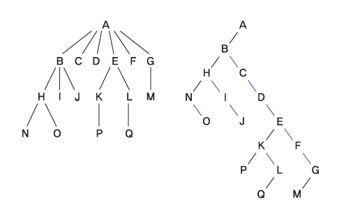
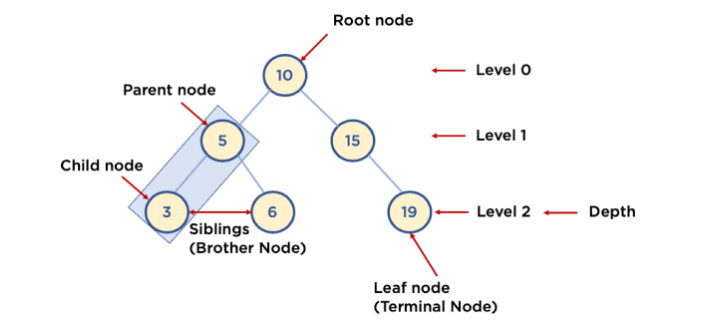
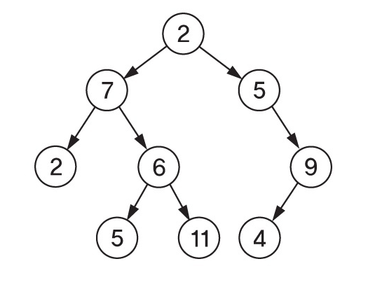
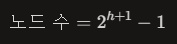
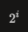
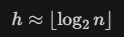

# 🧑🏻‍💻 Binary Tree  

- [✅ 트리 자료구조 기초](#-트리-자료구조-기초)  
- [✅ 이진 트리(Binary Tree)란?](#-이진-트리binary-tree란)  
- [✅ 이진 트리의 종류](#-이진-트리의-종류)  
- [✅ 이진 트리의 순회 방법](#-이진-트리의-순회-방법)  
- [✅ 이진 트리의 높이와 노드 수](#-이진-트리의-높이와-노드-수)  

<br>

## ✅ 트리 자료구조 기초  


> [!NOTE]  
> 트리(Tree)는 **계층 구조(hierarchy)** 를 표현하는 비선형 자료구조로, 노드(Node)와 간선(Edge)으로 구성된 그래프의 한 종류다.  
> 트리는 **사이클이 존재하지 않는 연결 그래프**이며, 루트(Root)에서 시작해 부모–자식 관계로 노드들이 연결된 구조를 가진다.  
> 하나의 루트 노드가 존재하고, 루트로부터 모든 노드에 도달할 수 있으며, 임의의 두 노드 사이 경로는 유일하다.  
> 파일 시스템, 조직도, DOM 트리 등 **계층적인 데이터를 표현**할 때 자주 사용된다.

### 💡 트리의 구성



> [!NOTE]  
> Tree는 다음과 같이 구성되어있다.
> - Root Node: 트리 맨 위에 있는 노드
> - Level: 최상위 노드를 Level 0으로 하였을 때, 하위 Branch로 연결된 노드의 깊이를 나타냄
> - Parent Node: 어떤 노드의 다음 레벨에 연결된 노드
> - Child Node: 어떤 노드의 상위 레벨에 연결된 노드
> - Leaf Node (Terminal Node): Child Node가 하나도 없는 노드, 즉 Degree가 0인 노드
> - Sibling (Brother Node): 동일한 Parent Node를 가진 노드
> - Depth(Height): 트리에서 Node가 가질 수 있는 최대 Level


<br>

## ✅ 이진 트리(Binary Tree)란?  



> [!NOTE]
> 이진 트리(Binary Tree)는 **모든 노드의 자식 수가 최대 2개(왼쪽 자식, 오른쪽 자식)** 인 트리 자료구조다.  
> 각 노드는 `왼쪽 자식(left child)`과 `오른쪽 자식(right child)` 포인터(또는 참조)를 가질 수 있다.  
> 이진 트리는 구현이 단순하고, 여러 변형 구조(이진 탐색 트리, 힙, AVL 트리 등)의 기반이 되기 때문에 중요하다.  

일반적으로 하나의 이진 트리 노드는 다음과 같이 표현할 수 있다.

```java
class TreeNode {
    int value;
    TreeNode left;
    TreeNode right;

    TreeNode(int value) {
        this.value = value;
    }
}
```

<br>

## ✅ 이진 트리의 순회 방법  

트리를 탐색하거나 모든 노드를 방문하는 과정을 **트리 순회(Tree Traversal)** 라고 한다.  
이진 트리의 대표적인 순회 방식은 다음과 같다.

### 💡 깊이 우선 탐색(DFS) 계열  

각 순회는 “루트 방문 시점”이 다르다.

- 전위 순회(Preorder)  
  - 방문 순서: **Root → Left → Right**  
  - 구조 자체를 직렬화하거나, 수식 트리에서 prefix 표현을 얻을 때 사용된다.
  - ```java
      void preorder(TreeNode node) {
            if (node == null) return;
            System.out.print(node.value + " "); // Root
            preorder(node.left);       // Left
            preorder(node.right);      // Right
        }
    ``` 

- 중위 순회(Inorder)  
  - 방문 순서: **Left → Root → Right**  
  - 이진 탐색 트리(BST)에서 중위 순회를 하면 **정렬된 오름차순**으로 노드를 방문하게 된다.  
  - ```java
      void inorder(TreeNode node) {
            if (node == null) return;
            inorder(node.left);       // Left
            System.out.print(node.value + " "); // Root
            inorder(node.right);      // Right
        }
    ```

- 후위 순회(Postorder)  
  - 방문 순서: **Left → Right → Root**  
  - 자식들을 먼저 처리한 뒤 부모를 처리해야 할 때(예: 트리 삭제) 자주 사용된다.
  - ```java
      void postorder(TreeNode node) {
            if (node == null) return;
            postorder(node.left);       // Left
            postorder(node.right);      // Right
            System.out.print(node.value + " "); // Root
        }
    ``` 


### 💡 너비 우선 탐색(BFS, Level-order)  

> [!NOTE]  
> 루트에서 시작해, 같은 레벨의 노드들을 **왼쪽에서 오른쪽 순서대로** 방문한다.  
> 보통 큐(Queue)를 사용하여 구현하며, 트리의 레벨별 정보를 얻는 데 유용하다.  

간단한 Level-order 예시 (Java):

```java
import java.util.LinkedList;
import java.util.Queue;

void levelOrder(TreeNode root) {
    if (root == null) return;

    Queue<TreeNode> queue = new LinkedList<>();
    queue.offer(root);

    while (!queue.isEmpty()) {
        TreeNode node = queue.poll();
        System.out.print(node.value + " ");

        if (node.left != null) queue.offer(node.left);
        if (node.right != null) queue.offer(node.right);
    }
}
```

<br>

## ✅ 이진 트리의 높이와 노드 수  

> [!NOTE]  
> 트리의 **높이(height)** 는 보통 루트에서 가장 깊은 리프까지의 간선 수(또는 레벨 수 - 1)로 정의한다.  
> 루트만 있는 트리의 높이는 0 또는 1로 정의할 수 있는데, 구현 시 일관된 기준을 정하는 것이 중요하다.  

완전/포화 이진 트리에서 자주 사용하는 관계는 다음과 같다.

- 높이가 (h)인 포화 이진 트리의 노드 수: 

- 레벨 (i)에 존재할 수 있는 최대 노드 수: 
- 노드 수가 (n)인 완전 이진 트리의 높이: 

이런 특성 때문에 이진 트리 기반 구조(힙, BST 등)의 핵심 연산은 보통 **O(log n)** 시간 복잡도를 갖는다.


<br>

## ✅ 이진 트리의 종류  

### 💡 정 이진 트리(Full Binary Tree)  

> [!NOTE]  
> 모든 노드가 **자식이 0개 또는 2개만** 가지는 이진 트리다.  
> 즉, 자식이 1개뿐인 노드는 존재하지 않는다.  

### 💡 완전 이진 트리(Complete Binary Tree)  

> [!NOTE]  
> 마지막 레벨을 제외한 모든 레벨이 **모두 꽉 차 있고**, 마지막 레벨의 노드들은 **왼쪽부터 연속해서 채워진** 이진 트리다.  
> 힙(Heap)은 완전 이진 트리의 대표적인 예시이며, 배열로 구현하기에 적합한 형태다.  

### 💡 포화 이진 트리(Perfect Binary Tree)  

> [!NOTE]  
> 모든 레벨이 **완전히 채워져 있는** 이진 트리로, 리프 노드의 깊이가 모두 같다.  
> 높이가 (h)일 때 노드 수가 정확히 (2^{h+1} - 1)개인 이진 트리를 말한다.  

**출처** 
- [C언어와 알고리즘_트리](https://www.epnc.co.kr/news/articleView.html?idxno=45380)
- [내가 정리하는 자료구조 - 트리(Tree)](https://heung-bae-lee.github.io/2020/05/02/data_structure_06/)