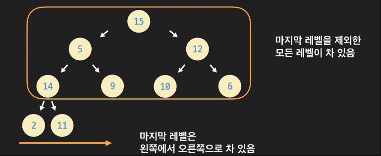

# 🧑🏻‍💻 Complete Binary Tree  


- [✅ Complete Binary Tree 정의](#-complete-binary-tree-정의)  
- [✅ Complete vs Full vs Perfect](#-complete-vs-full-vs-perfect)  
- [✅ 배열 구현의 핵심](#-배열-구현의-핵심)  
- [✅ 노드 수와 높이 관계](#-노드-수와-높이-관계)  
- [✅ 활용 사례](#-활용-사례)  

<br>

## ✅ Complete Binary Tree 정의  



> [!NOTE]  
> **Complete Binary Tree(완전 이진 트리)** 는 **마지막 레벨을 제외한 모든 레벨이 완전히 채워져 있고**, 마지막 레벨의 노드들은 **왼쪽부터 연속해서 채워진** 이진 트리다.  
> 즉, 빈 공간이 있더라도 **오른쪽 끝에만 존재**한다.  

**핵심 특징**:  
- 리프 노드들이 **왼쪽에서 오른쪽으로 연속**하게 배치됨  
- **배열로 구현하기에 최적화**된 구조  
- Heap 자료구조의 **기본 형태**  

<br>

## ✅ Complete vs Full vs Perfect  


| 종류              | 정의 요약 | 배열 구현 | Heap 사용 |
|------------------|-----------|----------------|---------------|
| **Complete**     | 마지막 레벨 왼쪽부터 채워짐 | **최적** | **기본** |
| **Full**         | 모든 노드 자식 0개 or 2개 | 불가능 (포인터 필요) | 불가능 |
| **Perfect**      | 모든 레벨 완전 채움 | 가능 | 가능 |

> [!TIP]  
> **Perfect ⊆ Complete ⊆ Binary Tree**  
> Perfect는 Complete의 특수 케이스, Complete는 Full과는 독립적인 제약조건을 가진다.  

<br>

## ✅ 배열 구현의 핵심  


Complete Binary Tree는 **인덱스 기반 배열 구현**이 매우 자연스럽다.

> [!NOTE]  
> 노드 인덱스 i (0-index 기준):  
> - **왼쪽 자식**: (2i + 1)  
> - **오른쪽 자식**: (2i + 2)  
> - **부모 노드**: ⌊(i-1)/2⌋

```java
class CompleteBinaryTree {
    private int[] nodes;
    private int size;

    // 인덱스 접근 예시
    private int leftChild(int i)  { return 2 * i + 1; }
    private int rightChild(int i) { return 2 * i + 2; }
    private int parent(int i)     { return (i - 1) / 2; }
}
```

**장점**:  
- 포인터/참조 없이 **단순 배열**로 모든 관계 표현 가능  
- 메모리 **연속성**으로 캐시 효율성 ↑  
- **힙 연산**(heapify up/down)이 O(log n)으로 구현 쉬움  

<br>

## ✅ 노드 수와 높이 관계  


> [!NOTE]  
> Complete Binary Tree는 높이와 노드 수 관계가 명확하다:  
> - 높이 (h)인 Complete Binary Tree의 **최소 노드 수**: (2^h)  
> - **최대 노드 수**: (2^{h+1} - 1) (Perfect Binary Tree)  
> - 노드 수 (n)일 때 **높이**: ⌈log_2 (n+1) rceil - 1⌉ 

**Heap과의 연관성**:  
```
n개 노드의 Complete Binary Tree 높이 = log₂n (근사치)
→ Heap의 insert/delete 연산이 O(log n)인 이유
```

<br>

## ✅ 활용 사례  


> [!NOTE]  
> Complete Binary Tree는 **실제 구현**에서 가장 많이 쓰이는 형태다:  

### 💡 Heap (우선순위 큐)  
```
MinHeap, MaxHeap 모두 Complete Binary Tree 기반
배열 구현으로 O(log n) 삽입/삭제 보장
```
> [!TIP]  
> Java의 `PriorityQueue`도 내부적으로 Complete Binary Tree를 배열로 구현하고 있다.  

### 💡 힙 정렬 (Heap Sort)  
```
배열 → Complete Binary Tree로 변환 → 루트 반복 추출 → O(n log n)
```

### 💡 Segment Tree / Fenwick Tree  
```
구간 합/최대값 쿼리에서 Complete Binary Tree 구조 활용
```


<br>

**출처**  
- [Heap Data Structure 기본 이론](https://www.geeksforgeeks.org/dsa/heap-data-structure/)
- [Binary Tree 구조 분석](https://en.wikipedia.org/wiki/Heap_(data_structure))