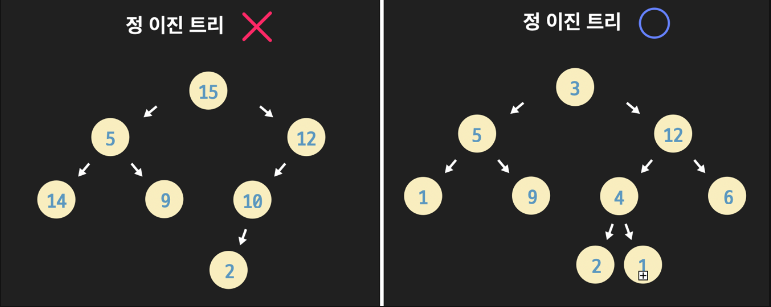

# 🧑🏻‍💻 Full Binary Tree  

- [✅ 트리와 이진 트리 복습](#-트리와-이진-트리-복습)  
- [✅ Full Binary Tree 정의](#-full-binary-tree-정의)  
- [✅ Full vs Complete vs Perfect](#-full-vs-complete-vs-perfect)  
- [✅ 노드 수와 높이 관계](#-노드-수와-높이-관계)  
- [✅ 성질과 활용 포인트](#-성질과-활용-포인트)  

 

## ✅ 트리와 이진 트리 복습  

> [!NOTE]  
> 트리(Tree)는 루트에서 시작해 부모–자식 관계로 연결된 계층적 자료구조이며, 사이클이 존재하지 않는 연결 그래프다.  
> 이진 트리(Binary Tree)는 각 노드가 최대 두 개의 자식(왼쪽, 오른쪽)만 가지는 트리다.  

 

## ✅ Full Binary Tree 정의  

> [!NOTE]  
> **Full Binary Tree(정이진 트리)** 는 모든 노드가 **자식이 0개(리프) 또는 2개(내부 노드)** 인 이진 트리다.  
> 즉, 정확히 한 개의 자식만 가진 노드는 존재하지 않는다.  

특징을 정리하면 다음과 같다.

- 리프 노드는 자식이 전혀 없다.  
- 리프가 아닌 노드는 항상 **왼쪽, 오른쪽 두 자식 모두**를 가진다.  
- 이진 트리의 한 특수 형태이므로, 깊이 우선 탐색(DFS), 너비 우선 탐색(BFS) 등 모든 이진 트리 알고리즘을 그대로 적용할 수 있다.  

 

## ✅ Full vs Complete vs Perfect  

이진 트리 관련 용어들이 헷갈리기 쉬우니, 세 가지를 비교해서 보는 게 좋다.

| 종류              | 조건 요약 |
|------------------|-----------|
| Full Binary Tree | 모든 노드의 자식 수가 0 또는 2개 (1개인 노드 없음) |
| Complete Binary Tree | 마지막 레벨을 제외한 레벨은 모두 채워져 있고, 마지막 레벨은 왼쪽부터 연속해서 채워짐 |
| Perfect Binary Tree  | 모든 레벨이 완전히 채워져 있으며, 모든 리프의 깊이가 동일 |

> [!TIP]  
> 어떤 트리는 **Full이면서 Complete**일 수도 있고, **Perfect인 트리는 항상 Full이자 Complete**이다.  
> 하지만 Full이라고 해서 반드시 Complete여야 하는 것은 아니다.  

 

## ✅ 노드 수와 높이 관계  

Full Binary Tree는 “자식이 1개인 노드가 없다”는 제약 덕분에, **내부 노드 수와 리프 노드 수 사이에 깔끔한 관계**가 생긴다.

- 노드 개수를 (n), 리프 노드 수를 (L), 내부 노드 수를 (I)라고 할 때:  
  [
  n = I + L
  ]
- Full Binary Tree에서 항상 성립하는 중요한 관계:  
  [
  L = I + 1
  ]
  즉, **리프 노드 수는 내부 노드 수보다 정확히 1개 많다.**  
- 따라서 전체 노드 수는  
  [
  n = 2L - 1 = 2I + 1
  ]

높이 (h)와의 관계는 일반 이진 트리와 동일하게, 최소/최대 범위만 이야기할 수 있다.

- 최소 높이: **가능한 한 균형 잡힌 경우**  
  - 높이가 (h)일 때 최소 높이에서의 노드 수는 대략 (2^{h+1} - 1) 수준.  
- 최대 높이: **편향 구조**로 길게 뻗은 경우 (한쪽으로 Full을 유지하며 내려가는 형태)  
  - 이 경우 높이는 O(n)까지 커질 수 있다.  

 

## ✅ 성질과 활용 포인트  

> [!NOTE]  
> - Full Binary Tree는 “자식 수가 1인 노드가 없다”는 제약 덕분에 **증명·분석이 쉬운 구조**로 자주 등장한다 (예: 재귀 알고리즘 분석, 트리 높이/노드 수 관계 증명 등).  
> - 많은 이론에서, 일반 이진 트리보다 Full Binary Tree로 먼저 가정하고 성질을 증명한 뒤, 그 결과를 일반 트리로 확장하는 방식이 자주 사용된다.  

이 구조 자체가 특정 알고리즘 구현에서 바로 쓰이는 것보다는,  

- 표현식 트리(Expression Tree)  
- 결정 트리(Decision Tree)  
- Huffman 코딩 트리 분석  

같은 곳에서 “각 내부 노드는 반드시 두 자식을 가진다”는 조건으로 자연스럽게 **Full Binary Tree가 되는 경우**가 많다.

**출처**
- [[자료구조] 트리, 이진트리 구현, 정이진트리, 완전이진트리 구현, 포화이진트리, 트리순회(pre, post, in-order) 구현](https://velog.io/@so_yeong/자료구조-트리-이진트리-구현-정이진트리-완전이진트리-구현-포화이진트리-트리순회pre-post-in-order-구현)
- ["이산수학 - 10.트리" 中 이진트리의 활용: 데이터 압축(Huffman coding)](https://contents.kocw.net/KOCW/document/2015/shinhan/kimeuhee/10.pdf)