# 🧑🏻‍💻 Graph

- [✅ 그래프의 구현 방법](#-그래프의-구현-방법)
- [✅ 그래프의 종류](#-그래프의-종류)

> [!NOTE]
> 그래프란 정점(Vertex)와 간선(Edge)으로 이루어진 자료구조다.

| 구분      | 그래프                                                 | 트리                                         |
|---------|-----------------------------------------------------|--------------------------------------------|
| 정의      | 노드와(Node) 그 노드를 연결하는 간선(Edge)을 하나로 모아놓은 자료구조        | 그래프의 한 종류, 방향성이 있는 비순환 그래프                 |
| 방향성     | 방향 그래프(Directed), 무방향 그래프(Undirected) 모두 존재         | 방향 그래프                                     |
| 사이클     | 사이클(Cycle) 가능, 자체 간선(self-loop)도 가능, 순환 그래프, 비순환 그래프 모두 존재 | 사이클 불가능, 자체 간선도 불가능, 비순환 그래프               |
| 루트 노드   | 루트 노드의 개념이 없음                                       | 한 개의 루트 노드만이 존재. 모든 자식 노드는 한 개의 부모 노드만을 가짐 |
| 모델      | 네트워크 모델                                             | 계층 모델                                      |
| 순회      | DFS, BFS                                            | DFS, BFS안의 PreOrder, InOrder, PostOrder    |
| 간선의 수   | 그래프에 따라 간선의 수가 다르고, 간선이 없을 수도 있음.                   | 노드가 N인 트리는 항상 N-1의 간선을 가짐                  |
| 경로      | -                                                   | 임의의 두 노드 간의 경로는 유일                         |
| 예시 및 종류 | 지도, 지하철 노선도의 최단 경로, 도로(교차점과 일방 통행길)                 | 이진 트리, 이진탐색트리, 균형 트리, 힙                    |

 

## ✅ 그래프의 구현 방법

> [!TIP]
> 그래프의 구현 방법에는 인접행렬과 인접리스트 방식이 있다.  
> 두 개의 구현 방식은 각각의 상반된 장단점을 가지고 있다.

### 💡 인접행렬(Adjacency Matrix) 방식

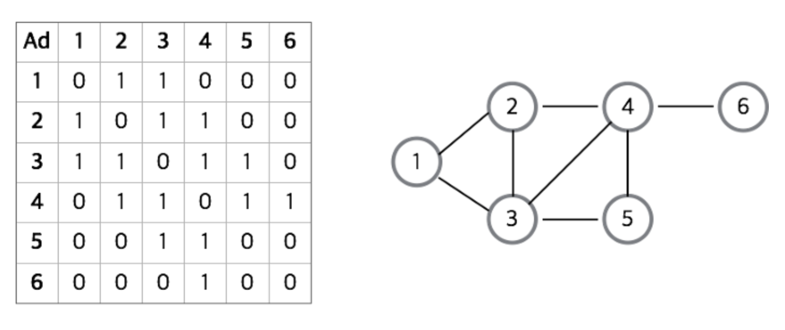

> [!NOTE]
> - 그래프에 V개의 정점이 있을 때, V 크기의 정방행렬을 이용하여 구현하는 방법이다.  
>   `Matrix[i][j] == 1`이면 정점 i에서 j로 가는 간선이 존재하고,  
>   `Matrix[i][j] == 0`이면 정점 i에서 j로 가는 간선이 존재하지 않는다는 뜻이다.
> - 값으로 1,0 대신 `boolean`을 사용해도 된다.
> - 해당하는 위치의 값을 통해서 정점 간의 연결 관계를 `O(1)`로 알 수 있다.
>   - 모든 정점에 대해 다른 모든 정점과의 관계를 표현한 행렬이므로, 간선 유무에 관계없이 **V^2의 메모리 공간이 필요**하다.

 

### 💡 인접리스트(Adjacency List) 방식
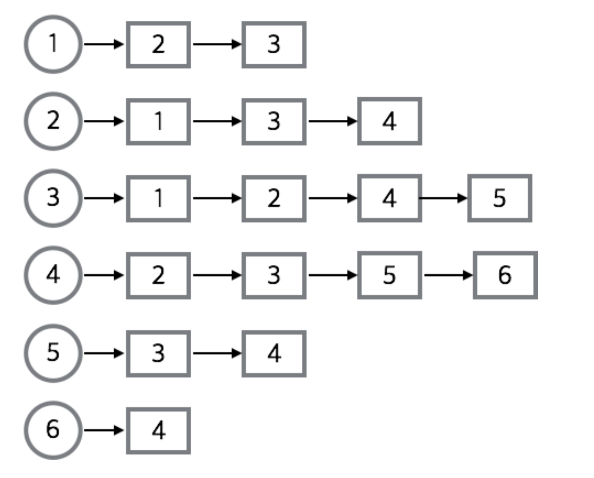
> [!NOTE]
> - 정점의 인접리스트를 이용하여 구현하는 방법이다.
> - 모든 정점의 진접 정점을 리스트로 만드는 방법이다.  
>   ➡️ 배열과 배열의 각 인덱스마다 존재하는 또 다른 리스트를 이용하여 인접 리스트를 표현한다.
> - 무방향 그래프에서는 하나의 간선이 두 번씩 저장된다.  
>   ➡️ (a,b)와 (b,a)로써 같은 간선이지만 출발 정점에는 따로 저장되기 때문이다.
> - 정점의 수 N, 간선의 수 E, 무방향 그래프의 경우, N개의 리스트, 길이가 N인 배열, 2*E개의 노드가 필요하다.

 

### 🤔 구현 방법 선택
> [!IMPORTANT]
> 인접행렬
> - 밀집 그래프(Dense Graph)를 표현하는 데 적당하다.
> - 장점
>   - 두 정점을 연결하는 간선의 존재 여부(M[i][j])를 O(1)안에 즉시 알 수 있다.
>   - 정점의 차수는 O(N) 안에 알 수 있다.
>   - 인접리스트에 비해 구현이 쉽다.
> - 단점
>   - 모든 정점에 대해 간선 정보를 대입해야 하므로 생성하는 데에 O(n^2)의 시간복잡도가 소요된다. 
>   - 무조건 2차원 배열이 필요하기 때문에 필요 이상의 공간이 낭비된다.

> [!IMPORTANT]
> 인접 리스트
> - 희소 그래프(Sparse Graph)를 표현하는 데 적당하다.
> - 장점
>   - 정점들의 연결 정보를 탐색할 때 O(n) 시간이면 가능하다.
>   - 필요한 만큼의 공간만 사용하기 때문에 공간의 낭비가 적다.
> - 단점
>   - 특정 두 점이 연결되었는지 확인하려면 인접행렬에 비해 시간이 오래 걸린다.(O(E))
>   - 구현이 비교적 어렵다.

 

## ✅ 그래프의 종류

### 💡 방향 그래프(Directed Graph)
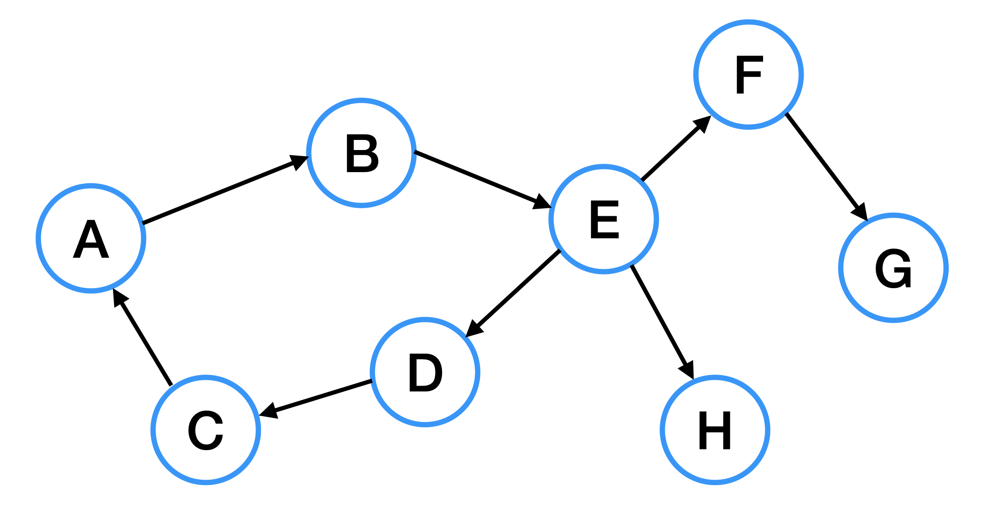  
간선에 화살표가 있는 그래프로, 화살표의 방향대로만 이동이 가능하다.

 

### 💡 무방향 그래프(Undirected Graph)
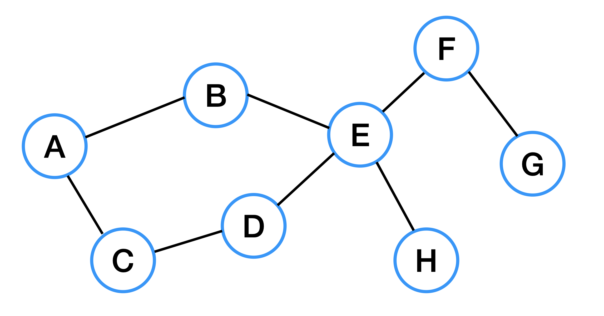  
간선에 화살표가 없는 그래프로, 양방향 이동이 가능하다.

 

### 💡 연결 그래프(Connected Graph)
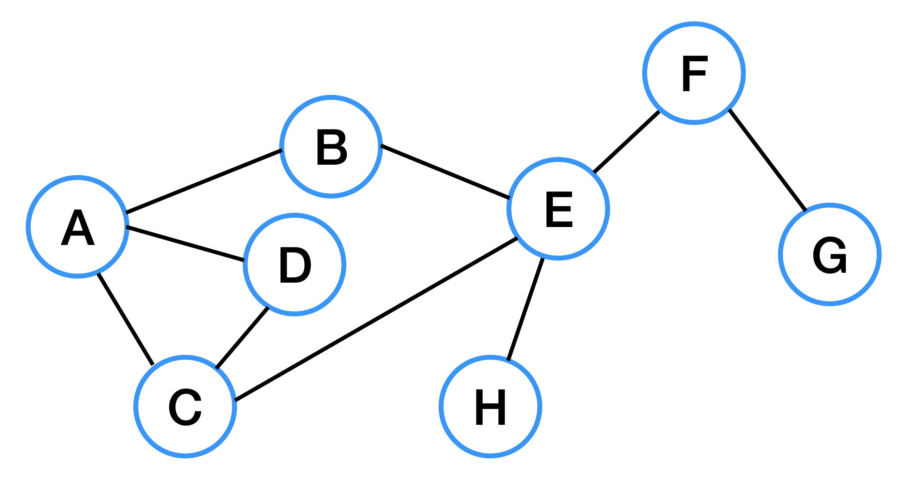  
연결 그래프는 모든 정점에 대해 항상 경로를 가지는 그래프를 말한다.  
위 그래프와 같이 간선의 개수와 상관없이 모든 정점으로 이동할 수 있다.  
트리도 연결 그래프에 속한다.

 

### 💡 비연결 그래프(Disconnected Graph)
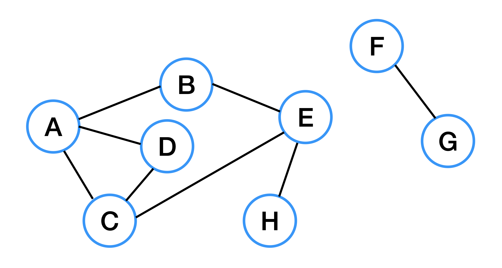  
정점들 사이에 간선이 존재하지 않아 경로가 없는 경우가 존재하는 그래프를 말한다.

 

### 💡 순환(Cycle)
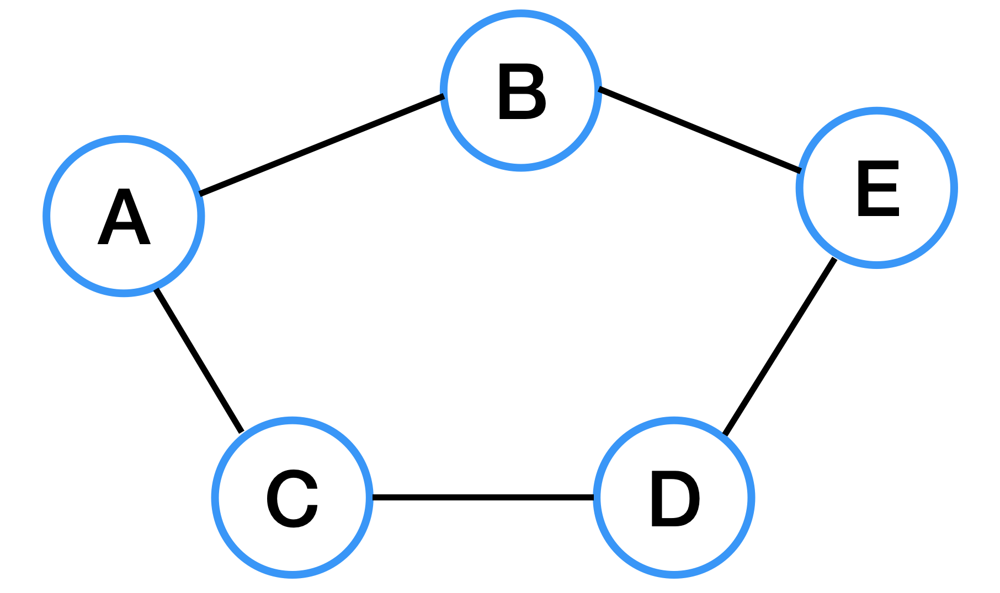  
그래프에서 단순 경로의 시작 정점과 종료 정점이 동일한 경우를 말한다.  
위 그래프의 경우, 어떤 정점에서 시작하든 항상 자신으로 돌아오게 된다.

 

### 💡 비순환 그래프(Acyclic Graph)
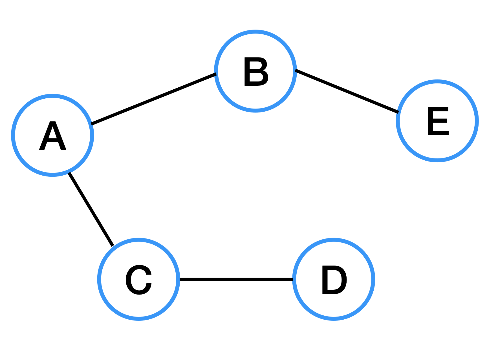  
비순환 그래프는 사이클이 없는 그래프를 말한다.

 

### 💡 완전 그래프(Complete Graph)
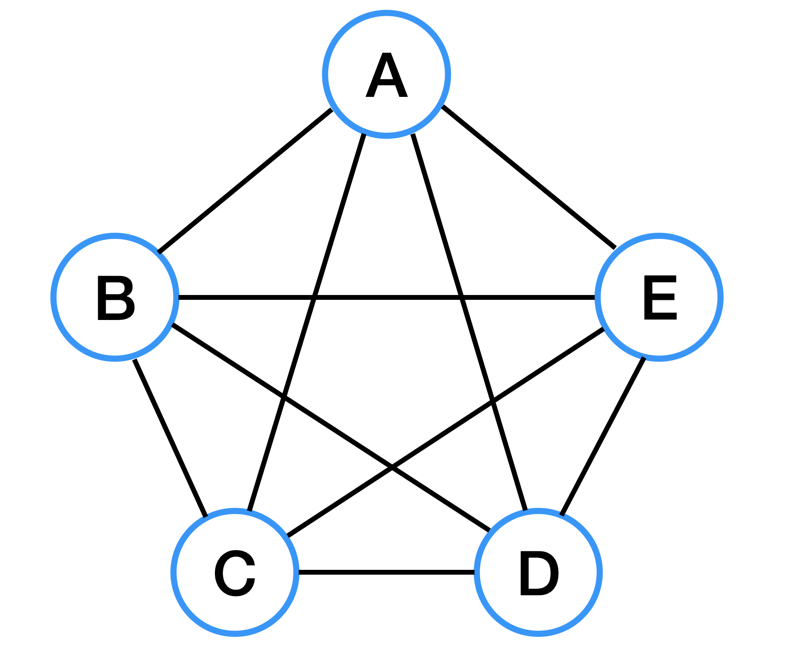  
완전 그래프는 모든 정점이 서로 하나의 간선으로 연결되어 있는 그래프를 말한다.  
무방향 완전 그래프의 경우, 정점이 n개일 때 간선의 수: `n * (n-1) / 2`

 

### 💡 희소 그래프(Sparse Graph)
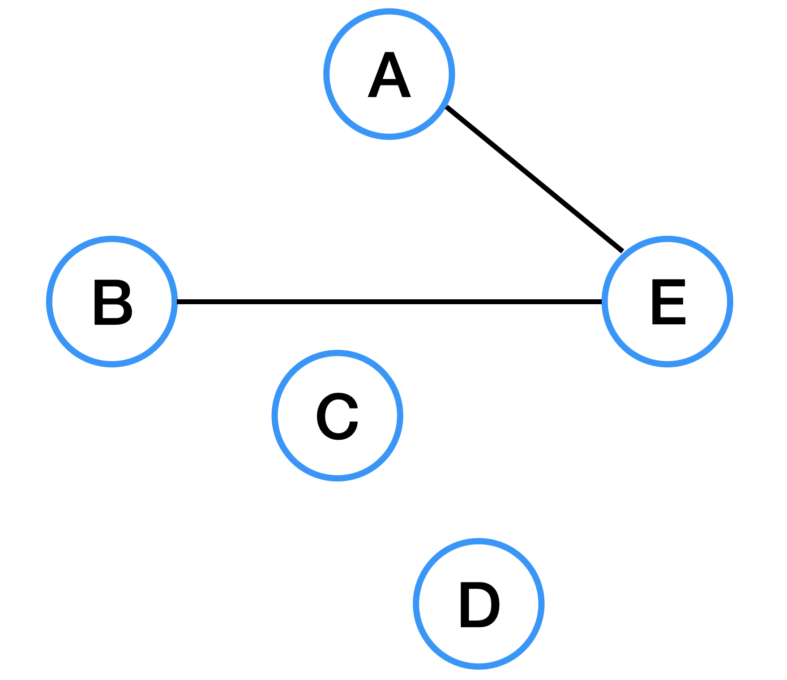  

희소 그래프란 정점의 개수보다 간선 개수가 적은 그래프를 뜻한다.

 

### 💡 밀집 그래프(Dense Graph)
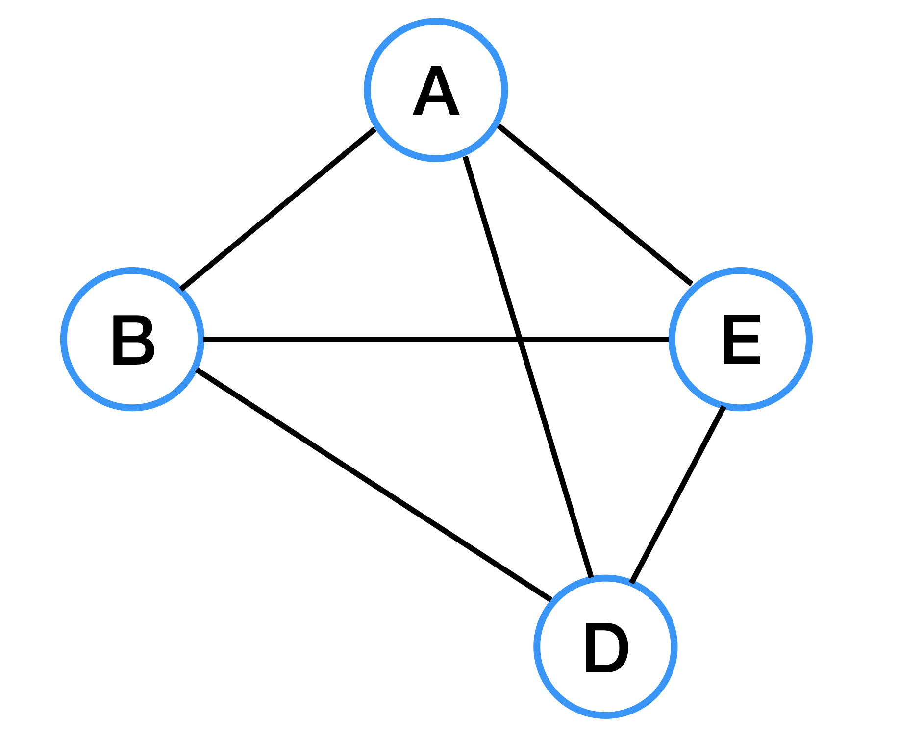

밀집 그래프란 정점의 개수보다 간선 개수가 많은 그래프를 뜻한다.

 

**출처**  
- [[자료구조] 그래프(Graph)란](https://gmlwjd9405.github.io/2018/08/13/data-structure-graph.html)
- [[자료구조] 그래프(Graph) 개념 정리](https://hongcoding.tistory.com/78)
- [[CS 기초 - 자료구조] Graph](https://velog.io/@deannn/CS-%EA%B8%B0%EC%B4%88-%EC%9E%90%EB%A3%8C%EA%B5%AC%EC%A1%B0-Graph)