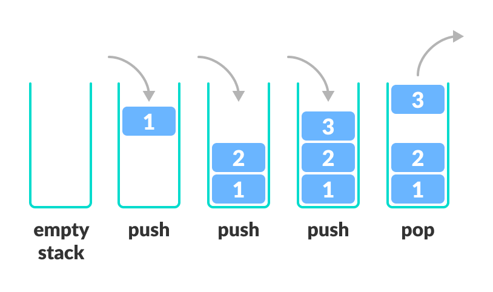
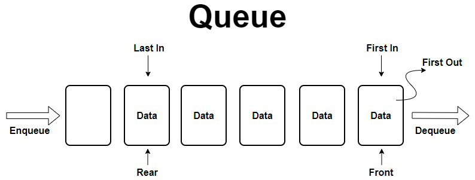
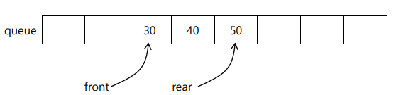
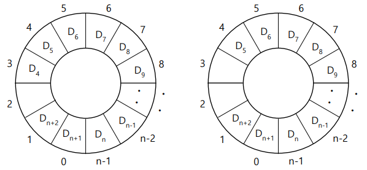
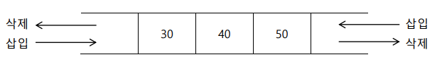

# 🕵️ Stack & Queue
<hr>

- [1️⃣ Stack](#1-stack)
- [2️⃣ Queue](#2-queue)

## 1️⃣ Stack
<hr>

### ▶️ 정의
 
- LIFO (Last In First Out, 후입선출) 형태의 자료구조
- 마지막에 들어간 자료가 가장 먼저 나오는 구조



### ▶️ 연산 및 특징

- Push : 새로운 데이터를 Top 위치에 삽입
- Pop : Top 위치에 있는 데이터 제거 및 반환
- Peek : Top 위치에 있는 데이터 반환(삭제 X)
- 중간 데이터 직접 수정 및 삭제 불가


### ▶️ 실제 사용사례

- 웹 브라우저 방문 기록 (뒤로가기)
- 실행 취소
- 후위 표기법 계산 (y=abc-dc/+)
  * 피연산자 -> push / 연산자 -> pop
- 깊이 우선 탐색 (DFS)
- 함수 호출 및 재귀

### ▶️ 시간복잡도

|       | 삽입   | 삭제   | 조회   |
|-------|------|------|------|
| Stack | O(1) | O(1) | O(N) |


### ▶️ 구현
```java
package Class;

import java.util.Stack;

public class StackAPITest {
  public static void main(String[] args) {
    Stack<String> stack = new Stack<String>();
    stack.push("test1");
    stack.push("test2");
    stack.push("test3");

    System.out.println("스택 사이즈 : " + stack.size());

    while(!stack.isEmpty()) {
      System.out.println(stack.pop());
    }
  }
}
```

## 2️⃣ Queue
<hr>

### ▶️ 정의

- FIFO (First In First Out, 선입선출) 형태의 자료 구조
- 처음 들어간 자료가 가장 먼저 나오는 구조



### ▶️ 연산 및 특징

- enqueue : rear 에서 데이터 삽입
- dequeue : front 에서 데이터 삭제 및 반환
- 중간 데이터 직접 수정 및 삭제 불가
- 오버 플로우(Overflow) : 큐 크기만큼 데이터가 꽉 차서 들어가지 않음
- 언더 플로우(Underflow) : 큐가 비어있는데 데이터를 꺼내려고 하는 경우

### ▶️ 실제 사용사례

- 작업 예약
- 서비스 센터 대기
- 프로세스 관리
- 너비 우선 탐색 (BFS)

### ▶️ 시간복잡도

|       | 삽입   | 삭제   | 조회   |
|-------|------|------|------|
| Queue | O(1) | O(1) | O(N) |


### ▶️ 구현
```java

package Class;

import java.util.ArrayDeque;
import java.util.Queue;

public class QueueAPITest {
  public static void main(String[] args) {
    Queue<String> queue = new ArrayDeque<String>();
    queue.offer("test1");
    queue.offer("test2");
    queue.offer("test3");


    System.out.println("큐 사이즈 : " + queue.size());

    while(!queue.isEmpty()) {
      System.out.println(queue.poll());
    }
  }
}
```
> [!NOTE]
> 자바에서 `Queue`는 인터페이스로 직접 구현되어 있지 않고 `LinkedList`와 `ArrayDeque` 클래스를 이용함
> 
> LinkedList 보다는 ArrayDeque 사용을 추천함 
>1. 메모리 오버헤드 (OverHead)
  >  * LinkedList: 데이터 저장 시 Node 객체를 새로 생성해야 함 (노드 하나당 Data + Next 주소 + Prev 주소 모두 저장해야함)
  >  * ArrayDeque: 내부적으로 하나의 큰 Object[] 배열을 사용 -> 추가적인 노드 객체 생성없이 데이터 저장 가능
>  
>2. 캐시 지역성 (Cache Locality)
 > * LinkedList: 노드들이 비연속적으로 힙(Heap) 메모리 영역 할당됨 -> Cache Miss가 자주 발생
 > * ArrayDeque: 배열 기반으로 데이터가 메모리에 연속적으로 붙음 -> CPU 캐시 적중률(Hit Rate)이 높아 연산 속도 빠름
 > 
> 3. 원형 큐(Circular Buffer) 구조
> * Head(Front)와 Tail(Rear) 포인터(인덱스)만 이동시키며 데이터를 관리
> * 데이터를 삭제(poll)g할 때, 실제로 지우거나 배열을 당기는(Shift) 작업 없이 Head 포인터만 한칸 이동 -> O(1)


### ▶️ 종류 

> 선형 큐 (Linear Queue)
> - 데이터를 FIFO 구조로 처리하는 기본 큐
> 
> 
>
> 원형 큐 (Circular Queue)
> - 큐의 마지막 요소가 첫 요소와 연결된 큐
> - 선형 큐의 데이터 삽입/삭제 시 데이터들을 앞뒤로 당겨주는 불필요한 낭비 극복 위함
> - isEmpty() : front == rear
> - isFull() : (rear + 1) % size == front
>
> 
> 
> 우선순위 큐 (Priority Queue)
> - 각 데이터 요소에 우선순위 할당
> - 우선순위애 따라 데이터 처리
> - 힙(Heap)을 이용하여 구현
>
> 데큐 (Deque)
> - 양쪽에서 삽입, 삭제 가능
>
> 

<hr>

#### 출처
- https://jud00.tistory.com/entry/%EC%9E%90%EB%A3%8C%EA%B5%AC%EC%A1%B0-%EC%8A%A4%ED%83%9DStack%EA%B3%BC-%ED%81%90Queue%EC%97%90-%EB%8C%80%ED%95%B4%EC%84%9C-%EC%95%8C%EC%95%84%EB%B3%B4%EC%9E%90
- https://dream-and-develop.tistory.com/93
- https://yoongrammer.tistory.com/m/45?t_src=GNBlayer_kakaostory
- https://velog.io/@mic050r/%EC%9E%90%EB%A3%8C%EA%B5%AC%EC%A1%B0-Tree-Graph%EC%9D%B4%EB%9E%80
- https://nukoori.tistory.com/30
- https://dylans-page.tistory.com/36