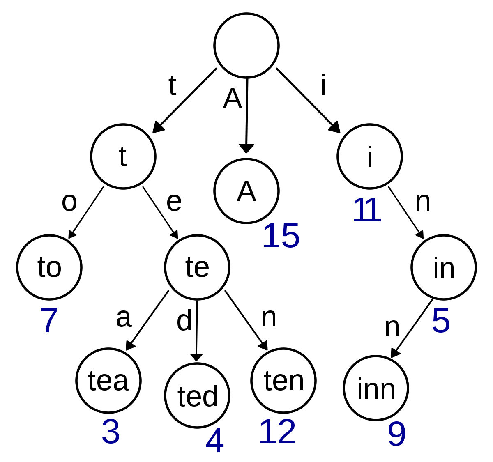
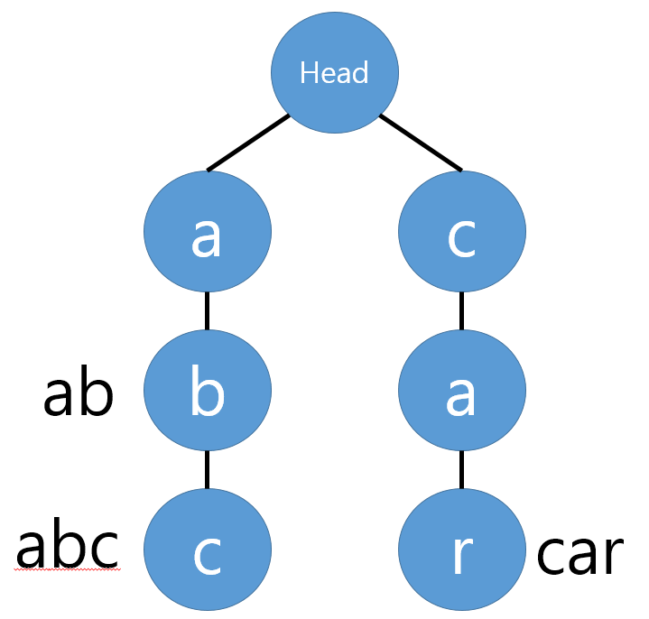
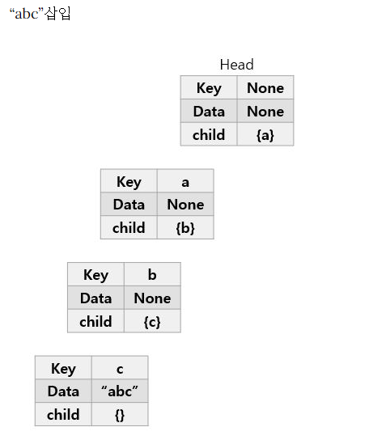
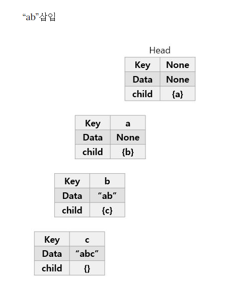
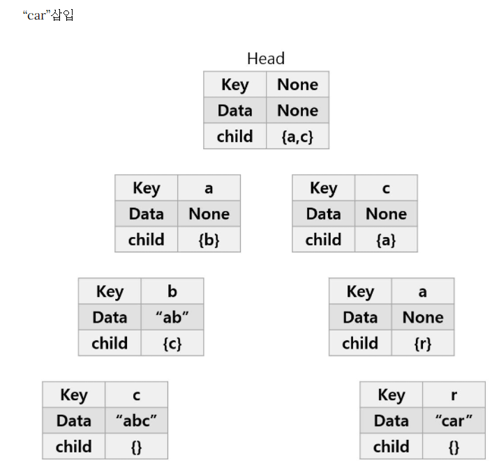
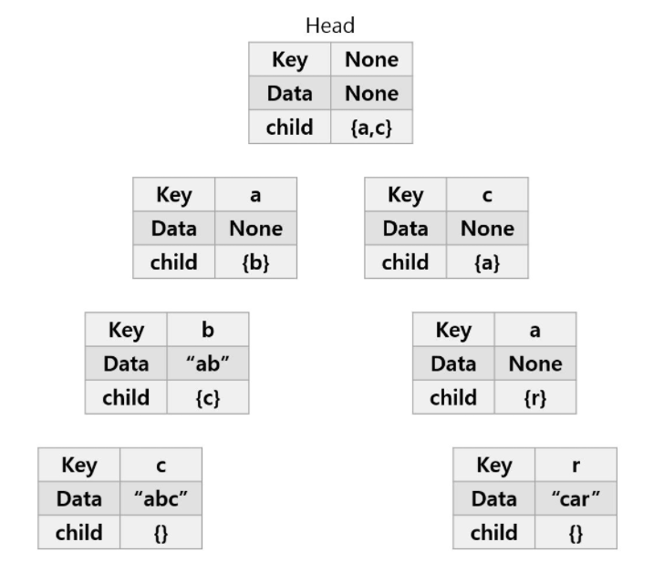
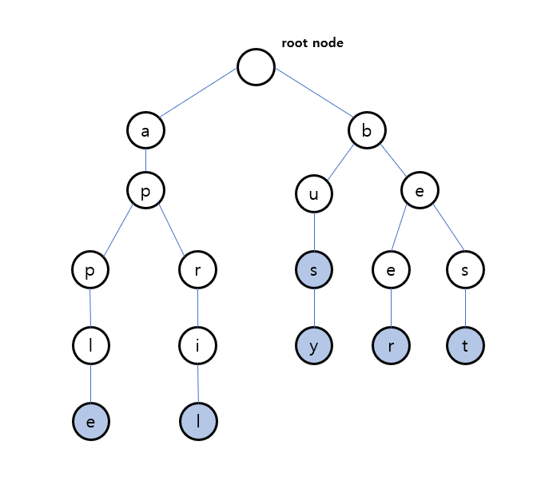

# 🧑🏻‍💻 트라이(Trie)
<hr>

  
> [!NOTE]
> - 트라이는 문자열을 저장하고 효율적으로 탐색하기 위한 **트리** 형태의 알고리즘이다.
> - 우리가 검색할 때 볼 수 있는 자동완성 기능, 사전 검색 등 문자열을 탐색하는 데 특화되어있는 자료구조다.
> - 트라이(Trie)의 어원은 탐색 트리(retrieval tree)에서 나왔다.

<br>

## ✅ 예제를 통한 트라이의 이해
<hr>

> [!TIP]
> 'abc', 'ab', 'car' 단어들을 'abc'부터 트라이에 저장한다고 가정해보자.

  

<br>

> [!NOTE]
> 아래 그림을 보면서 이해하자.
> 1. 'abc' 트라이에 삽입
>    - 첫 번째 문자는 'a'다.  
>      ➡️ 초기에 트라이 자료구조 내에는 아무것도 없으므로 Head의 자식 노드에 'a'를 추가해준다.
>    - 'a' 노드에도 현재 자식이 하나도 없으므로, 'a'의 자식 노드에 'b'를 추가해준다.
>    - 'c'도 마찬가지로 'b'의 자식노드로 추가해준다.
>    - 'abc' 단어가 여기서 끝남을 알리기 위해 현재 노드에 abc라고 표시한다.(Data)



<br>

> [!NOTE]
> 2. 'ab' 트라이에 삽입
>    - 현재 Head의 자식노드로 'a'가 이미 존재한다.  
>      ➡️ 따라서 'a' 노드를 추가하지 않고, 기존에 있는 'a' 노드로 이동한다.
>    - 'b'도 'a'의 자식노드로 이미 존재하므로 'b' 노드로 이동한다.
>    - 'ab' 단어가 여기서 끝이므로 현재 노드에 ab를 표시한다.



<br>

> [!NOTE]
> 3. 'car' 트라이에 삽입
>    - Head의 자식노드로 'a'만 존재하고, 'c'는 존재하지 않는다.  
>      ➡️ 따라서 'c'를 자식 노드로 추가한다.
>    - 'c'의 자식노드가 없으므로 마찬가지로 'a'를 추가한다.
>    - 'a'의 자식노드가 없으므로 마찬가지로 'r'을 추가한다.
>    - 'car' 단어가 여기서 끝이므로 현재 노드에 car를 표시한다.



<br>

## ✅ 트라이의 장단점
<hr>

> [!TIP]
> - 트라이는 문자열 검색을 빠르게 한다.
> - 문자열을 탐색할 때, 하나하나씩 전부 비교하면서 탐색을 하는 것보다 시간 복잡도 측면에서 훨씬 더 효율적이다.
> - 각 노드에서 자식들에 대한 포인터들을 배열(즉, 메모리)로 모두 저장하고 있다는 점에서 저장 공간의 크기가 크다는 단점도 있다.

<br>

## ✅ 트라이에서 문자열 탐색
<hr>

  

> [!IMPORTANT]
> 1. 'abc'라는 문자열이 있는지 탐색해보자.
>    - Head의 child에 'a'가 존재 ➡️ 'a' 노드(key='a')로 이동
>    - 'a' 노드의 child에 'b'가 존재 ➡️ 'b' 노드(key='b')로 이동
>    - 'b' 노드의 child에 'c'가 존재 ➡️ 'c' 노드(key='c')로 이동
>    - 문자열 탐색이 완료됨 ➡️ 현재 노드('c'노드)에 Data값이 존재!  
>      ➡️ 따라서 'abc'라는 문자열이 존재함을 알 수 있다.
> 2. 'ca'라는 문자열이 있는지 탐색해보자.
>    - Head의 child에 'c'가 존재 ➡️ 'c' 노드(key='c')로 이동
>    - 'c' 노드의 child에 'a'가 존재 ➡️ 'a' 노드(key='a')로 이동
>    - 문자열 탐색이 완료됨 ➡️ 현재 노드('a'노드)에 Data값이 미존재!  
>      ➡️ 따라서 'ca'라는 문자열이 존재하지 않음을 알 수 있다.

<br>

## ✅ 트라이에서 문자열 삭제 방법
<hr>

  
> [!NOTE]
> 'apple'을 삭제해보자.
> 1. 'apple'을 탐색하여 마지막 노드인 'e'로 간다.
> 2. 'e'의 노드의 Data가 존재한다면 Data 값을 삭제한다.  
>    (Data에 값 세팅 대신 `endOfWord`를 `true`로 세팅해서 자료구조를 운영하는 것도 가능하고, 그 경우에는 `false`로 바꿔준다.)
> 3. 'e'의 자식노드가 있는지 확인하고, 없으면 거꾸로 타고 올라가면서 노드를 삭제해준다.
> 4. 'l', 'p' 모두 자식 노드가 없으므로 삭제하고 올라간다.
> 5. 'p'의 경우에는 다른 자식 노드 'r'이 존재하므로 삭제하지 않고 끝난다.

<br>

## ✅ Java로 트라이 구현해보기
<hr>

```java
class Node{
    //노드의 자식 노드들을 저장
    HashMap<Character, Node> child;
    //이 노드가 단어의 끝인지 저장
    boolean endOfWord;
}
```

```java
public class Trie {
    Node root;
    
    public Trie(){
        this.root = new Node();
    }

    public void insert(String str); //삽입
    boolean search(String str); //탐색
    public boolean delete(String str);//삭제
        
}
```

```java
public void insert(String str){
    //시작 노드를 루트노드로 설정 (루트노드에는 값이 없음)
    Node node = this.root;

    for(int i=0;i<str.length();i++){
        char c = str.charAt(i);
        //문자열의 각 단어를 가져와서 자식노드 중에 있는지 체크
        node.child.putIfAbsent(c,new Node());
        //있을때 : node = node.child.get(str.charAt(i)); (putIfAbsent는 값 존재시에 value를 반환
        //없을 때 : 새로운 노드를 생성해서 넣음
        node = node.child.get(c); //자식노드로 이동
    }
    //for문이 끝나면 현재 노드는 마지막 글자이기 때문에 단어의 끝임을 명시
    node.endOfWord = true;
}

boolean search(String str){
    Node node = this.root;

    for(int i=0;i<str.length();i++){
        char c = str.charAt(i);

        if(node.child.containsKey(c)){//자식노드에 c가 있을 때 계속 탐색 진행
            node = node.child.get(c);
        }else{
            return false;
        }
    }
    //마지막 노드까지 도달 시
    return node.endOfWord; //마지막 노드의 endOfWord를 반환
}

//사용자가 삭제 요청 시 사용하는 메서드
public boolean delete(String str){
    boolean result = delete(this.root, str, 0);
    return result;
}
//내부적으로 재귀를 통해 삭제하는 메서드
private boolean delete(Node node, String str, int idx){
    char c = str.charAt(idx);

    //현재 노드의 자식노드에서 c를 지워야되는데 없으면 return false
    if(!node.child.containsKey(c)){
        return false;
    }

    Node cur = node.child.get(c);
    idx++;
    if(idx == str.length()){//문자열 끝에 도달했을 때
        if(!cur.endOfWord){
            return false;
        }
        //endOfWord를 false로 바꿔주면 지우려는 문자열을 찾을 수 없게 됨
        cur.endOfWord = false;

        //지우려는 문자열의 마지막에서 더 뻗어나가는 경우
        if(cur.child.isEmpty()){
            node.child.remove(c);
        }

    }else{//문자열의 끝에 도달하지 않았을 때
        //재귀적으로 현재 노드부터 다시 호출
        if(!this.delete(cur,str,idx)){//삭제에 실패했을 경우
            return false;
        }
        //true를 반환받았고, 자식노드가 비어있으면 현재 노드를 삭제
        // "node"는 "cur"의 부모노드임. 즉,"cur"노드를 "node"의 자식 Map에서 삭제하는 것
        if(!cur.endOfWord && cur.child.isEmpty()){
            node.child.remove(c);
        }
    }
    return true;
}
```


<br>

**출처**
- [[자료구조] 트라이 (Trie)](https://velog.io/@kimdukbae/%EC%9E%90%EB%A3%8C%EA%B5%AC%EC%A1%B0-%ED%8A%B8%EB%9D%BC%EC%9D%B4-Trie)
- [[JAVA/자료구조] 트라이(Trie) 개념, 직접 구현하기](https://innovation123.tistory.com/116)